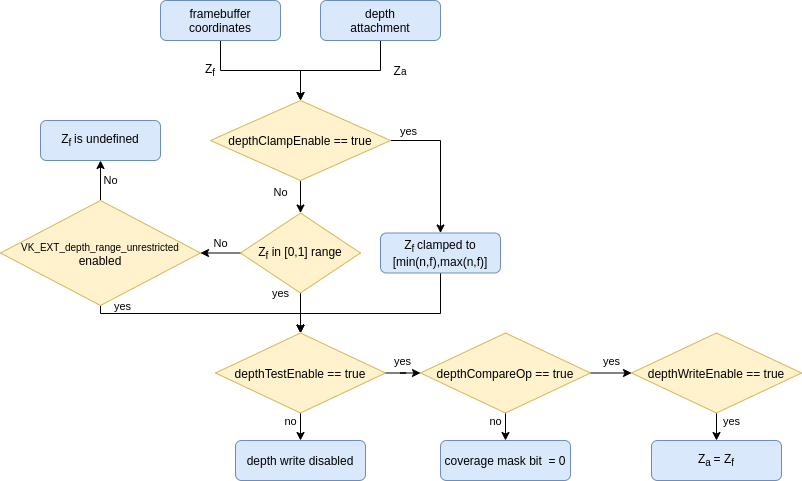

// Copyright 2019-2022 The Khronos Group, Inc.
// SPDX-License-Identifier: CC-BY-4.0

// Required for both single-page and combined guide xrefs to work
ifndef::chapters[:chapters:]

[[Depth]]
= Depth

The term `depth` is used in various spots in the xref:{chapters}vulkan_spec.adoc[Vulkan Spec]. This chapter is aimed to give an overview of the various "depth" terminology used in Vulkan. Some basic knowledge of 3D graphics is needed to get the most out of this chapter.

[NOTE]
====
While stencil is closely related depth, this chapter does not aim to cover it outside the realm of API names
====

  *  <<graphics-pipeline, Graphics Pipeline>>
  *  <<depth-formats, Depth Formats>>
  *  <<depth-buffer-as-a-vkimage, Depth Buffer as a VkImage>>
  **  <<layout, Layout>>
  **  <<clearing, Clearing>>
  *  <<pre-rasterization, Pre-rasterization>>
  **  <<primitive-clipping, Primitive Clipping>>
  ***  <<user-defined-clipping-and-culling, User defined clipping and culling>>
  ***  <<porting-from-opengl, Porting from OpenGL>>
  **  <<viewport-transformation, Viewport Transformation>>
  ***  <<depth-range, Depth Range>>
  *  <<rasterization, Rasterization>>
  **  <<depth-bias, Depth Bias>>
  *  <<post-rasterization, Post-rasterization>>
  **  <<fragment-shader, Fragment Shader>>
  ***  <<conservative-depth, Conservative depth>>
  **  <<per-sample-processing-and-coverage-mask, Per-sample processing and coverage mask>>
  ***  <<resolving-depth-buffer, Resolving depth buffer>>
  **  <<depth-bounds, Depth Bounds>>
  **  <<depth-test, Depth Test>>
  ***  <<depth-compare-operation, Depth Compare Operation>>
  ***  <<depth-buffer-writes, Depth Buffer Writes>>
  ***  <<depth-clamping, Depth Clamping>>

[[graphics-pipeline]]
== Graphics Pipeline

The concept of "depth" is only used for xref:{chapters}what_vulkan_can_do.adoc[graphics pipelines] in Vulkan and doesn't take effect until a draw call is submitted.

Inside the `VkGraphicsPipelineCreateInfo` there are many different values related to `depth` that can be controlled. Some states are even xref:{chapters}dynamic_state.adoc[dynamic] as well.

[[depth-formats]]
== Depth Formats

There are a few different depth formats and an implementation may expose support for in Vulkan.

For **reading** from a depth image only `VK_FORMAT_D16_UNORM` and `VK_FORMAT_D32_SFLOAT` are required to support being read via sampling or blit operations.

For **writing** to a depth image `VK_FORMAT_D16_UNORM` is required to be supported. From here at least one of (`VK_FORMAT_X8_D24_UNORM_PACK32` **or** `VK_FORMAT_D32_SFLOAT`) **and** (`VK_FORMAT_D24_UNORM_S8_UINT` **or** `VK_FORMAT_D32_SFLOAT_S8_UINT`) must also be supported. This will involve some extra logic when trying to find which format to use if **both** the depth and stencil are needed in the same format.

[source,cpp]
----
// Example of query logic
VkFormatProperties properties;

vkGetPhysicalDeviceFormatProperties(physicalDevice, VK_FORMAT_D24_UNORM_S8_UINT, &properties);
bool d24s8_support = (properties.optimalTilingFeatures & VK_FORMAT_FEATURE_DEPTH_STENCIL_ATTACHMENT_BIT);

vkGetPhysicalDeviceFormatProperties(physicalDevice, VK_FORMAT_D32_SFLOAT_S8_UINT, &properties);
bool d32s8_support = (properties.optimalTilingFeatures & VK_FORMAT_FEATURE_DEPTH_STENCIL_ATTACHMENT_BIT);

assert(d24s8_support | d32s8_support); // will always support at least one
----

[[depth-buffer-as-a-vkimage]]
== Depth Buffer as a VkImage

The term "depth buffer" is used a lot when talking about graphics, but in Vulkan, it is just a `VkImage`/`VkImageView` that a `VkFramebuffer` can reference at draw time. When creating a `VkRenderPass` the `pDepthStencilAttachment` value points to the depth attachment in the framebuffer.

In order to use `pDepthStencilAttachment` the backing `VkImage` must have been created with `VK_IMAGE_USAGE_DEPTH_STENCIL_ATTACHMENT_BIT`.

When performing operations such as image barriers or clearing where the `VkImageAspectFlags` is required, the `VK_IMAGE_ASPECT_DEPTH_BIT` is used to reference the depth memory.

[[layout]]
=== Layout

When selecting the `VkImageLayout` there are some layouts that allow for **both** reading and writing to the image:

  * VK_IMAGE_LAYOUT_**DEPTH**\_STENCIL_**ATTACHMENT**_OPTIMAL
  * VK_IMAGE_LAYOUT_**DEPTH_ATTACHMENT**_STENCIL_READ_ONLY_OPTIMAL
  * VK_IMAGE_LAYOUT_**DEPTH_ATTACHMENT**_OPTIMAL

as well as layouts that allow for **only** reading to the image:

  * VK_IMAGE_LAYOUT_**DEPTH**\_STENCIL_**READ_ONLY**_OPTIMAL
  * VK_IMAGE_LAYOUT_**DEPTH_READ_ONLY**_STENCIL_ATTACHMENT_OPTIMAL
  * VK_IMAGE_LAYOUT_**DEPTH_READ_ONLY**_OPTIMAL

When doing the layout transition make sure to set the proper depth access masks needed for both reading and writing the depth image.

[source,cpp]
----
// Example of going from undefined layout to a depth attachment to be read and written to

// Core Vulkan example
srcAccessMask = 0;
dstAccessMask = VK_ACCESS_DEPTH_STENCIL_ATTACHMENT_READ_BIT | VK_ACCESS_DEPTH_STENCIL_ATTACHMENT_WRITE_BIT;
sourceStage = VK_PIPELINE_STAGE_TOP_OF_PIPE_BIT;
destinationStage = VK_PIPELINE_STAGE_EARLY_FRAGMENT_TESTS_BIT | VK_PIPELINE_STAGE_LATE_FRAGMENT_TESTS_BIT;

// VK_KHR_synchronization2
srcAccessMask = VK_ACCESS_2_NONE_KHR;
dstAccessMask = VK_ACCESS_2_DEPTH_STENCIL_ATTACHMENT_READ_BIT_KHR | VK_ACCESS_2_DEPTH_STENCIL_ATTACHMENT_WRITE_BIT_KHR;
sourceStage = VK_PIPELINE_STAGE_2_NONE_KHR;
destinationStage = VK_PIPELINE_STAGE_2_EARLY_FRAGMENT_TESTS_BIT_KHR | VK_PIPELINE_STAGE_2_LATE_FRAGMENT_TESTS_BIT_KHR;
----

[NOTE]
====
If unsure to use only early or late fragment tests for your application, use both.
====

[[clearing]]
=== Clearing

It is always better to clear a depth buffer at the start of the pass with `loadOp` set to `VK_ATTACHMENT_LOAD_OP_CLEAR`, but depth images can also be cleared outside a render pass using `vkCmdClearDepthStencilImage`.

When clearing, notice that `VkClearValue` is a union and `VkClearDepthStencilValue depthStencil` should be set instead of the color clear value.

[[pre-rasterization]]
== Pre-rasterization

In the graphics pipeline, there are a series of link:https://www.khronos.org/registry/vulkan/specs/1.3-extensions/html/vkspec.html#pipeline-graphics-subsets-pre-rasterization[pre-rasterization shader stages] that generate primitives to be rasterized. Before reaching the rasterization step, the final `vec4` position (`gl_Position`) of the last pre-rasterization stage runs through link:https://www.khronos.org/registry/vulkan/specs/1.3-extensions/html/vkspec.html#vertexpostproc[Fixed-Function Vertex Post-Processing].

The following gives a high level overview of the various coordinates name and operations that occur before rasterization.

image::images/depth_coordinates_flow.png[depth_coordinates_flow]

[[primitive-clipping]]
=== Primitive Clipping

Clipping always occurs, unless using the `depthClipEnable` from xref:{chapters}extensions/translation_layer_extensions.adoc#vk_ext_depth_clip_enable[VK_EXT_depth_clip_enable], if the primitive is outside the `view volume`. In Vulkan, this is expressed for depth as

[source]
----
0 <= Zc <= Wc
----

When the normalized device coordinates (NDC) are calculated, anything outside of `[0, 1]` is clipped.

A few examples where `Zd` is the result of `Zc`/`Wc`:

  * `vec4(1.0, 1.0, 2.0, 2.0)` - not clipped (`Zd` == `1.0`)
  * `vec4(1.0, 1.0, 0.0, 2.0)` - not clipped (`Zd` == `0.0`)
  * `vec4(1.0, 1.0, -1.0, 2.0)` - clipped  (`Zd` == `-0.5`)
  * `vec4(1.0, 1.0, -1.0, -2.0)` - not clipped (`Zd` == `0.5`)

[[user-defined-clipping-and-culling]]
==== User defined clipping and culling

Using `ClipDistance` and `CullDistance` built-in arrays the link:https://www.khronos.org/registry/vulkan/specs/1.3-extensions/html/vkspec.html#pipeline-graphics-subsets-pre-rasterization[pre-rasterization shader stages] can set link:https://www.khronos.org/opengl/wiki/Vertex_Post-Processing#User-defined_clipping[user defined clipping and culling].

In the last pre-rasterization shader stage, these values will be linearly interpolated across the primitive and the portion of the primitive with interpolated distances less than `0` will be considered outside the clip volume. If `ClipDistance` or `CullDistance` are then used by a fragment shader, they contain these linearly interpolated values.

[NOTE]
====
`ClipDistance` and `CullDistance` are `gl_ClipDistance[]` and `gl_CullDistance[]` in GLSL.
====

[[porting-from-opengl]]
==== Porting from OpenGL

In OpenGL the `view volume` is expressed as

[source]
----
-Wc <= Zc <= Wc
----

and anything outside of `[-1, 1]` is clipped.

The link:https://www.khronos.org/registry/vulkan/specs/1.3-extensions/man/html/VK_EXT_depth_clip_control.html[VK_EXT_depth_clip_control] extension was added to allow efficient layering of OpenGL over Vulkan. By setting the `VkPipelineViewportDepthClipControlCreateInfoEXT::negativeOneToOne` to `VK_TRUE` when creating the `VkPipeline` it will use the OpenGL `[-1, 1]` view volume.

If `VK_EXT_depth_clip_control` is not available, the link:https://github.com/KhronosGroup/Vulkan-Docs/issues/1054#issuecomment-547202276[workaround currently] is to perform the conversion in the pre-rasterization shader

[source,glsl]
----
// [-1,1] to [0,1]
position.z = (position.z + position.w) * 0.5;
----

[[viewport-transformation]]
=== Viewport Transformation

The viewport transformation is a transformation from normalized device coordinates to framebuffer coordinates, based on a viewport rectangle and depth range.

The list of viewports being used in the pipeline is expressed by `VkPipelineViewportStateCreateInfo::pViewports` and `VkPipelineViewportStateCreateInfo::viewportCount` sets the number of viewports being used. If `VkPhysicalDeviceFeatures::multiViewport` is not enabled, there must only be 1 viewport.

[NOTE]
====
The viewport value can be set xref:{chapters}dynamic_state.adoc[dynamically] using `VK_DYNAMIC_STATE_VIEWPORT` or the `VK_DYNAMIC_STATE_VIEWPORT_WITH_COUNT_EXT` from link:https://www.khronos.org/registry/vulkan/specs/1.3-extensions/man/html/VK_EXT_extended_dynamic_state.html[VK_EXT_extended_dynamic_state].
====

[[depth-range]]
==== Depth Range

Each viewport holds a `VkViewport::minDepth` and `VkViewport::maxDepth` value which sets the "depth range" for the viewport.

[NOTE]
====
Despite their names, `minDepth` can be less than, equal to, or greater than `maxDepth`.
====

The `minDepth` and `maxDepth` are restricted to be set inclusively between `0.0` and `1.0`. If the link:https://www.khronos.org/registry/vulkan/specs/1.3-extensions/man/html/VK_EXT_depth_range_unrestricted.html[VK_EXT_depth_range_unrestricted] is enabled, this restriction goes away.

The framebuffer depth coordinate `Zf` is represented as:

[source]
----
Zf = Pz * Zd + Oz
----

  * `Zd` = `Zc`/`Wc` (see <<primitive-clipping,Primitive Clipping>>)
  * `Oz` = `minDepth`
  * `Pz` = `maxDepth` - `minDepth`

[[rasterization]]
== Rasterization

[[depth-bias]]
=== Depth Bias

The depth values of all fragments generated by the rasterization of a polygon can be offset by a single value that is computed for that polygon. If `VkPipelineRasterizationStateCreateInfo::depthBiasEnable` is `VK_FALSE` at draw time, no depth bias is applied.

Using the `depthBiasConstantFactor`, `depthBiasClamp`, and `depthBiasSlopeFactor` in `VkPipelineRasterizationStateCreateInfo` the depth bias link:https://www.khronos.org/registry/vulkan/specs/1.3-extensions/html/vkspec.html#primsrast-depthbias[can be calculated].

[NOTE]
====
Requires the `VkPhysicalDeviceFeatures::depthBiasClamp` feature to be supported otherwise `VkPipelineRasterizationStateCreateInfo::depthBiasClamp` must be `0.0f`.
====

[NOTE]
====
The depth bias values can be set xref:{chapters}dynamic_state.adoc[dynamically] using `VK_DYNAMIC_STATE_DEPTH_BIAS` or the `VK_DYNAMIC_STATE_DEPTH_BIAS_ENABLE_EXT` from link:https://www.khronos.org/registry/vulkan/specs/1.3-extensions/man/html/VK_EXT_extended_dynamic_state2.html[VK_EXT_extended_dynamic_state2].
====

[[post-rasterization]]
== Post-rasterization

[[fragment-shader]]
=== Fragment Shader

The input built-in `FragCoord` is the framebuffer coordinate. The `Z` component is the interpolated depth value of the primitive. This `Z` component value will be written to `FragDepth` if the shader doesn't write to it. If the shader dynamically writes to `FragDepth`, the `DepthReplacing` Execution Mode must be declared (This is done in tools such as glslang).

[NOTE]
====
`FragDepth` and `FragCoord` are `gl_FragDepth` and `gl_FragCoord` in GLSL.
====

[NOTE]
====
When using `OpTypeImage` in SPIR-V the `Depth` operand is ignored in Vulkan
====

[[conservative-depth]]
==== Conservative depth

The `DepthGreater`, `DepthLess`, and `DepthUnchanged` Executation Mode allow for a possible optimization for implementations that link:https://www.khronos.org/registry/OpenGL/extensions/ARB/ARB_conservative_depth.txt[relies on an early depth test to be run before the fragment]. This can be easily done in GLSL by declaring `gl_FragDepth` with the proper layout qualifier.

[source,glsl]
----
// assume it may be modified in any way
layout(depth_any) out float gl_FragDepth;

// assume it may be modified such that its value will only increase
layout(depth_greater) out float gl_FragDepth;

// assume it may be modified such that its value will only decrease
layout(depth_less) out float gl_FragDepth;

// assume it will not be modified
layout(depth_unchanged) out float gl_FragDepth;
----

Violating the condition​ yields undefined behavior.

[[per-sample-processing-and-coverage-mask]]
=== Per-sample processing and coverage mask

The following post-rasterization occurs as a "per-sample" operation. This means when doing link:https://www.khronos.org/registry/vulkan/specs/1.3-extensions/html/vkspec.html#fragops-covg[multisampling] with a color attachment, any "depth buffer" `VkImage` used as well must also have been created with the same `VkSampleCountFlagBits` value.

Each fragment has a link:https://www.khronos.org/registry/vulkan/specs/1.3-extensions/html/vkspec.html#primsrast-multisampling-coverage-mask[coverage mask] based on which samples within that fragment are determined to be within the area of the primitive that generated the fragment. If a fragment operation results in all bits of the coverage mask being `0`, the fragment is discarded.

[[resolving-depth-buffer]]
==== Resolving depth buffer

It is possible in Vulkan using the xref:{chapters}extensions/cleanup.adoc#vk_khr_depth_stencil_resolve[VK_KHR_depth_stencil_resolve] extension (promoted to Vulkan core in 1.2) to resolve multisampled depth/stencil attachments in a subpass in a similar manner as for color attachments.

[[depth-bounds]]
=== Depth Bounds

[NOTE]
====
Requires the `VkPhysicalDeviceFeatures::depthBounds` feature to be supported.
====

If `VkPipelineDepthStencilStateCreateInfo::depthBoundsTestEnable` is used to take each `Za` in the depth attachment and check if it is within the range set by `VkPipelineDepthStencilStateCreateInfo::minDepthBounds` and `VkPipelineDepthStencilStateCreateInfo::maxDepthBounds`. If the value is not within the bounds, the link:https://www.khronos.org/registry/vulkan/specs/1.3-extensions/html/vkspec.html#primsrast-multisampling-coverage-mask[coverage mask] is set to zero.

[NOTE]
====
The depth bound values can be set xref:{chapters}dynamic_state.adoc[dynamically] using `VK_DYNAMIC_STATE_DEPTH_BOUNDS` or the `VK_DYNAMIC_STATE_DEPTH_BOUNDS_TEST_ENABLE_EXT` from link:https://www.khronos.org/registry/vulkan/specs/1.3-extensions/man/html/VK_EXT_extended_dynamic_state.html[VK_EXT_extended_dynamic_state].
====

[[depth-test]]
=== Depth Test

The depth test compares the framebuffer depth coordinate `Zf` with the depth value `Za` in the depth attachment. If the test fails, the fragment is discarded. If the test passes, the depth attachment will be updated with the fragment's output depth. The `VkPipelineDepthStencilStateCreateInfo::depthTestEnable` is used to enable/disable the test in the pipeline.

The following gives a high level overview of the depth test.

[[depth-compare-operation]]
==== Depth Compare Operation

The `VkPipelineDepthStencilStateCreateInfo::depthCompareOp` provides the comparison function used for the depth test.

An example where `depthCompareOp` == `VK_COMPARE_OP_LESS` (`Zf` < `Za`)

  * `Zf` = 1.0 | `Za` = 2.0 | test passes
  * `Zf` = 1.0 | `Za` = 1.0 | test fails
  * `Zf` = 1.0 | `Za` = 0.0 | test fails

[NOTE]
====
The `depthTestEnable` and `depthCompareOp` value can be set xref:{chapters}dynamic_state.adoc[dynamically] using `VK_DYNAMIC_STATE_DEPTH_TEST_ENABLE_EXT` and `VK_DYNAMIC_STATE_DEPTH_COMPARE_OP_EXT` from link:https://www.khronos.org/registry/vulkan/specs/1.3-extensions/man/html/VK_EXT_extended_dynamic_state.html[VK_EXT_extended_dynamic_state].
====

[[depth-buffer-writes]]
==== Depth Buffer Writes

Even if the depth test passes, if `VkPipelineDepthStencilStateCreateInfo::depthWriteEnable` is set to `VK_FALSE` it will not write the value out to the depth attachment. The main reason for this is because the depth test itself will set the link:https://www.khronos.org/registry/vulkan/specs/1.3-extensions/html/vkspec.html#primsrast-multisampling-coverage-mask[coverage mask] which can be used for certain render techniques.

[NOTE]
====
The `depthWriteEnable` value can be set xref:{chapters}dynamic_state.adoc[dynamically] using `VK_DYNAMIC_STATE_DEPTH_WRITE_ENABLE_EXT` from link:https://www.khronos.org/registry/vulkan/specs/1.3-extensions/man/html/VK_EXT_extended_dynamic_state.html[VK_EXT_extended_dynamic_state].
====

[[depth-clamping]]
==== Depth Clamping

[NOTE]
====
Requires the `VkPhysicalDeviceFeatures::depthClamp` feature to be supported.
====

Prior to the depth test, if `VkPipelineRasterizationStateCreateInfo::depthClampEnable` is enabled, before the sample’s `Zf` is compared to `Za`, `Zf` is clamped to `[min(n,f), max(n,f)]`, where `n` and `f` are the `minDepth` and `maxDepth` depth range values of the viewport used by this fragment, respectively.

