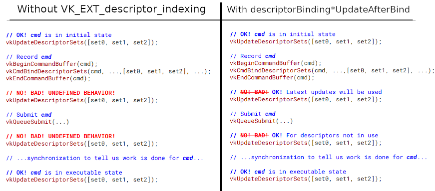

// Copyright 2019-2021 The Khronos Group, Inc.
// SPDX-License-Identifier: CC-BY-4.0

ifndef::chapters[:chapters: ../]

[[VK_EXT_descriptor_indexing]]
= VK_EXT_descriptor_indexing

[NOTE]
====
Promoted to core in Vulkan 1.2

link:https://htmlpreview.github.io/?https://github.com/KhronosGroup/SPIRV-Registry/blob/master/extensions/EXT/SPV_EXT_descriptor_indexing.html[SPV_EXT_descriptor_indexing]

link:https://github.com/KhronosGroup/GLSL/blob/master/extensions/ext/GL_EXT_nonuniform_qualifier.txt[GLSL - GL_EXT_nonuniform_qualifier]

Presentation from Montreal Developer Day (link:https://www.youtube.com/watch?v=tXipcoeuNh4[video] and link:https://www.khronos.org/assets/uploads/developers/library/2018-vulkan-devday/11-DescriptorUpdateTemplates.pdf[slides])
====

This extension was designed to be broken down into a few different, smaller features to allow implementations to add support for the each feature when possible.

== Update after Bind

Without this extension, descriptors in an application are not allowed to update between recording the command buffer and the execution of the command buffers. With this extension an application can querying for `descriptorBinding*UpdateAfterBind` support for the type of descriptor being used which allows an application to then update in between recording and execution.

[NOTE]
.Example
====
If an application has a `StorageBuffer` descriptor, then it will query for `descriptorBindingStorageBufferUpdateAfterBind` support.
====

After enabling the desired feature support for updating after bind, an application needs to setup the following in order to use a descriptor that can update after bind:

  * The `VK_DESCRIPTOR_POOL_CREATE_UPDATE_AFTER_BIND_BIT_EXT` flag for any `VkDescriptorPool` the descriptor is allocated from.
  * The `VK_DESCRIPTOR_SET_LAYOUT_CREATE_UPDATE_AFTER_BIND_POOL_BIT_EXT` flag for any `VkDescriptorSetLayout` the descriptor is from.
  * The `VK_DESCRIPTOR_BINDING_UPDATE_AFTER_BIND_BIT_EXT` for each binding in the `VkDescriptorSetLayout` that the descriptor will use.

The following code example gives an idea of the difference between enabling update after bind and without it:

== Partially bound

With the `descriptorBindingPartiallyBound` feature and using `VK_DESCRIPTOR_BINDING_PARTIALLY_BOUND_BIT_EXT` in the `VkDescriptorSetLayoutBindingFlagsCreateInfo::pBindingFlags` an application developer isn't required to update all the descriptors at time of use.

An example would be if an application's GLSL has

[source,glsl]
----
layout(set = 0, binding = 0) uniform sampler2D textureSampler[64];
----

but only binds the first 32 slots in the array. This also relies on the the application knowing that it will not index into the unbound slots in the array.

== Dynamic Indexing

Normally when an application indexes into an array of bound descriptors the index needs to be known at compile time. With the `shader*ArrayDynamicIndexing` feature, a certain type of descriptor can be indexed by "`dynamically uniform`" integers. This was already supported as a `VkPhysicalDeviceFeatures` for most descriptors, but this extension adds `VkPhysicalDeviceDescriptorIndexingFeatures` struct that lets implementations expose support for dynamic uniform indexing of input attachments, uniform texel buffers, and storage texel buffers as well.

The key word here is "`uniform`" which means that all invocations in a SPIR-V Invocation Group need to all use the same dynamic index. This translates to either all invocations in a single `vkCmdDraw*` call or a single workgroup of a `vkCmdDispatch*` call.

An example of dynamic uniform indexing in GLSL

[source,glsl]
----
layout(set = 0, binding = 0) uniform sampler2D mySampler[64];
layout(set = 0, binding = 1) uniform UniformBufferObject {
    int textureId;
} ubo;

// ...

void main() {
    // ...
    vec4 samplerColor = texture(mySampler[ubo.textureId], uvCoords);
    // ...
}
----

This example is "`dynamic`" as it is will not be known until runtime what the value of `ubo.textureId` is. This is also "`uniform`" as all invocations will use `ubo.textureId` in this shader.

== Dynamic Non-Uniform Indexing

To be dynamically **non-uniform** means that it is possible that invocations might index differently into an array of descriptors, but it won't be known until runtime. This extension exposes in `VkPhysicalDeviceDescriptorIndexingFeatures` a set of `shader*ArrayNonUniformIndexing` feature bits to show which descriptor types an implementation supports dynamic non-uniform indexing for. The SPIR-V extension adds a `NonUniform` decoration which can be set in GLSL with the help of the `nonuniformEXT` keyword added.

An example of dynamic non-uniform indexing in GLSL

[source,glsl]
----
#version450
#extension GL_EXT_nonuniform_qualifier : enable

layout(set = 0, binding = 0) uniform sampler2D mySampler[64];
layout(set = 0, binding = 1) uniform UniformBufferObject {
    int textureId;
} ubo;

// ...

void main() {
    // ...
    if (uvCoords.x > runtimeThreshold) {
        index = 0;
    } else {
        index = 1;
    }
    vec4 samplerColor = texture(mySampler[nonuniformEXT(index)], uvCoords);
    // ...
}
----

This example is non-uniform as some invocations index a `mySampler[0]` and some at `mySampler[1]`. The `nonuniformEXT()` is needed in this case.
