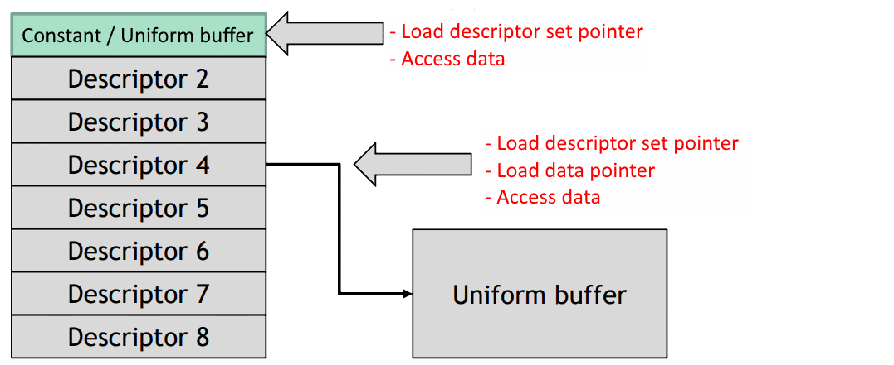

# VK_EXT_inline_uniform_block

For a common implementation, descriptors are just a table to indirectly point to the data that was bound to it during the recording of the command buffer. The issue is that not all descriptors are created equally, for example, one descriptor might only be a few DWORDS in size.

Using `VK_EXT_inline_uniform_block` gives an implementation the opportunity to reduce the number of indirections an implementation takes to access uniform values, when only a few values are used. Unlike push constants, this data can be reused across multiple disjoint sets of draws/dispatches.

## Suggestions

- Make sure to check the `VkPhysicalDeviceInlineUniformBlockPropertiesEXT` struct for the limitation for the implementation's usage of inline uniform blocks.
- Don't overdo the usage of inlining, otherwise the driver may need to repack them into a buffer, adding CPU overhead and losing the indirection benefit - aim for no more than a few dwords.