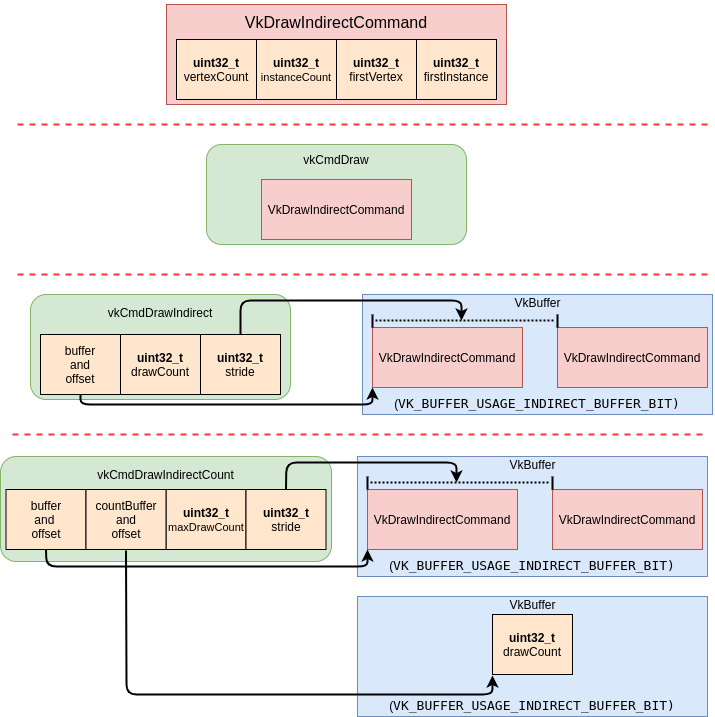

# VK_KHR_draw_indirect_count

> Promoted to core in Vulkan 1.2

With every `vkCmdDraw` consumes some parameters. To batch draw calls together the same parameters are stored in a `VkBuffer` in blocks of `VkDrawIndirectCommand`. Using `vkCmdDrawIndirect` allows you to invoke a `drawCount` number of draws, but the `drawCount` is needed at record time. The new `vkCmdDrawIndirectCount` call allows the `drawCount` to also be in a `VkBuffer`. This allows the value of `drawCount` to be dynamic and decided when the draw call is executed.

> The `vkCmdDrawIndirectCount` and `vkCmdDrawIndexedIndirectCount` function can be used if the extension is supported or checking the `VkPhysicalDeviceVulkan12Features::drawIndirectCount` feature bit.

The following diagram is to visualize the difference between `vkCmdDraw`, `vkCmdDrawIndirect`, and `vkCmdDrawIndirectCount`.

