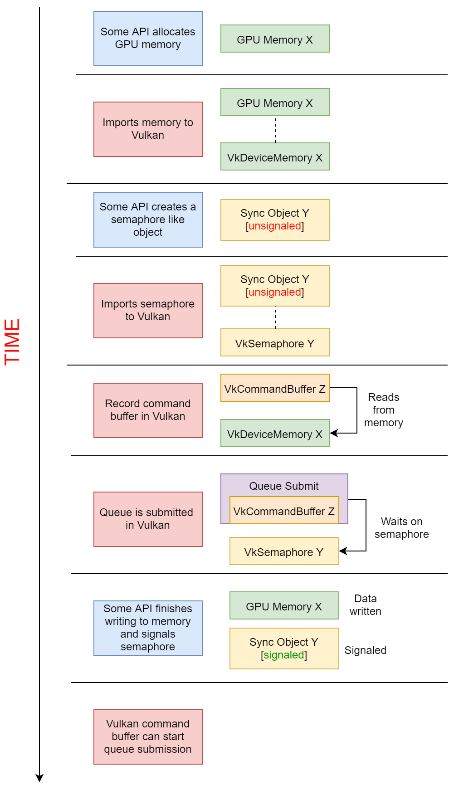

# VK_KHR_external_***

Sometimes not everything an application does related to the GPU is done in Vulkan. There are various situations where memory is written or read outside the scope of Vulkan. To support these use cases a set of external memory and synchronization functions was created

The list of extensions involved are:

- `VK_KHR_external_fence`
    - Promoted to core in 1.1
- `VK_KHR_external_fence_capabilities`
    - Promoted to core in 1.1
- `VK_KHR_external_memory`
    - Promoted to core in 1.1
- `VK_KHR_external_memory_capabilities`
    - Promoted to core in 1.1
- `VK_KHR_external_semaphore`
    - Promoted to core in 1.1
- `VK_KHR_external_semaphore_capabilities`
    - Promoted to core in 1.1
- `VK_KHR_external_fence_fd`
- `VK_KHR_external_fence_win32`
- `VK_KHR_external_memory_fd`
- `VK_KHR_external_memory_win32`
- `VK_KHR_external_semaphore_fd`
- `VK_KHR_external_semaphore_win32`
- `VK_ANDROID_external_memory_android_hardware_buffer`

This seems like a lot so let's break it down little by little

# Capabilities

The `VK_KHR_external_fence_capabilities`, `VK_KHR_external_semaphore_capabilities`, and `VK_KHR_external_memory_capabilities` are simply just ways to query information about what external support an implementation provides.

# Memory vs Synchronization

There is a set of extension to handle the importing/exporting of just the memory itself. The other set extensions are for the synchronization primitives (`VkFence` and `VkSemaphore`) used to control internal Vulkan commands. It is common practice that for each piece of memory imported/exported there is also a matching fence/semaphore to manage the memory access.

## Memory

The `VK_KHR_external_memory` extension is mainly to provide the `VkExternalMemoryHandleTypeFlagBits` enum which describes the type of memory being used externally.

There are currently 3 supported ways to import/export memory

- `VK_KHR_external_memory_fd` for memory in a POSIX file descriptor
- `VK_KHR_external_memory_win32` for memory in a Windows handle
- `VK_ANDROID_external_memory_android_hardware_buffer` for memory in a AHardwareBuffer

Each of these methods has their own detailed descriptions about limitations, requirements, ownership, etc.

### Importing Memory

The import memory, there is a `VkImport*Info` struct provided by the given external memory extension. This is passed into `vkAllocateMemory` where Vulkan will now have a `VkDeviceMemory` handle that maps to the imported memory.

### Exporting Memory

The export memory, there is a `VkGetMemory*` function provided by the given external memory extension. This function will take in a `VkDeviceMemory` handle and then map that to the extension exposed object.

## Synchronization

External synchronization can be used in Vulkan for both `VkFence` and `VkSemaphores`. There is almost no difference between the two with regards to how it is used to import and export them.

The `VK_KHR_external_fence` and `VK_KHR_external_semaphore` extension both expose a `Vk*ImportFlagBits` enum and `VkExport*CreateInfo` struct to describe the type a synchronization being imported/exported.

There are currently 2 supported ways to import/export synchronization

- `VK_KHR_external_fence_fd` / `VK_KHR_external_semaphore_fd`
- `VK_KHR_external_fence_win32` / `VK_KHR_external_semaphore_win32`

Each extension explains how it manages ownership of the synchronization primitives.

### Importing and Exporting Synchronization Primitives

There is a `VkImport*` function for importing and a `VkGet*` function for exporting. These both take the `VkFence`/`VkSemaphores` handle passed in along with the extension's method of defining the external synchronization object.

# Example

Here is a simple diagram showing the timeline of events between Vulkan and some other API talking to the GPU. This is used to represent a common use case for these external memory and synchronization extensions.

