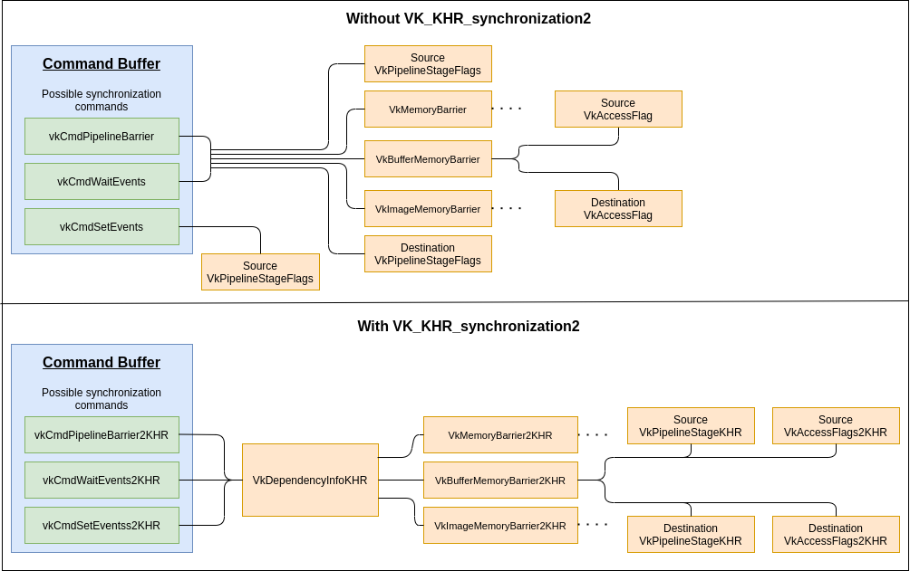

// Copyright 2019-2022 The Khronos Group, Inc.
// SPDX-License-Identifier: CC-BY-4.0

ifndef::chapters[:chapters: ../]

[[VK_KHR_synchronization2]]
= VK_KHR_synchronization2

[NOTE]
====
Promoted to core in Vulkan 1.3
====

The `VK_KHR_synchronization2` extension provides improvements to pipeline barriers, events, image layout transitions and queue submission. This document shows the difference between the original Vulkan synchronization operations and those provided by the extension. There are also examples of how to update application code to make use of the extension.

== Rethinking Pipeline Stages and Access Flags

One main change with the extension is to have pipeline stages and access flags now specified together in memory barrier structures. This makes the connection between the two more obvious.

The only new type of structure needed is `VkDependencyInfoKHR`, which wraps all the barriers into a single location.

=== Adding barriers for setting events

Note that with the introduction of `VkDependencyInfoKHR` that `vkCmdSetEvent2KHR`, unlike `vkCmdSetEvent`, has the ability to add barriers. This was added to allow the `VkEvent` to be more useful. Because the implementation of a synchronization2 `VkEvent` is likely to be substantially different from a Vulkan 1.2 `VkEvent`, you must not mix extension and core api calls for a single `VkEvent`. For example, you must not call `vkCmdSetEvent2KHR()` and then `vkCmdWaitEvents()`.

== Reusing the same pipeline stage and access flag names

Due to running out of the 32 bits for `VkAccessFlag` the `VkAccessFlags2KHR` type was created with a 64-bit range. To prevent the same issue for `VkPipelineStageFlags`, the `VkPipelineStageFlags2KHR` type was also created with a 64-bit range.

64-bit enumeration types are not available in all C/C++ compilers, so the code for the new fields uses `static const` values instead of an enum. As a result of this, there are no equivalent types to `VkPipelineStageFlagBits` and `VkAccessFlagBits`. Some code, including Vulkan functions such as `vkCmdWriteTimestamp()`, used the `Bits` type to indicate that the caller could only pass in a single bit value, rather than a mask of multiple bits. These calls need to be converted to take the `Flags` type and enforce the "`only 1-bit`" limitation via Valid Usage or the appropriate coding convention for your own code, as was done for `vkCmdWriteTimestamp2KHR()`.

The new flags include identical bits to the original synchronization flags, with the same base name and identical values.
Old flags can be used directly in the new APIs, subject to any typecasting constraints of the coding environment.
The following 2 examples show the naming differences:

  * `VK_PIPELINE_STAGE_COMPUTE_SHADER_BIT` to `VK_PIPELINE_STAGE_2_COMPUTE_SHADER_BIT_KHR`
  * `VK_ACCESS_SHADER_READ_BIT` to `VK_ACCESS_2_SHADER_READ_BIT_KHR`

== VkSubpassDependency

Updating the use of the pipeline stages and access flags in `VkSubpassDependency` requires simply using `VkSubpassDependency2` which can have a `VkMemoryBarrier2KHR` passed in the `pNext`

Example would be taking

[source,cpp]
----
// Without VK_KHR_synchronization2
VkSubpassDependency dependency = {
    .srcSubpass = 0,
    .dstSubpass = 1,
    .srcStageMask = VK_PIPELINE_STAGE_EARLY_FRAGMENT_TESTS_BIT |
                    VK_PIPELINE_STAGE_LATE_FRAGMENT_TESTS_BIT,
    .dstStageMask = VK_PIPELINE_STAGE_FRAGMENT_SHADER_BIT,
    .srcAccessMask = VK_ACCESS_DEPTH_STENCIL_ATTACHMENT_WRITE_BIT,
    .dstAccessMask = VK_ACCESS_INPUT_ATTACHMENT_READ_BIT,
    .dependencyFlags = VK_DEPENDENCY_BY_REGION_BIT
};
----

and turning it into

[source,cpp]
----
// With VK_KHR_synchronization2
VkMemoryBarrier2KHR memoryBarrier = {
    .sType = VK_STRUCTURE_TYPE_MEMORY_BARRIER_2_KHR,
    .pNext = nullptr,
    .srcStageMask = VK_PIPELINE_STAGE_2_EARLY_FRAGMENT_TESTS_BIT_KHR |
                    VK_PIPELINE_STAGE_2_LATE_FRAGMENT_TESTS_BIT_KHR,
    .dstStageMask = VK_PIPELINE_STAGE_2_FRAGMENT_SHADER_BIT_KHR,
    .srcAccessMask = VK_ACCESS_2_DEPTH_STENCIL_ATTACHMENT_WRITE_BIT_KHR,
    .dstAccessMask = VK_ACCESS_2_INPUT_ATTACHMENT_READ_BIT_KHR
}

// The 4 fields unset are ignored according to the spec
// When VkMemoryBarrier2KHR is passed into pNext
VkSubpassDependency2 dependency = {
    .sType = VK_STRUCTURE_TYPE_SUBPASS_DEPENDENCY_2,
    .pNext = &memoryBarrier,
    .srcSubpass = 0,
    .dstSubpass = 1,
    .dependencyFlags = VK_DEPENDENCY_BY_REGION_BIT
};
----

== Splitting up pipeline stages and access masks

Some `VkAccessFlags` and `VkPipelineStageFlags` had values that were ambiguous to what it was targeting in hardware. The new `VkAccessFlags2KHR` and `VkPipelineStageFlags2KHR` break these up for some cases while leaving the old value for maintability.

=== Splitting up VK_PIPELINE_STAGE_VERTEX_INPUT_BIT

The `VK_PIPELINE_STAGE_VERTEX_INPUT_BIT` (now `VK_PIPELINE_STAGE_2_VERTEX_INPUT_BIT_KHR`) was split into 2 new stage flags which specify a dedicated stage for both the index input and the vertex input instead of having them combined into a single pipeline stage flag.

  * `VK_PIPELINE_STAGE_2_INDEX_INPUT_BIT_KHR`
  * `VK_PIPELINE_STAGE_2_VERTEX_ATTRIBUTE_INPUT_BIT_KHR`

=== Splitting up VK_PIPELINE_STAGE_ALL_TRANSFER_BIT

The `VK_PIPELINE_STAGE_ALL_TRANSFER_BIT` (now `VK_PIPELINE_STAGE_2_ALL_TRANSFER_BIT_KHR`) was split into 4 new stage flags which specify a dedicated stage for the various staging commands instead of having them combined into a single pipeline stage flag.

  * `VK_PIPELINE_STAGE_2_COPY_BIT_KHR`
  * `VK_PIPELINE_STAGE_2_RESOLVE_BIT_KHR`
  * `VK_PIPELINE_STAGE_2_BLIT_BIT_KHR`
  * `VK_PIPELINE_STAGE_2_CLEAR_BIT_KHR`

=== Splitting up VK_ACCESS_SHADER_READ_BIT

The `VK_ACCESS_SHADER_READ_BIT` (now `VK_ACCESS_2_SHADER_READ_BIT_KHR`) was split into 3 new access flags which specify a dedicated access for the various case instead of having them combined into a single access flag.

  * `VK_ACCESS_2_UNIFORM_READ_BIT_KHR`
  * `VK_ACCESS_2_SHADER_SAMPLED_READ_BIT_KHR`
  * `VK_ACCESS_2_SHADER_STORAGE_READ_BIT_KHR`

=== Combining shader stages for pre-rasterization

Besides splitting up flags, the `VK_PIPELINE_STAGE_2_PRE_RASTERIZATION_SHADERS_BIT_KHR` was added to combine shader stages that occurs before rasterization in a single, convenient flag.

== VK_ACCESS_SHADER_WRITE_BIT alias

The `VK_ACCESS_SHADER_WRITE_BIT` (now `VK_ACCESS_2_SHADER_WRITE_BIT_KHR`) was given an alias of `VK_ACCESS_2_SHADER_STORAGE_WRITE_BIT_KHR` to better describe the scope of what resources in the shader are described by the access flag.

== TOP_OF_PIPE and BOTTOM_OF_PIPE deprecation

The use of `VK_PIPELINE_STAGE_TOP_OF_PIPE_BIT` and `VK_PIPELINE_STAGE_BOTTOM_OF_PIPE_BIT` are now deprecated and updating is simple as following the following 4 case with the new equivalents.

  * `VK_PIPELINE_STAGE_TOP_OF_PIPE_BIT` in first synchronization scope
+
[source,cpp]
----
// From
  .srcStageMask = VK_PIPELINE_STAGE_TOP_OF_PIPE_BIT;

// To
  .srcStageMask = VK_PIPELINE_STAGE_2_NONE_KHR;
  .srcAccessMask = VK_ACCESS_2_NONE_KHR;
----

  * `VK_PIPELINE_STAGE_TOP_OF_PIPE_BIT` in second synchronization scope
+
[source,cpp]
----
// From
  .dstStageMask = VK_PIPELINE_STAGE_TOP_OF_PIPE_BIT;

// To
  .dstStageMask = VK_PIPELINE_STAGE_2_ALL_COMMANDS_BIT_KHR;
  .dstAccessMask = VK_ACCESS_2_NONE_KHR;
----

  * `VK_PIPELINE_STAGE_BOTTOM_OF_PIPE_BIT` in first synchronization scope
+
[source,cpp]
----
// From
  .srcStageMask = VK_PIPELINE_STAGE_BOTTOM_OF_PIPE_BIT;

// To
  .srcStageMask = VK_PIPELINE_STAGE_2_ALL_COMMANDS_BIT_KHR;
  .srcAccessMask = VK_ACCESS_2_NONE_KHR;
----

  * `VK_PIPELINE_STAGE_BOTTOM_OF_PIPE_BIT` in second synchronization scope
+
[source,cpp]
----
// From
  .dstStageMask = VK_PIPELINE_STAGE_BOTTOM_OF_PIPE_BIT;

// To
  .dstStageMask = VK_PIPELINE_STAGE_2_NONE_KHR;
  .dstAccessMask = VK_ACCESS_2_NONE_KHR;
----

== Making use of new image layouts

`VK_KHR_synchronization2` adds 2 new image layouts `VK_IMAGE_LAYOUT_ATTACHMENT_OPTIMAL_KHR` and `VK_IMAGE_LAYOUT_READ_ONLY_OPTIMAL_KHR` to help with making layout transition easier.

The following uses the example of doing a draw thats writes to both a color attachment and depth/stencil attachment which then are both sampled in the next draw. Prior a developer needed to make sure they matched up the layouts and access mask correctly such as the following:

[source,cpp]
----
VkImageMemoryBarrier colorImageMemoryBarrier = {
  .srcAccessMask = VK_ACCESS_COLOR_ATTACHMENT_WRITE_BIT,
  .dstAccessMask = VK_ACCESS_SHADER_READ_BIT,
  .oldLayout = VK_IMAGE_LAYOUT_COLOR_ATTACHMENT_OPTIMAL,
  .newLayout = VK_IMAGE_LAYOUT_SHADER_READ_ONLY_OPTIMAL
};

VkImageMemoryBarrier depthStencilImageMemoryBarrier = {
  .srcAccessMask = VK_ACCESS_DEPTH_STENCIL_ATTACHMENT_WRITE_BIT,,
  .dstAccessMask = VK_ACCESS_SHADER_READ_BIT,
  .oldLayout = VK_IMAGE_LAYOUT_DEPTH_STENCIL_ATTACHMENT_OPTIMAL,
  .newLayout = VK_IMAGE_LAYOUT_SHADER_READ_ONLY_OPTIMAL
};
----

but with `VK_KHR_synchronization2` this is made simple

[source,cpp]
----
VkImageMemoryBarrier colorImageMemoryBarrier = {
  .srcAccessMask = VK_ACCESS_2_COLOR_ATTACHMENT_WRITE_BIT_KHR,
  .dstAccessMask = VK_ACCESS_2_SHADER_READ_BIT_KHR,
  .oldLayout = VK_IMAGE_LAYOUT_ATTACHMENT_OPTIMAL_KHR, // new layout from VK_KHR_synchronization2
  .newLayout = VK_IMAGE_LAYOUT_READ_ONLY_OPTIMAL_KHR   // new layout from VK_KHR_synchronization2
};

VkImageMemoryBarrier depthStencilImageMemoryBarrier = {
  .srcAccessMask = VK_ACCESS_2_DEPTH_STENCIL_ATTACHMENT_WRITE_BIT_KHR,,
  .dstAccessMask = VK_ACCESS_2_SHADER_READ_BIT_KHR,
  .oldLayout = VK_IMAGE_LAYOUT_ATTACHMENT_OPTIMAL_KHR, // new layout from VK_KHR_synchronization2
  .newLayout = VK_IMAGE_LAYOUT_READ_ONLY_OPTIMAL_KHR   // new layout from VK_KHR_synchronization2
};
----

In the new case `VK_IMAGE_LAYOUT_ATTACHMENT_OPTIMAL_KHR` works by contextually appling itself based on the image format used. So as long as `colorImageMemoryBarrier` is used on a color format, `VK_IMAGE_LAYOUT_ATTACHMENT_OPTIMAL_KHR` maps to `VK_IMAGE_LAYOUT_COLOR_ATTACHMENT_OPTIMAL`

Additionally, with `VK_KHR_synchronization2`, if `oldLayout` is equal to `newLayout`, no layout transition is performed and the image contents are preserved.  The layout used does not even need to match the layout of an image, so the following barrier is valid:

[source,cpp]
----
VkImageMemoryBarrier depthStencilImageMemoryBarrier = {
  // other fields omitted
  .oldLayout = VK_IMAGE_LAYOUT_UNDEFINED,
  .newLayout = VK_IMAGE_LAYOUT_UNDEFINED,
};
----

== New submission flow

`VK_KHR_synchronization2` adds the `vkQueueSubmit2KHR` command which main goal is to clean up the syntax for the function to wrap command buffers and semaphores in extensible structures, which incorporate changes from Vulkan 1.1, `VK_KHR_device_group`, and `VK_KHR_timeline_semaphore`.

Taking the following example of a normal queue submission call

[source,cpp]
----
VkSemaphore waitSemaphore;
VkSemaphore signalSemaphore;
VkCommandBuffer commandBuffers[8];

// Possible pNext from VK_KHR_timeline_semaphore
VkTimelineSemaphoreSubmitInfo timelineSemaphoreSubmitInfo = {
    // ...
    .pNext = nullptr
};

// Possible pNext from VK_KHR_device_group
VkDeviceGroupSubmitInfo deviceGroupSubmitInfo = {
    // ...
    .pNext = &timelineSemaphoreSubmitInfo
};

// Possible pNext from Vulkan 1.1
VkProtectedSubmitInfo = protectedSubmitInfo {
    // ...
    .pNext = &deviceGroupSubmitInfo
};

VkSubmitInfo submitInfo = {
    .pNext = &protectedSubmitInfo, // Chains all 3 extensible structures
    .waitSemaphoreCount = 1,
    .pWaitSemaphores = &waitSemaphore,
    .pWaitDstStageMask = VK_PIPELINE_STAGE_COLOR_ATTACHMENT_OUTPUT_BIT
    .commandBufferCount = 8,
    .pCommandBuffers = commandBuffers,
    .signalSemaphoreCount = 1,
    .pSignalSemaphores = signalSemaphore
};

vkQueueSubmit(queue, 1, submitInfo, fence);
----

this can now be transformed to `vkQueueSubmit2KHR` as

[source,cpp]
----
// Uses same semaphore and command buffer handles
VkSemaphore waitSemaphore;
VkSemaphore signalSemaphore;
VkCommandBuffer commandBuffers[8];

VkSemaphoreSubmitInfoKHR waitSemaphoreSubmitInfo = {
    .semaphore = waitSemaphore,
    .value = 1, // replaces VkTimelineSemaphoreSubmitInfo
    .stageMask = VK_PIPELINE_STAGE_2_COLOR_ATTACHMENT_OUTPUT_BIT_KHR,
    .deviceIndex = 0, // replaces VkDeviceGroupSubmitInfo
};

// Note this is allowing a stage to set the signal operation
VkSemaphoreSubmitInfoKHR signalSemaphoreSubmitInfo = {
    .semaphore = waitSemaphore,
    .value = 2, // replaces VkTimelineSemaphoreSubmitInfo
    .stageMask = VK_PIPELINE_STAGE_2_VERTEX_SHADER_BIT_KHR, // when to signal semaphore
    .deviceIndex = 0, // replaces VkDeviceGroupSubmitInfo
};

// Need one for each VkCommandBuffer
VkCommandBufferSubmitInfoKHR = commandBufferSubmitInfos[8] {
    // ...
    {
        .commandBuffer = commandBuffers[i],
        .deviceMask = 0 // replaces VkDeviceGroupSubmitInfo
    },
};

VkSubmitInfo2KHR submitInfo = {
    .pNext = nullptr, // All 3 struct above are built into VkSubmitInfo2KHR
    .flags = VK_SUBMIT_PROTECTED_BIT_KHR, // also can be zero, replaces VkProtectedSubmitInfo
    .waitSemaphoreInfoCount = 1,
    .pWaitSemaphoreInfos = waitSemaphoreSubmitInfo,
    .commandBufferInfoCount = 8,
    .pCommandBufferInfos = commandBufferSubmitInfos,
    .signalSemaphoreInfoCount = 1,
    .pSignalSemaphoreInfos = signalSemaphoreSubmitInfo
}

vkQueueSubmit2KHR(queue, 1, submitInfo, fence);
----

The difference between the two examples code snippets above is that the `vkQueueSubmit2KHR` will signal `VkSemaphore signalSemaphore` when the vertex shader stage is complete compared to the `vkQueueSubmit` call which will wait until the end of the submission.

To emulate the same behavior of semaphore signaling from `vkQueueSubmit` in `vkQueueSubmit2KHR` the `stageMask` can be set to `VK_PIPELINE_STAGE_2_ALL_COMMANDS_BIT`

[source,cpp]
----
// Waits until everything is done
VkSemaphoreSubmitInfoKHR signalSemaphoreSubmitInfo = {
    // ...
    .stageMask = VK_PIPELINE_STAGE_2_ALL_COMMANDS_BIT,
    // ...
};
----

== Emulation Layer

For devices that do not natively support this extension, there is a portable implementation in the link:https://github.com/KhronosGroup/Vulkan-ExtensionLayer[Vulkan-Extensionlayer] repository.   This layer should work with any Vulkan device. For more information see the link:https://github.com/KhronosGroup/Vulkan-ExtensionLayer/blob/master/docs/synchronization2_layer.md[layer documentation] and the link:https://github.com/KhronosGroup/Vulkan-ExtensionLayer/blob/bd8a72b14c67d011561cd795d777fb838c926e0f/tests/synchronization2_tests.cpp#L1243[Sync2Compat.Vulkan10] test case.

[NOTE]
====
The `VK_KHR_synchronization2` specification lists `VK_KHR_create_renderpass2` and `VK_KHR_get_phyiscal_device_properties2` as requirements. As a result, using synchronization2 without these extensions may result in validation errors. The extension requirements are being reevaluated and validation will be adjusted once this is complete.
====