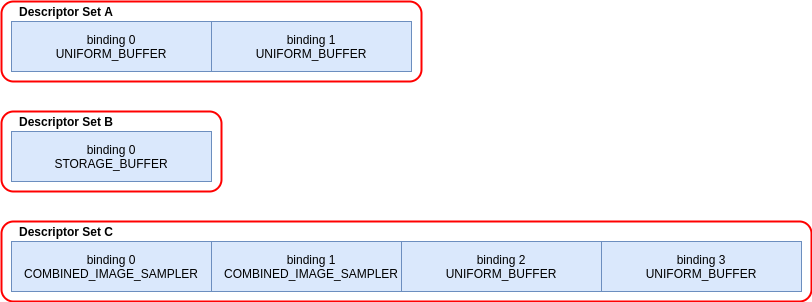
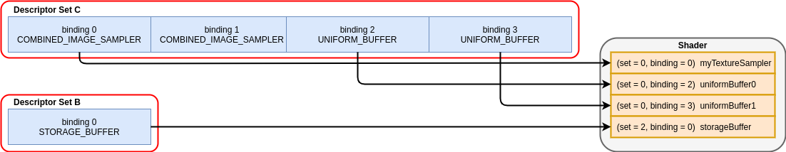

# Mapping Data to Shaders

> Note: All SPIR-V assembly was generated with glslangValidator

This chapter goes over how to [interface Vulkan with SPIR-V](https://www.khronos.org/registry/vulkan/specs/1.2-extensions/html/vkspec.html#interfaces) in order to map data. Using the `VkDeviceMemory` objects allocated from `vkAllocateMemory`, it is up to the application to properly map the data from Vulkan such that the SPIR-V shader understands how to consume it correctly.

In core Vulkan, there are 5 fundamental ways to map data from your Vulkan application to interface with SPIR-V:

- [Input Attributes](#input-attributes)
- [Descriptors](#descriptors)
- [Push Constants](#push-constants)
- [Specialization Constants](#specialization-constants)
- [Physical Storage Buffer](#physical-storage-buffer)

## Input Attributes

The only shader stage in core Vulkan that has an input attribute controlled by Vulkan is the vertex shader stage (`VK_SHADER_STAGE_VERTEX_BIT`). This involves declaring the interface slots when creating the `VkPipeline` and then binding the `VkBuffer` before draw time with the data to map. Other shaders stages, such as a fragment shader stage, has input attributes, but the values are determined from the output of the previous stages ran before it.

Before calling `vkCreateGraphicsPipelines` a `VkPipelineVertexInputStateCreateInfo` struct will need to be filled out with a list of `VkVertexInputAttributeDescription` mappings to the shader.

An example GLSL vertex shader:

```glsl
#version 450
layout(location = 0) in vec3 inPosition;

void main() {
    gl_Position = vec4(inPosition, 1.0);
}
```

There is only a single input attribute at location 0. This can also be seen in the generated SPIR-V assembly:

```
                Name 18  "inPosition"
                Decorate 18(inPosition) Location 0

            17: TypePointer Input 16(fvec3)
18(inPosition): 17(ptr) Variable Input
            19: 16(fvec3) Load 18(inPosition)
```

In this example, the following could be used for the `VkVertexInputAttributeDescription`:

```c
VkVertexInputAttributeDescription input = {};
input.location = 0;
input.binding  = 0;
input.format   = VK_FORMAT_R32G32B32_SFLOAT; // maps to vec3
input.offset   = 0;
```

The only thing left to do is bind the vertex buffer and optional index buffer prior to the draw call.

> Note: Using `VK_BUFFER_USAGE_VERTEX_BUFFER_BIT` when creating the `VkBuffer` is what makes it a "vertex buffer"

```c
vkBeginCommandBuffer();
// ...
vkCmdBindVertexBuffer();
vkCmdDraw();
// ...
vkCmdBindVertexBuffer();
vkCmdBindIndexBuffer();
vkCmdDrawIndexed();
// ...
vkEndCommandBuffer();
```

> More information can be found in the [Vertex Input Data Processing](vertex_input_data_processing.md) chapter

## Descriptors

A [resource descriptor](https://www.khronos.org/registry/vulkan/specs/1.2-extensions/html/vkspec.html#descriptorsets) is the core way to map data such as uniform buffers, storage buffers, samplers, etc. to any shader stage in Vulkan. One way to conceptualize a descriptor is by thinking of it as a pointer to memory that the shader can use.

There are various [descriptor types](https://www.khronos.org/registry/vulkan/specs/1.2-extensions/html/vkspec.html#VkDescriptorType) in Vulkan, each with their own [detailed description](https://www.khronos.org/registry/vulkan/specs/1.2-extensions/html/vkspec.html#descriptorsets-types) in what they allow.

Descriptors are grouped together in [descriptor sets](https://www.khronos.org/registry/vulkan/specs/1.2-extensions/html/vkspec.html#descriptorsets-sets) which get bound to the shader. Even if there is only a single descriptor in the descriptor set, the entire `VkDescriptorSet` is used when binding to the shader.

### Example

In this example, there are the following 3 descriptor sets:



The GLSL of the shader:

```glsl
#version 450

layout(set = 0, binding = 0) uniform sampler2D myTextureSampler;

layout(set = 0, binding = 2) uniform uniformBuffer0 {
    float someData;
} ubo_0;

layout(set = 0, binding = 3) uniform uniformBuffer1 {
    float moreData;
} ubo_1;

layout(set = 2, binding = 0) buffer storageBuffer {
    float myResults;
} ssbo;
```

The corresponding SPIR-V assembly:

```
Decorate 19(myTextureSampler) DescriptorSet 0
Decorate 19(myTextureSampler) Binding 0

MemberDecorate 29(uniformBuffer0) 0 Offset 0
Decorate 29(uniformBuffer0) Block
Decorate 31(ubo_0) DescriptorSet 0
Decorate 31(ubo_0) Binding 2

MemberDecorate 38(uniformBuffer1) 0 Offset 0
Decorate 38(uniformBuffer1) Block
Decorate 40(ubo_1) DescriptorSet 0
Decorate 40(ubo_1) Binding 3

MemberDecorate 44(storageBuffer) 0 Offset 0
Decorate 44(storageBuffer) BufferBlock
Decorate 46(ssbo) DescriptorSet 2
Decorate 46(ssbo) Binding 0
```

The binding of descriptors is done while recording the command buffer. The descriptors must be bound at the time of a draw/dispatch call. The following is some pseudo code to better represent this:

```c
vkBeginCommandBuffer();
// ...
vkCmdBindPipeline(); // Binds shader

// One possible way of binding the two sets
vkCmdBindDescriptorSets(firstSet = 0, pDescriptorSets = &descriptor_set_c);
vkCmdBindDescriptorSets(firstSet = 2, pDescriptorSets = &descriptor_set_b);

vkCmdDraw(); // or dispatch
// ...
vkEndCommandBuffer();
```

The following results would look as followed



## Push Constants

A push constant is a small bank of values accessible in shaders. Push constants allow the application to set values used in shaders without creating buffers or modifying and binding descriptor sets for each update.

These are designed for small amount (a few dwords) of high frequency data to be updated per-recording of the command buffer.

From a shader perspective, it is similar to a uniform buffer.

```glsl
#version 450

layout(push_constant) uniform myPushConstants {
    vec4 myData;
} myData;
```

Resulting SPIR-V assembly:

```
MemberDecorate 13(myPushConstants) 0 Offset 0
Decorate 13(myPushConstants) Block
```

While recording the command buffer the values of the push constants are decided.

```c
vkBeginCommandBuffer();
// ...
vkCmdBindPipeline();

float someData[4] = {0.0, 1.0, 2.0, 3.0};
vkCmdPushConstants(sizeof(float) * 4, someData);

vkCmdDraw();
// ...
vkEndCommandBuffer();
```

## Specialization Constants

[Specialization constants](https://www.khronos.org/registry/vulkan/specs/1.2-extensions/html/vkspec.html#pipelines-specialization-constants) are a mechanism allowing a constant value in SPIR-V to be specified at `VkPipeline` creation time. This is powerful as it replaces the idea of doing preprocessor macros in the high level shading language (GLSL, HLSL, etc).

### Example

If an application wants to create to `VkPipeline` where the color value is different for each, a naive approach is to have two shaders:

```glsl
// shader_a.frag
#version 450
layout(location = 0) out vec4 outColor;

void main() {
    outColor = vec4(0.0);
}
```

```glsl
// shader_b.frag
#version 450
layout(location = 0) out vec4 outColor;

void main() {
    outColor = vec4(1.0);
}
```

Using specialization constants, the decision can instead be made when calling `vkCreateGraphicsPipelines` to compile the shader. This means there only needs to be a single shader.

```glsl
#version 450
layout (constant_id = 0) const float myColor = 1.0;
layout(location = 0) out vec4 outColor;

void main() {
    outColor = vec4(myColor);
}
```

Resulting SPIR-V assembly:

```
             Decorate 9(outColor) Location 0
             Decorate 10(myColor) SpecId 0

// 0x3f800000 as decimal which is 1.0 for a 32 bit float
10(myColor): 6(float) SpecConstant 1065353216
```

With specialization constants, the value is still a constant inside the shader, but for example, if another `VkPipeline` uses the same shader, but wants to set the `myColor` value to `0.5f`, it is possible to do so at runtime.

```cpp
struct myData {
    float myColor = 1.0f;
} myData;

VkSpecializationMapEntry mapEntry = {};
mapEntry.constantID = 0; // matches constant_id in GLSL and SpecId in SPIR-V
mapEntry.offset     = 0;
mapEntry.size       = sizeof(float);

VkSpecializationInfo specializationInfo = {};
specializationInfo.mapEntryCount = 1;
specializationInfo.pMapEntries   = &mapEntry;
specializationInfo.dataSize      = sizeof(myData);
specializationInfo.pData         = &myData;

VkGraphicsPipelineCreateInfo pipelineInfo = {};
pipelineInfo.pStages[fragIndex].pSpecializationInfo = &specializationInfo;

// Create first pipeline with myColor as 1.0
vkCreateGraphicsPipelines(&pipelineInfo);

// Create second pipeline with same shader, but sets different value
myData.myColor = 0.5f;
vkCreateGraphicsPipelines(&pipelineInfo);
```

The second `VkPipeline` shader disassembled has the new constant value for `myColor` of `0.5f`.

### 3 Types of Specialization Constants Usages

The typical use cases for specialization constants can be best grouped into three different usages.

1. Toggling features
    - Support for a feature in Vulkan isn't known until runtime. This usage of specialization constants is to prevent writing two separate shaders, but instead embedding a constant runtime decision.
2. Improving backend optimizations
    - The "backend" here refers the the implementation's compiler that takes the resulting SPIR-V and lowers it down to some ISA to run on the device.
    - Constant values allow a set of optimizations such as [constant folding](https://en.wikipedia.org/wiki/Constant_folding), [dead code elimination](https://en.wikipedia.org/wiki/Dead_code_elimination), etc. to occur.
3. Affecting types and memory sizes
    - It is possible to set the length of an array or a variable type used through a specialization constant.
    - It is important to note that a compiler will need to allocate registers depending on these types and sizes. This means it is likely that a pipeline cache will fail if the difference is significant in registers allocated.

## Physical Storage Buffer

The [VK_KHR_buffer_device_address](https://www.khronos.org/registry/vulkan/specs/1.2-extensions/man/html/VK_KHR_buffer_device_address.html#_description) extension promoted to Vulkan 1.2 adds the ability to have "pointers in the shader". Using the `PhysicalStorageBuffer` storage class in SPIR-V an application can call `vkGetBufferDeviceAddress` which will return the `VkDeviceAddress` to the memory.

While this is a way to map data to the shader, it is not a way to interface with the shader. For example, if an application wants to use this with a uniform buffer it would have to create a `VkBuffer` with both `VK_BUFFER_USAGE_SHADER_DEVICE_ADDRESS_BIT` and `VK_BUFFER_USAGE_UNIFORM_BUFFER_BIT`. From here in this example, Vulkan would use a descriptor to interface with the shader, but could then use the physical storage buffer to update the value after.

## Limits

With all the above examples it is important to be aware that there are [limits in Vulkan](https://www.khronos.org/registry/vulkan/specs/1.2-extensions/html/vkspec.html#limits) that expose how much data can be bound at a single time.

- Input Attributes
  - `maxVertexInputAttributes`
  - `maxVertexInputAttributeOffset`
- Descriptors
  - `maxBoundDescriptorSets`
  - Per stage limit
    - `maxPerStageDescriptorSamplers`
    - `maxPerStageDescriptorUniformBuffers`
    - `maxPerStageDescriptorStorageBuffers`
    - `maxPerStageDescriptorSampledImages`
    - `maxPerStageDescriptorStorageImages`
    - `maxPerStageDescriptorInputAttachments`
  - Per type limit
    - `maxPerStageResources`
    - `maxDescriptorSetSamplers`
    - `maxDescriptorSetUniformBuffers`
    - `maxDescriptorSetUniformBuffersDynamic`
    - `maxDescriptorSetStorageBuffers`
    - `maxDescriptorSetStorageBuffersDynamic`
    - `maxDescriptorSetSampledImages`
    - `maxDescriptorSetStorageImages`
    - `maxDescriptorSetInputAttachments`
  - `VkPhysicalDeviceDescriptorIndexingProperties` if using [Descriptor Indexing](extensions/VK_EXT_inline_uniform_block.md)
  - `VkPhysicalDeviceInlineUniformBlockPropertiesEXT` if using [Inline Uniform Block](extensions/VK_EXT_inline_uniform_block.md)
- Push Constants
  - `maxPushConstantsSize` - guaranteed at least `128` bytes on all devices
