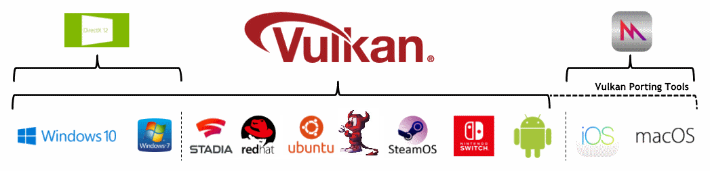

# Platforms

While Vulkan runs on many platforms, each has small variations on how Vulkan is managed.

## Android

The Vulkan API is [available](https://developer.android.com/ndk/guides/graphics/getting-started) on any Android device starting with API level 24 (Android Nougat), however not all devices will have a Vulkan driver.

Android uses its [Hardware Abstraction Layer (HAL)](https://source.android.com/devices/architecture/hal) to find the Vulkan Driver in a [predefined path](https://source.android.com/devices/graphics/implement-vulkan#driver_emun).

All 64-bit devices that launch with API level 29 (Android Q) or later must include a Vulkan 1.1 driver.

## iOS

Vulkan is not natively supported on iOS, but can still be targeted with [Vulkan Portability Tools](./portability_initiative.md).

## Linux

Vulkan is supported on many Linux distributions.

## MacOS

Vulkan is not natively supported on MacOS, but can still be targeted with [Vulkan Portability Tools](./portability_initiative.md).

## Nintendo Switch

The Nintendo Switch runs an NVIDIA Tegra chipset that supports native Vulkan.

## Stadia

Google's Stadia runs on AMD based Linux machines and Vulkan is the required graphics API.

## Windows

Vulkan is supported on Windows 7, Windows 8, and Windows 10.

## Others

Some embedded systems support Vulkan by allowing presentation [directly-to-display](https://www.khronos.org/registry/vulkan/specs/1.2-extensions/html/vkspec.html#display).
