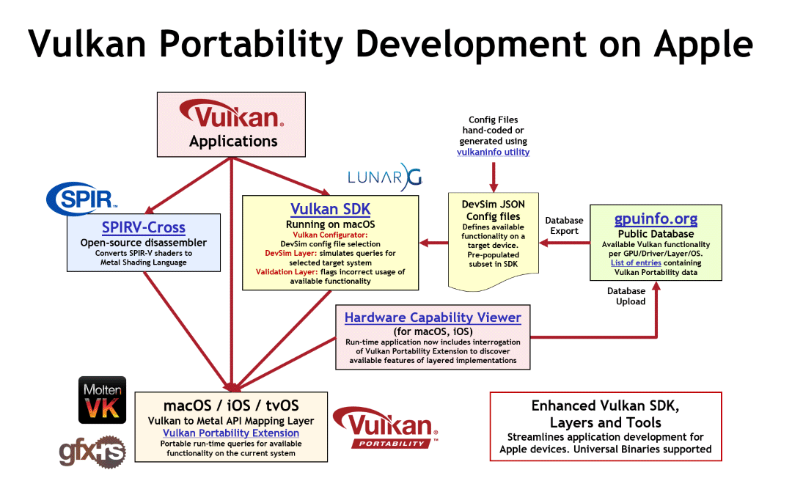

# Portability Initiative

The [Vulkan Portability Initiative](https://www.khronos.org/vulkan/portability-initiative) is an effort inside the Khronos Group to develop resources to define and evolve the [subset](https://github.com/KhronosGroup/Vulkan-Portability) of Vulkan capabilities that can be made universally available at native performance levels across all major platforms, including those not currently served by Vulkan native drivers. In a nutshell, this initiative is about making Vulkan viable on platforms that do not natively support the API (e.g MacOS and iOS).

## MacOS and iOS Tools

Press release for more [information about macOS and iOS support](https://www.khronos.org/news/press/vulkan-applications-enabled-on-apple-platforms)

## gfx-rs

Mozilla is currently helping drive [gfx-rs portability](https://github.com/gfx-rs/portability) to use [gfx-hal](https://gfx-rs.github.io/2017/07/24/low-level.html) as a way to interface with various other APIs.

## Translation Layer

There are projects with the goal of taking another API and mapping it to Vulkan. The translation layer is in charge of taking in another API (for example OpenGL) and mapping it to equivalent Vulkan calls. It is important to realize that a translation layer is just translating and is not necessarily implementing Vulkan.

- The [ANGLE](https://github.com/google/angle) project is an example of a translation layer for OpenGL to Vulkan. [SIGGRAPH 2019 Presentation](https://www.youtube.com/watch?v=1fU4w2ZGxH4&feature=youtu.be&t=10822)
- The [DXVK](https://github.com/doitsujin/dxvk) project is an example of a translation layer for Direct3D 10/11 to Vulkan.
- There are many more layering projects as shown in chart below

