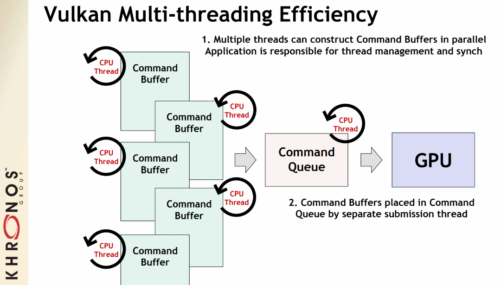

# Threading

One of the big differences between Vulkan and OpenGL is that Vulkan is not limited to a single-threaded state machine system. Before running off to implement threads in an application, it is important to understand how threading works in Vulkan.

The Vulkan Spec [Threading Behavior section](https://www.khronos.org/registry/vulkan/specs/1.1/html/vkspec.html#fundamentals-threadingbehavior) explains in detail how applications are in charge of managing all _externally synchronized_ elements of Vulkan. It is important to realize that multithreading in Vulkan only provides host-side scaling, as anything interacting with the device still needs to be [synchronized correctly](./sychronization.md)

Vulkan implementations are not suppose to be introducing any multi-threading, so if an app wants multi-CPU performance, the app is in charge of managing the threading.

## Command Pools

[Command Pools](https://www.khronos.org/registry/vulkan/specs/1.1/html/vkspec.html#commandbuffers-pools) are a system to allow recording command buffers across multiple threads. A single command pool must be _externally synchronized_; it must not be accessed simultaneously from multiple threads. By using a separate command pool in each host-thread the application can create multiple command buffers in parallel without any costly locks.

The idea is command buffers can be recorded on multiple threads while having a relatively light thread handle the submissions.

## Descriptor Pools

[Descriptor Pools](https://www.khronos.org/registry/vulkan/specs/1.1/html/vkspec.html#VkDescriptorPool) are used to allocate, free, reset, and update descriptor sets. By creating multiple descriptor pools, each application host thread is able to manage a descriptor set in each descriptor pool at the same time.