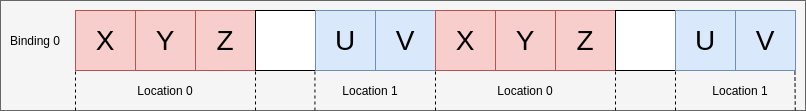
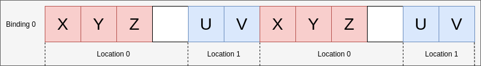
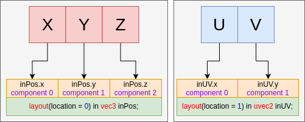
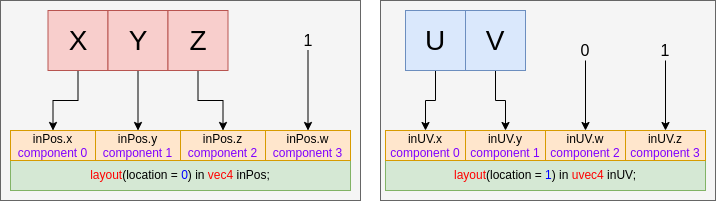

# Vertex Input Data Processing

This chapter is an overview of the [Fixed-Function Vertex Processing chapter in the spec](https://www.khronos.org/registry/vulkan/specs/1.2-extensions/html/vkspec.html#fxvertex) to help give a high level understanding of how an application can map data to the vertex shader when using a graphics pipeline.

It is also important to remember that Vulkan is a tool with many possible ways to use. The following are examples for educational purposes of how vertex data **can** be laid out.

## Binding and Locations

The following show various ways to set your binding and locations depending on your data input

### Example A - packed data

For the first example, the per-vertex attribute data will look like:

```c
struct Vertex
{
    float   x, y, z;
    uint8_t u, v;
};
```


The pipeline create info code will look roughly like:

```c
const VkVertexInputBindingDescription binding = {
    0,                         // binding
    sizeof(Vertex),            // stride
    VK_VERTEX_INPUT_RATE_VERTE // inputRate
};

const VkVertexInputAttributeDescription attributes[] = {
    {
        0,                          // location
        binding.binding,            // binding
        VK_FORMAT_R32G32B32_SFLOAT, // format
        0                           // offset
    },
    {
        1,                          // location
        binding.binding,            // binding
        VK_FORMAT_R8G8_UNORM,       // format
        3 * sizeof(float)           // offset
    }
};

const VkPipelineVertexInputStateCreateInfo info = {
    1,             // vertexBindingDescriptionCount
    &binding,      // pVertexBindingDescriptions
    2,             // vertexAttributeDescriptionCount
    &attributes[0] // pVertexAttributeDescriptions
};
```

The GLSL code that would consume this could look like

```glsl
layout(location = 0) in vec3 inPos;
layout(location = 1) in uvec2 inUV;
```

### Example B - padding

This example examines a case where the vertex data is not tightly packed and has extra padding.

```c
struct Vertex
{
    float   x, y, z, pad;
    uint8_t u, v;
};
```

There are 2 ways to go about this by either:

- Adjusting the location **offset**
- Adjusting the location **format**

#### Adjusting offset

For the first case of changing the offset, the only change to your pipeline creation becomes

```patch
        1,                          // location
        binding.binding,            // binding
        VK_FORMAT_R8G8_UNORM,       // format
-        3 * sizeof(float)           // offset
+        4 * sizeof(float)           // offset
```



#### Adjusting format

For the second case changing the format, you keep the `3 * sizeof(float)` offset and adjust the format to change the size of each location element

```patch
        0,                          // location
        binding.binding,            // binding
-        VK_FORMAT_R32G32B32_SFLOAT, // format
+        VK_FORMAT_R32G32B32A32_SFLOAT, // format
        0                           // offset
```

Note, this does **not** require an update to the shader from a `vec3` to a `vec4` as the spec states

> If the vertex shader has fewer components, the extra components are discarded.



### Example C - non-interleaved

Sometimes data is not interleaved, in this case, there might have the following

```c
float position_data[] = { /*....*/ };
float uv_data[] = { /*....*/ };
```


In this case, there will be 2 bindings, but still 2 locations

```c
const VkVertexInputBindingDescription bindings[] = {
    {
        0,                         // binding
        3 * sizeof(float),         // stride
        VK_VERTEX_INPUT_RATE_VERTE // inputRate
    },
    {
        1,                         // binding
        2 * sizeof(float),         // stride
        VK_VERTEX_INPUT_RATE_VERTE // inputRate
    }
};

const VkVertexInputAttributeDescription attributes[] = {
    {
        0,                          // location
        bindings[0].binding,        // binding
        VK_FORMAT_R32G32B32_SFLOAT, // format
        0                           // offset
    },
    {
        1,                          // location
        bindings[1].binding,        // binding
        VK_FORMAT_R8G8_UNORM,       // format
        0                           // offset
    }
};

const VkPipelineVertexInputStateCreateInfo info = {
    2,             // vertexBindingDescriptionCount
    &bindings[0],  // pVertexBindingDescriptions
    2,             // vertexAttributeDescriptionCount
    &attributes[0] // pVertexAttributeDescriptions
};
```

The GLSL code does not change from Example A

```glsl
layout(location = 0) in vec3 inPos;
layout(location = 1) in uvec2 inUV;
```

## Components Assignment

The [spec](https://www.khronos.org/registry/vulkan/specs/1.2-extensions/html/vkspec.html#fxvertex-attrib-location) explains more in detail about the `Component` assignment. The following is a general overview of the topic.


### Filling in components

Each `location` in the `VkVertexInputAttributeDescription` has 4 components. The example above already showed that extra components from the `format` are discarded when the shader input has fewer components.

> Example: `VK_FORMAT_R32G32B32_SFLOAT` has 3 components while a `vec2` has only 2

For the opposite case, the spec says:

> If the format does not include G, B, or A components, then those are filled with (0,0,1) as needed (using either 1.0f or integer 1 based on the format) for attributes that are not 64-bit data types.

This means the example of

```glsl
layout(location = 0) in vec3 inPos;
layout(location = 1) in uvec2 inUV;
```



would fill the examples above with the following

```glsl
layout(location = 0) in vec4 inPos;
layout(location = 1) in uvec4 inUV;
```


