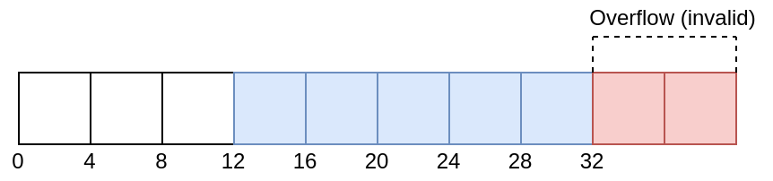

// Copyright 2022 The Khronos Group, Inc.
// SPDX-License-Identifier: CC-BY-4.0

ifndef::chapters[:chapters:]

[[descriptor-dynamic-offset]]
= ディスクリプタ動的オフセット

Vulkanは、link:https://docs.vulkan.org/spec/latest/chapters/descriptorsets.html#descriptorsets-binding-dynamicoffsets[仕様で定義されている]ように、バインド時にオフセットを調整できる2種類のディスクリプタを提供しています。

* 動的ユニフォームバッファ (`VK_DESCRIPTOR_TYPE_UNIFORM_BUFFER_DYNAMIC`)
* 動的ストレージバッファ (`VK_DESCRIPTOR_TYPE_STORAGE_BUFFER_DYNAMIC`)

== 例

この例では、32 バイトのバッファを持ち、そのうち 16 バイトが `vkUpdateDescriptorSets` の際に設定されます。この最初の例では、動的オフセットは追加しません。

[source,c]
----
VkDescriptorSet descriptorSet; // 割り当て
VkBuffer buffer; // 32 バイトのサイズ

VkDescriptorBufferInfo bufferInfo = {
    buffer,
    4,      // offset
    16      // range
};

VkWriteDescriptorSet writeInfo = {
    .dstSet = descriptorSet,
    .descriptorType = VK_DESCRIPTOR_TYPE_STORAGE_BUFFER_DYNAMIC,
    .pBufferInfo = bufferInfo
};

vkUpdateDescriptorSets(
    1,         // descriptorWriteCount,
    &writeInfo // pDescriptorWrites,
);

// 非動的オフセット
vkCmdBindDescriptorSets(
    1,              // descriptorSetCount,
    &descriptorSet, // pDescriptorSets,
    0,              // dynamicOffsetCount
    NULL            // pDynamicOffsets
);
----

現在、バッファは以下のようになっています。

image::../../../chapters/images/descriptor_dynamic_offset_example_a.png[descriptor_dynamic_offset_example_a.png]

次に、バインド時に 8 バイトの動的オフセットを適用します。

[source,c]
----
uint32_t offsets[1] = { 8 };
vkCmdBindDescriptorSets(
    1,              // descriptorSetCount,
    &descriptorSet, // pDescriptorSets,
    1,              // dynamicOffsetCount
    offsets         // pDynamicOffsets
);
----

現在、バッファは以下のようになっています。

image::../../../chapters/images/descriptor_dynamic_offset_example_b.png[descriptor_dynamic_offset_example_b.png]

== VK_WHOLE_SIZE を使用した例

今回は `VK_WHOLE_SIZE` 値を範囲に使用します。`VkDescriptorBufferInfo::range` 以外は、すべて上記の例と同じです。

[source,c]
----
VkDescriptorSet descriptorSet; // 割り当て
VkBuffer buffer; // 32 バイトのサイズ

VkDescriptorBufferInfo info = {
    buffer,
    4,             // offset
    VK_WHOLE_SIZE  // range
};

VkWriteDescriptorSet writeInfo = {
    .dstSet = descriptorSet,
    .descriptorType = VK_DESCRIPTOR_TYPE_STORAGE_BUFFER_DYNAMIC,
    .pBufferInfo = bufferInfo
};

vkUpdateDescriptorSets(
    1,         // descriptorWriteCount,
    &writeInfo // pDescriptorWrites,
);

// 非動的オフセット
vkCmdBindDescriptorSets(
    1,              // descriptorSetCount,
    &descriptorSet, // pDescriptorSets,
    0,              // dynamicOffsetCount
    NULL            // pDynamicOffsets
);
----

現在、バッファは以下のようになっています。

image::../../../chapters/images/descriptor_dynamic_offset_example_c.png[descriptor_dynamic_offset_example_c.png]

今回、動的オフセットを適用しようとすると、未定義の動作となり、link:https://github.com/KhronosGroup/Vulkan-ValidationLayers/issues/2846[検証レイヤでエラーが発生]します。

[source,c]
----
// 無効
uint32_t offsets[1] = { 8 };
vkCmdBindDescriptorSets(
    1,              // descriptorSetCount,
    &descriptorSet, // pDescriptorSets,
    1,              // dynamicOffsetCount
    offsets         // pDynamicOffsets
);
----

無効な動的オフセットの場合は、このようになります。

== 制限

また、`minUniformBufferOffsetAlignment` と `minStorageBufferOffsetAlignment` も確認することが重要です。ベースオフセットと動的オフセットの両方がこれらの制限の倍数でなければならないからです。
