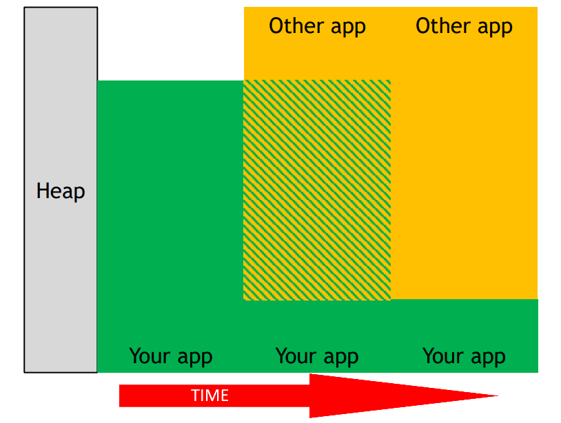

// Copyright 2019-2021 The Khronos Group, Inc.
// SPDX-License-Identifier: CC-BY-4.0

ifndef::chapters[:chapters: ../]

[[VK_EXT_memory_priority]]
= VK_EXT_memory_priority

Vulkan では、メモリ管理が重要な役割を果たします。`VK_EXT_memory_priority` 拡張機能は、アプリケーションが重要な割り当てをより遅いメモリに移動するのを防ぐように設計されています。

この拡張機能は、2つのアプリケーション（メインアプリケーションとホストマシン上の別プロセス）を例にして説明することができます。時間の経過とともに、2つのアプリケーションは限られたデバイスのヒープメモリを消費しようとします。

この場合、メインアプリケーションからのアロケーションはまだ存在しますが、低速なメモリ上にある可能性があります（実装により、再び必要になるまでホストビジブルメモリに移動している可能性があります）。

**どのメモリ**を移動させるかは、実装で定義されます。メインアプリケーションのメモリ使用量を考えてみましょう。

image::../../../../chapters/images/extensions/VK_EXT_memory_priority_app.png[VK_EXT_memory_priority_app]

このように、常に高速なメモリに保持するべき重要なデータがあります。

`VK_EXT_memory_priority` 拡張機能を使用すると、非常に簡単に対応することができます。メモリを割り当てるとき、アプリケーションは `VkMemoryPriorityAllocateInfoEXT` を `VkMemoryAllocateInfo::pNext` に追加するだけでよいのです。ここから `VkMemoryPriorityAllocateInEXT::priority` の値を `0.0` から `1.0` (デフォルトは `0.5`) の間で設定することが可能です。これにより、上記のような状況が発生した場合に、実装がより良い推測を行うことができるようになります。

== 提案

  * 拡張機能がサポートされていることを確認してください。
  * これは実装に対する**ヒント**であり、アプリケーションはこれを使用する前に適切なバジェットを立てるよう努力する必要があることを忘れないでください。
  * メモリのボトルネックについては、推測で済ませるのではなく、必ず測定してください。
  * 書き込みが必要なメモリは、高い優先度を持つ可能性が高いです。
  ** レンダーターゲット（例：フレームバッファの出力アタッチメント）は、通常、高優先度に設定することが重要です。
  * 優先度の高いメモリは、「高頻度のアクセス」と「低レイテンシ耐性」を持つものと考えてください。
  ** 例：頂点バッファは、複数のフレームにまたがって安定しており、各値は一度だけアクセスされ、通常アクセス遅延に寛容であるため、通常は優先度の低い候補となります。
