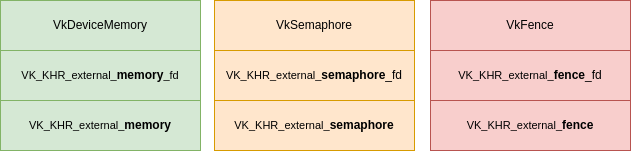
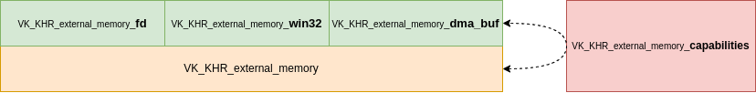

// Copyright 2019-2021 The Khronos Group, Inc.
// SPDX-License-Identifier: CC-BY-4.0

ifndef::chapters[:chapters: ../]

[[external-memory]]
= 外部メモリと同期

アプリケーションが GPU に関連して行うことのすべてが Vulkan で行われているわけではない場合があります。また、Vulkan の範囲外でメモリの書き込みや読み出しが行われる場合もあります。このようなユースケースのために、外部メモリの機能と同期の機能のセットが作成されました。

== Extension breakdown

`VK_KHR_external_*` 拡張子がたくさんあるように見えるかもしれないが、実際にはうまく分離されている。

== メモリ vs 同期

メモリ自体のインポート/エクスポートを処理する拡張機能セットがあります。もう一つの拡張機能セットは、Vulkan の内部コマンドを制御するための同期プリミティブ（`VkFence` と `VkSemaphore`）のためのものです。一般的には、インポート/エクスポートされるメモリの各部分には、メモリアクセスを管理するためのマッチするフェンス/セマフォもあります。

== Handle Types

プラットフォームによって、Vulkanと外部プラットフォーム間の通信に使用される特定の「ハンドル」があります。例えば、POSIXの `fd` は、ほとんどの非Windowsベースのプラットフォームで使用されます。

== 機能（Capabilities）

`VK_KHR_external_fence_capabilities`、`VK_KHR_external_semaphore_capabilities`、`VK_KHR_external_memory_capabilities` は、単に実装がどのような外部サポートを提供しているかという情報をクエリする方法です。

== メモリ

`VK_KHR_external_memory` 拡張機能は、主に外部で使用されているメモリのタイプを記述する `VkExternalMemoryHandleTypeFlagBits` 列挙型を提供します。

メモリのインポート/エクスポートには、現在3つの方法があります。

  * `VK_KHR_external_memory_fd` は、POSIX ファイルディスクリプタ内のメモリです。
  * `VK_KHR_external_memory_win32` は、Windows ハンドル内のメモリです。
  * `VK_ANDROID_external_memory_android_hardware_buffer` は、AHardwareBuffer内のメモリです。

これらのメソッドにはそれぞれ、制限、要件、所有権などに関する詳細な説明があります。

=== メモリのインポート

メモリをインポートするには、与えられた外部メモリ拡張機能によって提供される `VkImport*Info` 構造体があります。これが `vkAllocateMemory` に渡され、Vulkan はインポートされたメモリにマップする `VkDeviceMemory` ハンドルを持つことになります。

[source,cpp]
----
// 外部メモリの種類によっては、専用の割り当てが必要
VkMemoryDedicatedAllocateInfo dedicated_info;
dedicated_info.buffer = buffer;

VkImportMemoryFdInfoKHR import_info;
import_info.pNext = &dedicated_info;
import_info.handleType = VK_EXTERNAL_MEMORY_HANDLE_TYPE_OPAQUE_FD_BIT;
import_info.fd = fd;

VkMemoryAllocateInfo allocate_info;
allocate_info.pNext = &import_info

VkDeviceMemory device_memory;
vkAllocateMemory(device, &allocate_info, nullptr, device_memory);
----

=== メモリのエクスポート

メモリをエクスポートするには、与えられた外部メモリ拡張機能によって提供される `VkGetMemory*` 関数があります。この関数は、`VkDeviceMemory` のハンドルを受け取り、それを拡張機能が公開しているオブジェクトにマッピングします。

[source,cpp]
----
VkExportMemoryAllocateInfo export_info;
export_info.handleTypes = VK_EXTERNAL_MEMORY_HANDLE_TYPE_OPAQUE_FD_BIT;

VkMemoryAllocateInfo allocate_info;
allocate_info.pNext = &export_info

VkDeviceMemory device_memory;
vkAllocateMemory(device, &allocate_info, nullptr, device_memory);

VkMemoryGetFdInfoKHR get_handle_info;
get_handle_info.memory = device_memory;
get_handle_info.handleType = VK_EXTERNAL_MEMORY_HANDLE_TYPE_OPAQUE_FD_BIT;

int fd;
vkGetMemoryFdKHR(device, &get_handle_info, &fd);
----

== 同期

外部同期はVulkanでは `VkFence` と `VkSemaphores` の両方で使用できます。両者のインポート/エクスポートの方法に関しては、ほとんど違いはありません。

`VK_KHR_external_fence` と `VK_KHR_external_semaphore` 拡張機能はどちらも `Vk*ImportFlagBits` 列挙型と `VkExport*CreateInfo` 構造体を公開して、インポート/エクスポートされる同期のタイプを記述します。

現在、同期をインポート/エクスポートする方法は2つあります。

  * `VK_KHR_external_fence_fd` / `VK_KHR_external_semaphore_fd`
  * `VK_KHR_external_fence_win32` / `VK_KHR_external_semaphore_win32`

各拡張機能は、同期プリミティブの所有権をどのように管理するかを説明します。

=== 同期プリミティブのインポートとエクスポート

インポートするための `VkImport*` 関数と、エクスポートするための `VkGet*` 関数があります。これらはどちらも `VkFence` / `VkSemaphores` のハンドルが渡され、外部同期オブジェクトを定義する拡張機能のメソッドを受け取ります。

== 例

Vulkan と、GPU と通信する他の API との間のイベントのタイムラインの図を示します。これは、外部メモリと同期の拡張機能の一般的な使用例を表しています。

image::../../../../chapters/images/extensions/external_example.png[external_example.png]