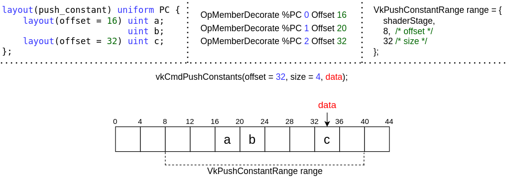

// Copyright 2022 The Khronos Group, Inc.
// SPDX-License-Identifier: CC-BY-4.0

ifndef::chapters[:chapters:]
ifndef::images[:images: images/]

[[push-constants]]
= プッシュ定数

Vulkan Spec では、`プッシュ定数` を次のように定義しています。

[NOTE]
====
API 経由で値を書き込める小さなメモリ領域で、シェーダからアクセス可能です。プッシュ定数を使用すると、アプリケーションは、バッファを作成したり、更新のたびにディスクリプタセットを変更してバインドすることなく、シェーダで使用される値を設定することができます。
====

* <<pc-how-to-us, 使用方法>>
** <<pc-shader-code, シェーダコード>>
** <<pc-pipeline-layout, パイプラインレイアウト>>
** <<pc-updating, 記録時に更新する>>
** <<pc-offsets, オフセット>>
* <<pc-pipeline-layout-compatibility, パイプラインレイアウトの互換性>>
* <<pc-lifetime, プッシュ定数の寿命>>
** <<pc-binding-descriptor-sets, バインディングディスクリプタセットへの影響はない>>
** <<pc-mixing-bind-points, バインドポイントを混ぜ合わせる>>
** <<pc-binding-non-compatible, 非互換性のパイプラインをバインドする>>
** <<pc-layout-without, 静的プッシュ定数がないパイプラインレイアウト>>
** <<pc-updated-incrementally, 値をインクリメンタルに更新>>

[[pc-how-to-us]]
== 使用方法

[[pc-shader-code]]
=== シェーダコード

シェーダから見ると、プッシュ定数はユニフォームバッファと似ています。VulkanとSPIR-Vの間のlink:https://www.khronos.org/registry/vulkan/specs/1.3-extensions/html/vkspec.html#interfaces-resources-pushconst[プッシュ定数インターフェース]は、Specに記載されています。

簡単な GLSLのフラグメントシェーダの例です:

[source,glsl]
----
layout(push_constant, std430) uniform pc {
    vec4 data;
};

layout(location = 0) out vec4 outColor;

void main() {
   outColor = data;
}
----

SPIR-Vの逆アセンブル:

[source,swift]
----
                  OpMemberDecorate %pc 0 Offset 0
                  OpDecorate %pc Block

         %float = OpTypeFloat 32
       %v4float = OpTypeVector %float 4

%pc             = OpTypeStruct %v4float
%pc_ptr         = OpTypePointer PushConstant %pc
%pc_var         = OpVariable %pc_ptr PushConstant
%pc_v4float_ptr = OpTypePointer PushConstant %v4float

%access_chain   = OpAccessChain %pc_v4float_ptr %pc_var %int_0
----

これは、`Block` 修飾を持つ `OpTypeStruct` タイプであるという link:https://www.khronos.org/registry/vulkan/specs/1.3-extensions/html/vkspec.html#interfaces-resources-pushconst[Vulkan Spec]の記述に一致します。

[[pc-pipeline-layout]]
=== パイプラインレイアウト

`vkCreatePipelineLayout` の呼び出し時に、link:https://www.khronos.org/registry/vulkan/specs/1.3-extensions/man/html/VkPipelineLayoutCreateInfo.html[VkPipelineLayoutCreateInfo]にlink:https://www.khronos.org/registry/vulkan/specs/1.3-extensions/man/html/VkPushConstantRange.html[プッシュ定数範囲]を設定する必要があります。

上記のシェーダを使用した例:

[source,cpp]
----
// プッシュ定数範囲
VkPushConstantRange range = {};
range.stageFlags = VK_SHADER_STAGE_FRAGMENT_BIT;
range.offset = 0;
range.size = 16; // %v4float (vec4) 16バイトと定義される

VkPipelineLayoutCreateInfo create_info = {};
create_info.sType = VK_STRUCTURE_TYPE_PIPELINE_LAYOUT_CREATE_INFO;
create_info.pNext = NULL;
create_info.flags = 0;
create_info.setLayoutCount = 0;
create_info.pushConstantRangeCount = 1;
create_info.pPushConstantRanges = &range;

VkPipelineLayout pipeline_layout;
vkCreatePipelineLayout(device, &create_info, NULL, &pipeline_layout);
----

[[pc-updating]]
=== 記録時に更新する

最後に、プッシュ定数の値は、link:https://www.khronos.org/registry/vulkan/specs/1.3-extensions/man/html/vkCmdPushConstants.html[vkCmdPushConstants]を使用して更新する必要があります。

[source,cpp]
----
float data[4] = {0.0f, 1.0f, 2.0f, 3.0f}; // sizeof(float) == 4バイト

// vkBeginCommandBuffer()
uint32_t offset = 0;
uint32_t size = 16;
vkCmdPushConstants(commandBuffer, pipeline_layout, VK_SHADER_STAGE_FRAGMENT_BIT, offset, size, data);
// 描画 / ディスパッチ / レイをトレースする など
// vkEndCommandBuffer()
----

[[pc-offsets]]
=== オフセット

上記のシェーダに対して、開発者はプッシュ定数のブロックにオフセットを追加することもできます。

[source,patch]
----
layout(push_constant, std430) uniform pc {
-   vec4 data;
+   layout(offset = 32) vec4 data;
};

layout(location = 0) out vec4 outColor;

void main() {
   outColor = data;
}
----

SPIR-Vの逆アセンブル結果はメンバー修飾が異なるだけです。

[source,patch]
----
- OpMemberDecorate %pc 0 Offset 0
+ OpMemberDecorate %pc 0 Offset 32
----

`32` のオフセットを使用する各シェーダステージで `VkPushConstantRange` に設定する必要があります。

[source,patch]
----
VkPushConstantRange range = {};
range.stageFlags = VK_SHADER_STAGE_FRAGMENT_BIT;
-range.offset = 0;
+range.offset = 32;
range.size = 16;
----

次の図は、プッシュ定数のオフセットの仕組みを視覚化したものです。

[[pc-pipeline-layout-compatibility]]
== パイプラインレイアウトの互換性

Vulkan Spec では、link:https://www.khronos.org/registry/vulkan/specs/1.3-extensions/html/vkspec.html#descriptorsets-compatibility[プッシュ定数との互換]を次のように定義しています。

[NOTE]
====
パイプラインレイアウトが同じプッシュ定数範囲で作成された場合
====

つまり、バインドされた link:https://www.khronos.org/registry/vulkan/specs/1.3-extensions/html/vkspec.html#pipeline-bindpoint-commands[パイプラインコマンド]　（`vkCmdDraw`、`vkCmdDispatch` など）が呼ばれる直前の `vkCmdPushConstants` と `vkCmdBindPipeline`（適切な `VkPipelineBindPoint` 用）で使用された `VkPipelineLayout` は、**同じ** `VkPushConstantRange` を持っている必要があります。

[[pc-lifetime]]
== プッシュ定数の寿命

プッシュ定数の寿命は、いくつかの　link:https://github.com/KhronosGroup/Vulkan-Docs/issues/1081[エッジ] link:https://github.com/KhronosGroup/Vulkan-Docs/issues/1485[ケース]　を持つことができます。以下は、プッシュ定数で何が有効で何が無効かについて、一般的な例を示すためのものです。

[NOTE]
====
`dEQP-VK.pipeline.push_constant.lifetime.*` でいくつかのCTSテストがあります。
====

[[pc-binding-descriptor-sets]]
=== バインディングディスクリプタセットへの影響はない

プッシュ定数はディスクリプタに結びつかないので `vkCmdBindDescriptorSets` を使用しても、プッシュ定数の寿命やパイプラインレイアウトの互換性には影響しません。

[[pc-mixing-bind-points]]
=== バインドポイントを混ぜ合わせる

2つの異なる `VkPipelineBindPoint` を使用することができ、それぞれのシェーダで異なるプッシュ定数を使えます。

[source,cpp]
----
// プッシュ定数範囲が異なるため、パイプラインレイアウトの互換性がない
VkPipelineLayout layout_graphics; // VK_SHADER_STAGE_FRAGMENT_BIT
VkPipelineLayout layout_compute;  // VK_SHADER_STAGE_COMPUTE_BIT

// vkBeginCommandBuffer()
vkCmdBindPipeline(pipeline_graphics); // layout_graphics
vkCmdBindPipeline(pipeline_compute);  // layout_compute

vkCmdPushConstants(layout_graphics); // VK_SHADER_STAGE_FRAGMENT_BIT
// 最後のパイプラインとグラフィックスのプッシュ定数に互換性があるため有効
vkCmdDraw();

vkCmdPushConstants(layout_compute); // VK_SHADER_STAGE_COMPUTE_BIT
vkCmdDispatch(); // 有効
// vkEndCommandBuffer()
----

[[pc-binding-non-compatible]]
=== 非互換性のパイプラインをバインドする

Vulkan Spec では以下のように述べられています:

[NOTE]
====
プッシュ定数レイアウトと互換性のないレイアウトでパイプラインをバインドしても、プッシュ定数の値が乱れることはありません。
====

例を示します:

[source,cpp]
----
// vkBeginCommandBuffer()
vkCmdPushConstants(layout_0);
vkCmdBindPipeline(pipeline_b); // layout_0と非互換性
vkCmdBindPipeline(pipeline_a); // layout_0と互換性
vkCmdDraw(); // 有効
// vkEndCommandBuffer()

// vkBeginCommandBuffer()
vkCmdBindPipeline(pipeline_b); // layout_0と非互換性
vkCmdPushConstants(layout_0);
vkCmdBindPipeline(pipeline_a); // layout_0と互換性
vkCmdDraw(); // 有効
// vkEndCommandBuffer()

// vkBeginCommandBuffer()
vkCmdPushConstants(layout_0);
vkCmdBindPipeline(pipeline_a); // layout_0と互換性
vkCmdBindPipeline(pipeline_b); // layout_0と非互換性
vkCmdDraw(); // 無効
// vkEndCommandBuffer()
----

[[pc-layout-without]]
=== 静的プッシュ定数がないパイプラインレイアウト

また、パイプラインレイアウトに `VkPushConstantRange` があるものの、シェーダにプッシュ定数がない場合も有効です。例を示します:

[source,cpp]
----
VkPushConstantRange range = {VK_SHADER_STAGE_VERTEX_BIT, 0, 4};
VkPipelineLayoutCreateInfo pipeline_layout_info = {VK_SHADER_STAGE_VERTEX_BIT. 1, &range};
----

[source,glsl]
----
void main() {
   gl_Position = vec4(1.0);
}
----

上記のようなシェーダとパイプラインレイアウトで `VkPipeline` を作成した場合でも、`vkCmdPushConstants` を呼び出すことは**有効**です。

`vkCmdPushConstants` は、`VkPipelineLayout` の使用法と結びついていると考えることができます。これを踏まえると、`vkCmdDraw` や `vkCmdDispatch` を呼び出す前に、それらが一致している必要があることが理解できます。

シェーダが使用しないディスクリプタセットをバインドすることが可能で、プッシュ定数も同じように動作します。

[[pc-updated-incrementally]]
=== 値をインクリメンタルに更新

コマンドバッファの有効期間中、プッシュ定数はインクリメンタルに更新できます。

`vec4` プッシュ定数の例を示します。

[source,cpp]
----
// vkBeginCommandBuffer()
vkCmdBindPipeline();
vkCmdPushConstants(offset: 0, size: 16, value = [0, 0, 0, 0]);
vkCmdDraw(); // 値 = [0, 0, 0, 0]

vkCmdPushConstants(offset: 4, size: 8, value = [1 ,1]);
vkCmdDraw(); // 値 = [0, 1, 1, 0]

vkCmdPushConstants(offset: 8, size: 8, value = [2, 2]);
vkCmdDraw(); // 値 = [0, 1, 2, 2]
// vkEndCommandBuffer()
----

