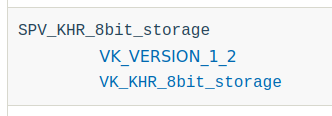
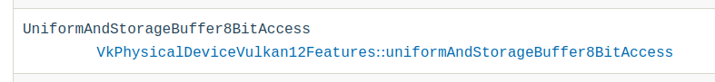

// Copyright 2019-2022 The Khronos Group, Inc.
// SPDX-License-Identifier: CC-BY-4.0

// Required for both single-page and combined guide xrefs to work
ifndef::chapters[:chapters: ../]

[[spirv-extensions]]
= SPIR-V 拡張機能の使い方

xref:{chapters}what_is_spirv.adoc[SPIR-V] は `vkCreateShaderModule` 時に使用されるシェーダ表現です。Vulkan と同様に、SPIR-V にもlink:https://github.com/KhronosGroup/SPIRV-Guide/blob/master/chapters/extension_overview.md[拡張機能]とlink:https://github.com/KhronosGroup/SPIRV-Guide/blob/master/chapters/capabilities.md[機能システム]があります。

SPIR-V は中間言語であり、API ではないことを忘れてはいけません。SPIR-V は、実行時にアプリケーションで利用できる機能を公開するために、Vulkan のような API に依存しているのです。本章では、SPIR-V クライアント API である Vulkan が、SPIR-V の拡張機能や機能とどのように関係するかを説明します。

== SPIR-V 拡張機能の例

この例では、 link:https://www.khronos.org/registry/vulkan/specs/latest/man/html/VK_KHR_8bit_storage.html[VK_KHR_8bit_storage] と link:http://htmlpreview.github.io/?https://github.com/KhronosGroup/SPIRV-Registry/blob/main/extensions/KHR/SPV_KHR_8bit_storage.html[SPV_KHR_8bit_storage] を使用して、`UniformAndStorageBuffer8BitAccess` 機能を公開します。SPIR-V を逆アセンブルすると、以下のようになります。

[source,swift]
----
OpCapability Shader
OpCapability UniformAndStorageBuffer8BitAccess
OpExtension  "SPV_KHR_8bit_storage"
----

[[steps-for-using-spriv-features]]
=== SPIR-V の機能を利用するための手順：

  1. SPIR-V の拡張機能と機能が Vulkan で利用可能であることを確認します。
  2. 必要な Vulkan の拡張機能、機能、バージョンがサポートされているか確認します。
  3. 必要な場合、Vulkan 拡張機能と機能を有効にします。
  4. 必要な場合、使用する高レベルシェーディング言語（例：GLSL または HLSL）に一致する拡張機能があるかどうかを確認します。

各ステップをより詳細に説明します。

==== SPIR-V 機能がサポートされているか確認する

シェーダの機能によっては、`OpExtension` または `OpCapability` だけが必要な場合があります。この例では、`UniformAndStorageBuffer8BitAccess` は link:http://htmlpreview.github.io/?https://github.com/KhronosGroup/SPIRV-Registry/blob/main/extensions/KHR/SPV_KHR_8bit_storage.html[SPV_KHR_8bit_storage] 拡張機能に含まれます。

SPIR-V 拡張機能がサポートされているかどうかを確認するには、Vulkan Spec のlink:https://docs.vulkan.org/spec/latest/appendices/spirvenv.html#spirvenv-extensions[対応している SPIR-V 拡張機能表]をご覧ください。

また、Vulkan Spec のlink:https://docs.vulkan.org/spec/latest/appendices/spirvenv.html#spirvenv-capabilities[対応している SPIR-V 機能表]もご覧ください。

[NOTE]
====
表には `VkPhysicalDeviceVulkan12Features::uniformAndStorageBuffer8BitAccess` と書いてありますが、ここでは `VkPhysicalDevice8BitStorageFeatures::uniformAndStorageBuffer8BitAccess` がエイリアスであると考えることができます。
====

幸いなことに、もし確認を忘れたとしても、Vulkan Validation Layers にはlink:https://github.com/KhronosGroup/Vulkan-ValidationLayers/blob/main/layers/vulkan/generated/spirv_validation_helper.cpp[自動生成された検証]が用意されています。Validation Layers も Vulkan Spec 表も、すべて link:https://github.com/KhronosGroup/Vulkan-Docs/blob/main/xml/vk.xml[./xml/vk.xml] ファイルを元にしています。

[source,xml]
----
<spirvcapability name="UniformAndStorageBuffer8BitAccess">
    <enable struct="VkPhysicalDeviceVulkan12Features" feature="uniformAndStorageBuffer8BitAccess" requires="VK_VERSION_1_2,VK_KHR_8bit_storage"/>
</spirvcapability>

<spirvextension name="SPV_KHR_8bit_storage">
    <enable version="VK_VERSION_1_2"/>
    <enable extension="VK_KHR_8bit_storage"/>
</spirvextension>
----

==== サポートを確認し、必要に応じて有効化する

この例では、`VK_KHR_8bit_storage` または Vulkan 1.2 デバイスのいずれかが必要です。

Vulkan 1.0 または 1.1 デバイスを使用する場合、`VK_KHR_8bit_storage` 拡張機能をサポートし、デバイス作成時にxref:{chapters}enabling_extensions.adoc#enabling-extensions[有効化]する必要があります。

Vulkan 拡張機能またはバージョンの使用に関係なく、必要な場合はデバイス作成時に、必要な Vulkan 機能の対応を確認し、 xref:{chapters}enabling_features.adoc#enabling-extensions[有効化]する必要があります。SPIR-V の拡張機能や機能には、Vulkan 機能を必要としないものもありますが、これはすべて仕様書の表に記載されています。

この例では、`VkPhysicalDeviceVulkan12Features::uniformAndStorageBuffer8BitAccess` または `VkPhysicalDevice8BitStorageFeatures::uniformAndStorageBuffer8BitAccess` 機能をサポートし有効にしておく必要があります。

==== 高レベルのシェーディング言語拡張機能を使用する

この例では、GLSL は link:https://github.com/KhronosGroup/GLSL/blob/master/extensions/ext/GL_EXT_shader_16bit_storage.txt[GL_EXT_shader_16bit_storage] 拡張機能を持ち、その中に `GL_EXT_shader_8bit_storage` 拡張機能が含まれています。

`glslang` や `SPIRV-Tools` などのツールは、一致する `OpExtension` と `OpCapability` が使用されていることを確認します。
