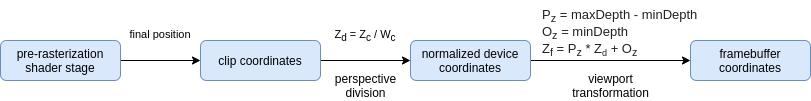
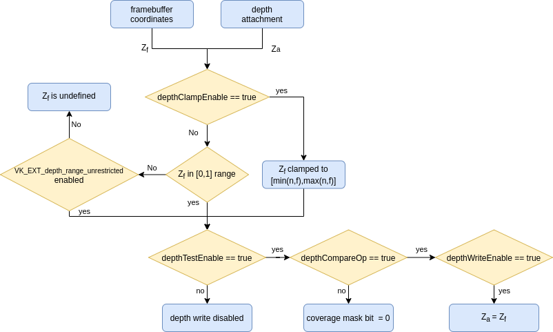

// Copyright 2019-2022 The Khronos Group, Inc.
// SPDX-License-Identifier: CC-BY-4.0

// Required for both single-page and combined guide xrefs to work
ifndef::chapters[:chapters:]
ifndef::images[:images: images/]

[[Depth]]
= 깊이(Depth)

xref:{chapters}vulkan_spec.adoc[Vulkan Spec] 의 다양한 부분에서 `depth` 라는 용어가 사용되고 있습니다. 이 장은 Vulkan 에서 사용되는 다양한 "깊이(depth)" 용어에 대한 개요를 제공하는 것을 목표로 합니다. 이 장을 최대한 활용하려면 3D 그래픽스에 대한 기본적인 지식이 필요합니다.

[NOTE]
====
스텐실은 깊이와 밀접한 관련이 있지만, 이 장에서는 API 이름 영역 밖의 내용을 다루지 않습니다.
====

  *  <<graphics-pipeline, 그래픽스 파이프라인(Graphics Pipeline)>>
  *  <<depth-formats, 깊이 포맷(Depth Formats)>>
  *  <<depth-buffer-as-a-vkimage, VkImage의 깊이 버퍼(Depth Buffer)>>
  **  <<layout, 레이아웃(Layout)>>
  **  <<clearing, 정리(Clearing)>>
  *  <<pre-rasterization, 래스터화 전(Pre-rasterization)>>
  **  <<primitive-clipping, 프리미티브 클리핑(Primitive Clipping)>>
  ***  <<user-defined-clipping-and-culling, 사용자 정의 클리핑 및 컬링>>
  ***  <<porting-from-opengl, OpenGL로부터 포팅>>
  **  <<viewport-transformation, 뷰포트 변환(Viewport Transformation)>>
  ***  <<depth-range, 깊이 범위(Depth Range)>>
  *  <<rasterization, 래스터화(Rasterization)>>
  **  <<depth-bias, 깊이 바이어스(Depth Bias)>>
  *  <<post-rasterization, 래스터화 후(Post-rasterization)>>
  **  <<fragment-shader, 프래그먼트 쉐이더(Fragment Shader)>>
  ***  <<conservative-depth, 보수적인 깊이(Conservative depth)>>
  **  <<per-sample-processing-and-coverage-mask, 샘플별 처리 및 커버리지 마스크(Per-sample processing and coverage mask)>>
  ***  <<resolving-depth-buffer, 깊이 버퍼 처리(Resolving depth buffer)>>
  **  <<depth-bounds, 깊이 경계(Depth Bounds)>>
  **  <<depth-test, 깊이 테스트(Depth Test)>>
  ***  <<depth-compare-operation, 깊이 비교 연산(Depth Compare Operation)>>
  ***  <<depth-buffer-writes, 깊이 버퍼 쓰기(Depth Buffer Writes)>>
  ***  <<depth-clamping, 깊이 클램핑(Depth Clamping)>>

[[graphics-pipeline]]
== 그래픽스 파이프라인(Graphics Pipeline)

"깊이(depth)" 개념은 xref:{chapters}what_vulkan_can_do.adoc[graphics pipelines] 에만 사용되며 드로우콜이 제출될 때까지 적용되지 않습니다.

`VkGraphicsPipelineCreateInfo` 내부에는 `depth` 와 관련된 다양한 제어 가능한 값들이 있습니다. 일부 상태는 xref:{chapters}dynamic_state.adoc[dynamic] 이기도 합니다.

[[depth-formats]]
== 깊이 포맷(Depth Formats)

몇 가지 깊이 형식이 있으며, 구현에 따라 Vulkan에서 지원되는 형식이 노출될 수 있습니다.

깊이 이미지에서 **읽기(reading)**에 필요한 포맷은 샘플링이나 블릿 연산을 통한 읽기를 지원하기 위한 `VK_FORMAT_D16_UNORM` 과 `VK_FORMAT_D32_SFLOAT` 뿐입니다.

깊이 이미지에서 **쓰기(writing)**를 하려면 `VK_FORMAT_D16_UNORM` 이 지원되어야 합니다. 여기에서 (`VK_FORMAT_X8_D24_UNORM_PACK32` **또는** `VK_FORMAT_D32_SFLOAT`) ** 및 ** (`VK_FORMAT_D24_UNORM_S8_UINT` **또는** `VK_FORMAT_D32_SFLOAT_S8_UINT`) 중 적어도 하나를 지원해야 합니다. 따라서 깊이와 스텐실이 **모두** 같은 포맷으로 필요한 경우 사용할 포맷을 착이 위해 여분의 로직이 필요합니다.

[source,cpp]
----
// 쿼리 로직 예시
VkFormatProperties properties;

vkGetPhysicalDeviceFormatProperties(physicalDevice, VK_FORMAT_D24_UNORM_S8_UINT, &properties);
bool d24s8_support = (properties.optimalTilingFeatures & VK_FORMAT_FEATURE_DEPTH_STENCIL_ATTACHMENT_BIT);

vkGetPhysicalDeviceFormatProperties(physicalDevice, VK_FORMAT_D32_SFLOAT_S8_UINT, &properties);
bool d32s8_support = (properties.optimalTilingFeatures & VK_FORMAT_FEATURE_DEPTH_STENCIL_ATTACHMENT_BIT);

assert(d24s8_support | d32s8_support); // 적어도 하나를 항상 지원
----

[[depth-buffer-as-a-vkimage]]
== 깊이 버퍼를 VkImage로 사용

"깊이 버퍼" 라는 용어는 그래픽스에 대해 이야기할 때 많이 사용되지만, Vulkan에서는 `VkFramebuffer` 가 그리기 시점에 참조할 수 있는 `VkImage`/`VkImageView` 에 불과합니다. `VkRenderPass` 를 생성할 때 `pDepthStencilAttachment` 값은 프레임버퍼의 깊이 첨부(attachment)를 가리킵니다.(attachment : (주로 이미지) 버퍼 데이터를 원하는 용도로 장치가 사용할 수 있게 제공)

`pDepthStencilAttachment` 를 사용하려면 `VkImage` 는 `VK_IMAGE_USAGE_DEPTH_STENCIL_ATTACHMENT_BIT` 로 작성되어 있어야 합니다.

이미지 장벽이나 정리(Clearing) 등 `VkImageAspectFlags` 가 필요한 작업을 수행할 때, `VK_IMAGE_ASPECT_DEPTH_BIT` 는 깊이 메모리를 참조하는 데 사용됩니다.

[[layout]]
=== 레이아웃(Layout)

`VkImageLayout` 를 선택할 때 이미지에 대한 읽기 및 쓰기를 **모두** 허용하는 레이아웃이 있습니다:

  * VK_IMAGE_LAYOUT_**DEPTH**\_STENCIL_**ATTACHMENT**_OPTIMAL
  * VK_IMAGE_LAYOUT_**DEPTH_ATTACHMENT**_STENCIL_READ_ONLY_OPTIMAL
  * VK_IMAGE_LAYOUT_**DEPTH_ATTACHMENT**_OPTIMAL

뿐만 아니라 이미지를 읽을 수 **만** 있는 레이아웃도 지원합니다:

  * VK_IMAGE_LAYOUT_**DEPTH**\_STENCIL_**READ_ONLY**_OPTIMAL
  * VK_IMAGE_LAYOUT_**DEPTH_READ_ONLY**_STENCIL_ATTACHMENT_OPTIMAL
  * VK_IMAGE_LAYOUT_**DEPTH_READ_ONLY**_OPTIMAL

레이아웃 전환을 수행할 때 깊이 이미지 읽기 및 쓰기에 필요한 적절한 깊이 액세스 마스크를 설정해야 합니다.

[source,cpp]
----
// 정의되지 않은 레이아웃에서 읽고 쓸 수 있는 깊이 첨부로 변경하는 예시

// 핵심 Vulkan 예시
srcAccessMask = 0;
dstAccessMask = VK_ACCESS_DEPTH_STENCIL_ATTACHMENT_READ_BIT | VK_ACCESS_DEPTH_STENCIL_ATTACHMENT_WRITE_BIT;
sourceStage = VK_PIPELINE_STAGE_TOP_OF_PIPE_BIT;
destinationStage = VK_PIPELINE_STAGE_EARLY_FRAGMENT_TESTS_BIT | VK_PIPELINE_STAGE_LATE_FRAGMENT_TESTS_BIT;

// VK_KHR_synchronization2
srcAccessMask = VK_ACCESS_2_NONE_KHR;
dstAccessMask = VK_ACCESS_2_DEPTH_STENCIL_ATTACHMENT_READ_BIT_KHR | VK_ACCESS_2_DEPTH_STENCIL_ATTACHMENT_WRITE_BIT_KHR;
sourceStage = VK_PIPELINE_STAGE_2_NONE_KHR;
destinationStage = VK_PIPELINE_STAGE_2_EARLY_FRAGMENT_TESTS_BIT_KHR | VK_PIPELINE_STAGE_2_LATE_FRAGMENT_TESTS_BIT_KHR;
----

[NOTE]
====
애플리케이션에 초기 또는 후기 프래그먼트 테스트 중 하나만 사용할지 확실하지 않은 경우 둘 다 사용하세요.
====

[[clearing]]
=== 정리(Clearing)

깊이 버퍼를 지우는 것은 `loadOp` 을 `VK_ATTACHMENT_LOAD_OP_CLEAR` 로 설정하여 패스 시작 시 수행하는 것이 언제나 좋지만, `vkCmdClearDepthStencilImage` 를 사용하여 렌더링 패스 밖에서도 깊이 이미지를 지울 수 있습니다.

정리할 때, `VkClearValue` 는 유니온이며, 색상 지우기 값 대신 `VkClearDepthStencilValue depthStencil` 을 설정할 필요가 있는 것에 주의해 주세요.

[[pre-rasterization]]
== 래스터화 전(Pre-rasterization)

그래픽스 파이프라인에는 래스터화할 프리미티브를 생성하는 일련의  link:https://registry.khronos.org/vulkan/specs/1.3-extensions/html/vkspec.html#pipeline-graphics-subsets-pre-rasterization[래스터화 전 쉐이더 단계]가 있습니다. 래스터화 단계에 도달하기 전에 래스터화 전 마지막 단계의 최종 `vec4` 위치(`gl_Position`)는  link:https://registry.khronos.org/vulkan/specs/1.3-extensions/html/vkspec.html#vertexpostproc[고정 함수 정점 포스트 프로세싱]을 통해 실행됩니다.

다음은 래스터화 전에 수행되는 다양한 좌표명과 연산에 대한 개괄적인 개요입니다.

[[primitive-clipping]]
=== 프리미티브 클리핑(Primitive Clipping)

프리미티브가 `view volume` 외부에 있는 경우, xref:{chapters}extensions/translation_layer_extensions.adoc#vk_ext_depth_clip_enable[VK_EXT_depth_clip_enable]의 `depthClipEnable` 를 사용하지 않는 한 클리핑은 항상 수행됩니다. Vulkan에서는 깊이에 대해 다음과 같이 표현됩니다.

[source]
----
0 <= Zc <= Wc
----

정규화된 장치 좌표(NDC)를 계산할 때, `[0, 1]` 을 벗어나는 것은 모두 잘립니다.

`Zd` 가 `Zc`/`Wc` 의 결과인 몇 가지 예시:

  * `vec4(1.0, 1.0, 2.0, 2.0)` - not clipped (`Zd` == `1.0`)
  * `vec4(1.0, 1.0, 0.0, 2.0)` - not clipped (`Zd` == `0.0`)
  * `vec4(1.0, 1.0, -1.0, 2.0)` - clipped  (`Zd` == `-0.5`)
  * `vec4(1.0, 1.0, -1.0, -2.0)` - not clipped (`Zd` == `0.5`)

[[user-defined-clipping-and-culling]]
==== 사용자 정의 클리핑 및 컬링(User defined clipping and culling)

`ClipDistance` 및 `CullDistance` 내장 배열을 사용하여 link:https://registry.khronos.org/vulkan/specs/1.3-extensions/html/vkspec.html#pipeline-graphics-subsets-pre-rasterization[래스터화 전 쉐이더 단계] 에서 link:https://www.khronos.org/opengl/wiki/Vertex_Post-Processing#User-defined_clipping[사용자 정의 클리핑 및 컬링]을 설정할 수 있습니다.

마지막 래스터화 전 쉐이더 단계에서 이 값은 프리미티브 전체에 걸쳐 선형 보간되며 보간된 거리가 `0` 보다 작은 프리미티브 부분은 클립 볼퓸 외부로 간주됩니다. 이후 프래그먼트 쉐이더에서 `ClipDistance` 또는 `CullDistance` 를 사용하는 경우, 이 선형 보간된 값이 포함됩니다.

[NOTE]
====
`ClipDistance` 와 `CullDistance` 는 GLSL에서는 `gl_ClipDistance[]` 와 `gl_CullDistance[]` 입니다.
====

[[porting-from-opengl]]
==== OpenGL로부터 포팅(Porting from OpenGL)

OpenGL에서는 `view volume` 는 다음과 같이 표현됩니다.

[source]
----
-Wc <= Zc <= Wc
----

`[-1, 1]` 의 바깥쪽에 있는 것은 클립됩니다.

link:https://registry.khronos.org/vulkan/specs/1.3-extensions/man/html/VK_EXT_depth_clip_control.html[VK_EXT_depth_clip_control] 확장을 추가하여 Vulkan 위에 OpenGL을 효율적으로 레이어링할 수 있습니다. `VkPipeline` 을 생성할 때, `VkPipelineViewportDepthClipControlCreateInfoEXT::negativeOneToOne` 을 `VK_TRUE` 로 설정하면 OpenGL `[-1, 1]` 뷰 볼륨을 사용할 수 있습니다.

`VK_EXT_depth_clip_control` 을 사용할 수 없는 경우, link:https://github.com/KhronosGroup/Vulkan-Docs/issues/1054#issuecomment-547202276[현재 회피책]을 사용하여 래스터화 전 쉐이더에서 변환을 수행합니다.

[source,glsl]
----
// [-1,1] to [0,1]
position.z = (position.z + position.w) * 0.5;
----

[[viewport-transformation]]
=== 뷰포트 변환(Viewport Transformation)

뷰포트 변환은 뷰포트 사각형과 깊이 범위를 기준으로 정규화된 장치 좌표에서 프레임버퍼 좌표로 변환하는 것입니다.

파이프라인에서 사용 중인 뷰포트 `VkPipelineViewportStateCreateInfo::pViewports` 로 표현되며,  `VkPipelineViewportStateCreateInfo::viewportCount` 는 사용 중인 뷰포트의 수를 설정합니다. `VkPhysicalDeviceFeatures::multiViewport` 가 활성화되지 않은 경우 뷰포트는 1개만 있어야 합니다.

[NOTE]
====
뷰포트 값은 `VK_DYNAMIC_STATE_VIEWPORT` 또는 link:https://registry.khronos.org/vulkan/specs/1.3-extensions/man/html/VK_EXT_extended_dynamic_state.html[VK_EXT_extended_dynamic_state] 의 `VK_DYNAMIC_STATE_VIEWPORT_WITH_COUNT_EXT` 를 사용하여 xref:{chapters}dynamic_state.adoc[동적으로] 설정할 수 있습니다.
====

[[depth-range]]
==== 깊이 범위(Depth Range)

각 뷰포트에는 뷰포트의 "깊이 범위"를 설정하는 `VkViewport::minDepth` 및 `VkViewport::maxDepth` 값이 있습니다.

[NOTE]
====
이름과 상관없이 `minDepth` 는 `maxDepth` 보다 작든, 같든, 크든 문제없습니다.
====

`minDepth` 와 `maxDepth` 는 `0.0` 에서 `1.0` 사이로만 설정하도록 제한되어 있습니다. link:https://registry.khronos.org/vulkan/specs/1.3-extensions/man/html/VK_EXT_depth_range_unrestricted.html[VK_EXT_depth_range_unrestricted]를 활성화하면 이 제한이 사라집니다.

프레임버퍼 깊이 좌표 `Zf` 는 다음과 같이 표시됩니다:

[source]
----
Zf = Pz * Zd + Oz
----

  * `Zd` = `Zc`/`Wc` (<<primitive-clipping, 프리미티브 클리핑>>을 참조하세요)
  * `Oz` = `minDepth`
  * `Pz` = `maxDepth` - `minDepth`

[[rasterization]]
== 래스터화(Rasterization)

[[depth-bias]]
=== 깊이 바이어스(Depth Bias)

다각형의 래스터화에 의해 생성된 모든 프래그먼트의 깊이 값은 해당 다각형에 대해 계산된 단일 값으로 오프셋할 수 있습니다. 그리기 시점에 `VkPipelineRasterizationStateCreateInfo::depthBiasEnable` 이 `VK_FALSE` 인 경우 깊이 바이어스가 적용되지 않습니다.

`VkPipelineRasterizationStateCreateInfo` 의 `depthBiasConstantFactor`, `depthBiasClamp`, `depthBiasSlopeFactor` 를 사용하여 깊이 바이어스 link:https://registry.khronos.org/vulkan/specs/1.3-extensions/html/vkspec.html#primsrast-depthbias[를 계산할 수 있습니다].

[NOTE]
====
`VkPhysicalDeviceFeatures::depthBiasClamp` 기능이 지원되어야 하며, 그렇지 않으면 `VkPipelineRasterizationStateCreateInfo::depthBiasClamp` 가 `0.0f` 여야 합니다.
====

[NOTE]
====
깊이 바이어스 값은 `VK_DYNAMIC_STATE_DEPTH_BIAS` 또는 link:https://registry.khronos.org/vulkan/specs/1.3-extensions/man/html/VK_EXT_extended_dynamic_state2.html[VK_EXT_extended_dynamic_state2]의 `VK_DYNAMIC_STATE_DEPTH_BIAS_ENABLE_EXT` 를 사용하여 xref:{chapters}dynamic_state.adoc[동적으로] 설정할 수 있습니다.
====

[[post-rasterization]]
== 래스터화 후(Post-rasterization)

[[fragment-shader]]
=== 프래그먼트 쉐이더(Fragment Shader)

내장된 `FragCoord` 입력은 프레임 버퍼 좌표입니다. `Z` 성분은 프리미티브의 보간된 깊이 값입니다. 이 `Z` 성분 값은 쉐이더가 쓰지 않으면 `FragDepth` 에 기록됩니다. 쉐이더가 동적으로 `FragDepth` 에 쓰는 경우, `DepthReplacing` 실행 모드를 선언해야 합니다(glslang과 같은 툴에서 이 작업을 실시합니다).

[NOTE]
====
`FragDepth` 와 `FragCoord` 는 GLSL에서 `gl_FragDepth` 와 `gl_FragCoord` 입니다.
====

[NOTE]
====
SPIR-V에서 `OpTypeImage` 를 사용하면 Vulkan에서는 `Depth` 피연산자가 무시됩니다.
====

[[conservative-depth]]
==== 보수적인 깊이(Conservative depth)

`DepthGreater`, `DepthLess`, `DepthUnchanged` 실행 모드를 사용하면 link:https://registry.khronos.org/OpenGL/extensions/ARB/ARB_conservative_depth.txt[프래그먼트 전에 실행되는 초기 깊이 테스트에 의존하는] 구현의 최적화가 가능해집니다. GLSL에서는 `gl_FragDepth` 를 적절한 레이아웃 수식자로 선언하는 것으로 간단하게 수행할 수 있습니다.

[source,glsl]
----
// 어떤 식으로든 수정될 수 있다고 가정
layout(depth_any) out float gl_FragDepth;

// 값이 증가만 하도록 수정될 수 있다고 가정
layout(depth_greater) out float gl_FragDepth;

// 값이 감소만 하도록 수정될 수 있다고 가정
layout(depth_less) out float gl_FragDepth;

// 수정되지 않는다고 가정
layout(depth_unchanged) out float gl_FragDepth;
----

이 조건을 위반하면 정의되지 않은 동작이 발생합니다.

[[per-sample-processing-and-coverage-mask]]
=== 샘플별 처리 및 커버리지 마스크(Per-sample processing and coverage mask)

다음 래스터화-후 작업은 "샘플별" 작업으로 이루어집니다. 즉, 컬러 첨부가 있는 link:https://registry.khronos.org/vulkan/specs/1.3-extensions/html/vkspec.html#fragops-covg[멀티샘플링]을 수행할 때, 사용되는 모든 "깊이 버퍼" `VkImage` 도 동일한 `VkSampleCountFlagBits` 값으로 생성되어 있어야 합니다.

각 프래그먼트에는 해당 프래그먼트 내의 샘플이 해당 프래그먼트를 생성한 프리미티브의 영역 내에 있는 것으로 판단되는 link:https://registry.khronos.org/vulkan/specs/1.3-extensions/html/vkspec.html#primsrast-multisampling-coverage-mask[커버리지 마스크]가 설정되어 있습니다. 프래그먼트 조작 결과 커버리지 마스크의 모든 비트가 `0` 이면 프래그먼트는 파기됩니다.

[[resolving-depth-buffer]]
==== 깊이 버퍼 처리(Resolving depth buffer)

Vulkan에서는 xref:{chapters}extensions/cleanup.adoc#vk_khr_depth_stencil_resolve[VK_KHR_depth_stencil_resolve] 확장 기능(1.2 버전에서 코어로 승격)을 사용하여 멀티샘플링된 깊이/스텐실 첨부를 컬러 첨부와 비슷한 방식으로 서브패스로 해결할 수 있습니다.

[[depth-bounds]]
=== 깊이 경계(Depth Bounds)

[NOTE]
====
`VkPhysicalDeviceFeatures::depthBounds` 기능이 지원되어야 합니다.
====

`VkPipelineDepthStencilStateCreateInfo::depthBoundsTestEnable` 을 사용하면, 깊이 첨부의 각 `Za` 를 가져와 `VkPipelineDepthStencilStateCreateInfo::minDepthBounds` 및 `VkPipelineDepthStencilStateCreateInfo::maxDepthBounds` 에 의해 설정된 범위 내에 있는지 확인합니다. 값이 경계 내에 있지 않은 경우, link:https://registry.khronos.org/vulkan/specs/1.3-extensions/html/vkspec.html#primsrast-multisampling-coverage-mask[커버리지 마스크]는 0으로 설정됩니다.

[NOTE]
====
깊이 경계 값은 `VK_DYNAMIC_STATE_DEPTH_BOUNDS` 또는 link:https://registry.khronos.org/vulkan/specs/1.3-extensions/man/html/VK_EXT_extended_dynamic_state.html[VK_EXT_extended_dynamic_state]의 `VK_DYNAMIC_STATE_DEPTH_BOUNDS_TEST_ENABLE_EXT` 를 사용하여 xref:{chapters}dynamic_state.adoc[동적으로] 설정할 수 있습니다.
====

[[depth-test]]
=== 깊이 테스트(Depth Test)

깊이 테스트는 프레임버퍼 깊이 좌표 `Zf` 를 깊이 첨부의 깊이값 `Za` 와 비교합니다. 테스트에 실패하면 프래그먼트는 파기됩니다. 테스트에 통과하면 깊이 첨부는 프래그먼트 출력 깊이로 업데이트됩니다. 파이프라인에서 `VkPipelineDepthStencilStateCreateInfo::depthTestEnable` 를 사용하여 테스트를 활성화/비활성화 할 수 있습니다.

다음은 깊이 테스트에 대한 개괄적인 개요입니다.

[[depth-compare-operation]]
==== 깊이 비교 연산(Depth Compare Operation)

`VkPipelineDepthStencilStateCreateInfo::depthCompareOp` 은 깊이 테스트에 사용되는 비교 함수를 제공합니다.

`depthCompareOp` == `VK_COMPARE_OP_LESS` (`Zf` < `Za`) 예시

  * `Zf` = 1.0 | `Za` = 2.0 | test passes
  * `Zf` = 1.0 | `Za` = 1.0 | test fails
  * `Zf` = 1.0 | `Za` = 0.0 | test fails

[NOTE]
====
`depthTestEnable` 및 `depthCompareOp` 값은 `VK_DYNAMIC_STATE_DEPTH_TEST_ENABLE_EXT` 와 link:https://registry.khronos.org/vulkan/specs/1.3-extensions/man/html/VK_EXT_extended_dynamic_state.html[VK_EXT_extended_dynamic_state]의 `VK_DYNAMIC_STATE_DEPTH_COMPARE_OP_EXT` 를 사용하여 xref:{chapters}dynamic_state.adoc[동적으로] 설정할 수 있습니다.
====

[[depth-buffer-writes]]
==== 깊이 버퍼 쓰기(Depth Buffer Writes)

깊이 테스트에 통과하더라도 `VkPipelineDepthStencilStateCreateInfo::depthWriteEnable` 이 `VK_FALSE` 로 설정되어 있으면, 깊이 첨부에 값이 써지지 않습니다. 그 주된 이유는 깊이 테스트 자체가 특정 렌더링 기법에 사용될 수 있는 link:https://registry.khronos.org/vulkan/specs/1.3-extensions/html/vkspec.html#primsrast-multisampling-coverage-mask[커버리지 마스크]를 설정하기 위해서입니다.

[NOTE]
====
`depthWriteEnable` 값은 link:https://registry.khronos.org/vulkan/specs/1.3-extensions/man/html/VK_EXT_extended_dynamic_state.html[VK_EXT_extended_dynamic_state]의 `VK_DYNAMIC_STATE_DEPTH_WRITE_ENABLE_EXT` 를 사용하여 xref:{chapters}dynamic_state.adoc[동적으로] 설정할 수 있습니다.
====

[[depth-clamping]]
==== 깊이 클램핑(Depth Clamping)

[NOTE]
====
`VkPhysicalDeviceFeatures::depthClamp` 기능이 지원되어야 합니다.
====

깊이 테스트 전, `VkPipelineRasterizationStateCreateInfo::depthClampEnable` 이 활성화되면 샘플의 `Zf` 를 `Za` 와 비교하기 전에 `Zf` 가 `[min(n,f), max(n,f)]` 로 클램핑되며, 여기서 `n` 과 `f` 는 각각 이 프래그먼트에서 사용하는 뷰포트의 `minDepth` 와 `maxDepth` 의 깊이 범위 값입니다.

