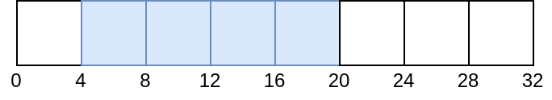
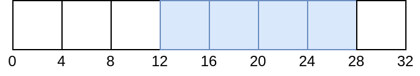
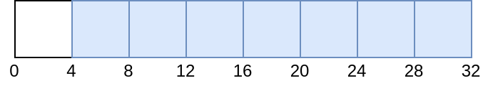
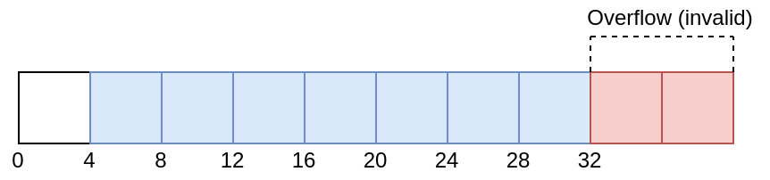

// Copyright 2022 The Khronos Group, Inc.
// SPDX-License-Identifier: CC-BY-4.0

ifndef::chapters[:chapters:]
ifndef::images[:images: images/]

[[descriptor-dynamic-offset]]
= 디스크립터 동적 오프셋(Descriptor Dynamic Offset)

Vulkan은 link:https://registry.khronos.org/vulkan/specs/1.3/html/vkspec.html#descriptorsets-binding-dynamicoffsets[사양으로 정의된 대로] 바인드 시 오프셋을 조정할 수 있는 두 종류의 디스크립터를 제공합니다.

* 동적 유니폼 버퍼(`VK_DESCRIPTOR_TYPE_UNIFORM_BUFFER_DYNAMIC`)
* 동적 스토리지 버퍼(`VK_DESCRIPTOR_TYPE_STORAGE_BUFFER_DYNAMIC`)

== 예제

이 예제는 32바이트의 버퍼를 가지고 있으며, 이 중 16바이트가 `vkUpdateDescriptorSets` 일 때 설정됩니다. 이 첫 번째 예제에서는 동적 오프셋을 추가하지 않습니다.

[source,c]
----
VkDescriptorSet descriptorSet; // 할당
VkBuffer buffer; // 32바이트 크기

VkDescriptorBufferInfo bufferInfo = {
    buffer,
    4,      // offset
    16      // range
};

VkWriteDescriptorSet writeInfo = {
    .dstSet = descriptorSet,
    .descriptorType = VK_DESCRIPTOR_TYPE_STORAGE_BUFFER_DYNAMIC,
    .pBufferInfo = bufferInfo
};

vkUpdateDescriptorSets(
    1,         // descriptorWriteCount,
    &writeInfo // pDescriptorWrites,
);

// 동적 오프셋 없음
vkCmdBindDescriptorSets(
    1,              // descriptorSetCount,
    &descriptorSet, // pDescriptorSets,
    0,              // dynamicOffsetCount
    NULL            // pDynamicOffsets
);
----

현재 버퍼는 다음과 같습니다:

다음은 바인드 시 8바이트 동적 오프셋이 적용된 예제입니다.

[source,c]
----
uint32_t offsets[1] = { 8 };
vkCmdBindDescriptorSets(
    1,              // descriptorSetCount,
    &descriptorSet, // pDescriptorSets,
    1,              // dynamicOffsetCount
    offsets         // pDynamicOffsets
);
----

현재 버퍼는 다음과 같습니다:

== VK_WHOLE_SIZE 를 사용한 예제

이번에는 `VK_WHOLE_SIZE` 값을 범위로 사용합니다. `VkDescriptorBufferInfo::range` 를 제외하고는 위의 예제와 모두 동일합니다.

[source,c]
----
VkDescriptorSet descriptorSet; // 할당
VkBuffer buffer; // 32바이트 크기

VkDescriptorBufferInfo info = {
    buffer,
    4,             // offset
    VK_WHOLE_SIZE  // range
};

VkWriteDescriptorSet writeInfo = {
    .dstSet = descriptorSet,
    .descriptorType = VK_DESCRIPTOR_TYPE_STORAGE_BUFFER_DYNAMIC,
    .pBufferInfo = bufferInfo
};

vkUpdateDescriptorSets(
    1,         // descriptorWriteCount,
    &writeInfo // pDescriptorWrites,
);

// 동적 오프셋 없음
vkCmdBindDescriptorSets(
    1,              // descriptorSetCount,
    &descriptorSet, // pDescriptorSets,
    0,              // dynamicOffsetCount
    NULL            // pDynamicOffsets
);
----

현재 버퍼는 다음과 같습니다.

이번에는 동적 오프셋을 적용하려고 하면 정의되지 않은 동작이 되어 link:https://github.com/KhronosGroup/Vulkan-ValidationLayers/issues/2846[검증 레이어에서 오류가 발생]합니다.

[source,c]
----
// Invalid
uint32_t offsets[1] = { 8 };
vkCmdBindDescriptorSets(
    1,              // descriptorSetCount,
    &descriptorSet, // pDescriptorSets,
    1,              // dynamicOffsetCount
    offsets         // pDynamicOffsets
);
----

유효하지 않은 동적 오프셋의 경우는 다음과 같습니다.

== 제한

기본 오프셋과 동적 오프셋은 모두 이 제한의 배수여야 하므로 `minUniformBufferOffsetAlignment` 과 `minStorageBufferOffsetAlignment` 도 확인하는 것이 중요합니다.
