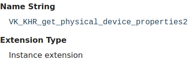
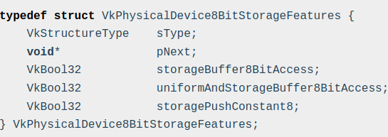

// Copyright 2019-2022 The Khronos Group, Inc.
// SPDX-License-Identifier: CC-BY-4.0

ifndef::chapters[:chapters:]
ifndef::images[:images: images/]

[[enabling-extensions]]
= 확장 기능 사용(Enabling Extensions)

여기서는 확장 기능의 활성화에 대해 설명합니다.

== 두 종류의 확장 기능

확장에는 **인스턴스 확장(instance extensions)** 과 **장치 확장(device extensions)**의 두 가지 그룹이 있습니다. 간단히 말해, **인스턴스 확장**은 전체 `VkInstance` 에 연결되는 반면 **장치 확장**은 단일 `VkDevice` 객체에만 연결됩니다.

이 정보는 각 확장 프로그램 참조 페이지의 "`확장 기능 유형(Extension Type)`" 섹션에 문서화되어 있습니다. 아래 예시를 참조하세요:

== 지원 확인

애플리케이션은 link:https://registry.khronos.org/vulkan/specs/1.3-extensions/html/vkspec.html#extendingvulkan-extensions[물리적 장치에 대한 쿼리]를 통해 먼저 `vkEnumerateInstanceExtensionProperties` 또는 `vkEnumerateDeviceExtensionProperties` 로 확장 기능이 **지원**되는지 확인할 수 있습니다.

[source,cpp]
----
// 간단한 예제
uint32_t count = 0;
vkEnumerateDeviceExtensionProperties(physicalDevice, nullptr, &count, nullptr);
std::vector<VkExtensionProperties> extensions(count);
vkEnumerateDeviceExtensionProperties(physicalDevice, nullptr, &count, extensions.data());

// VK_KHR_bind_memory2 지원 여부 확인
for (uint32_t i = 0; i < count; i++) {
    if (strcmp(VK_KHR_BIND_MEMORY_2_EXTENSION_NAME, extensions[i].extensionName) == 0) {
        break; // VK_KHR_bind_memory2 is supported
    }
}
----

== 확장 기능 활성화

확장 기능이 구현되어 **지원**되더라도 `VkInstance` 또는 `VkDevice` 생성 시점에 **활성화**되지 않으면, 확장 기능을 사용하는 것은 **정의되지 않은 동작**입니다.

다음은 `VK_KHR_driver_properties` 와 같은 확장 기능을 활성화하는 데 필요한 예제입니다.

image::../../../chapters/images/enabling_extensions_driver_properties.png[enabling_extensions_driver_properties.png]

[source,cpp]
----
// VK_KHR_driver_properties를 사용하려면 VK_KHR_get_physical_device_properties2가 필요합니다
// 인스턴스 확장이므로 VkInstance 생성 시점 이전에 활성화해야 합니다
std::vector<const char*> instance_extensions;
instance_extensions.push_back(VK_KHR_GET_PHYSICAL_DEVICE_PROPERTIES_2_EXTENSION_NAME);

VkInstanceCreateInfo instance_create_info  = {};
instance_create_info.enabledExtensionCount   = static_cast<uint32_t>(instance_extensions.size());
instance_create_info.ppEnabledExtensionNames = instance_extensions.data();
vkCreateInstance(&instance_create_info, nullptr, &myInstance);

// ...

std::vector<const char*> device_extensions;
device_extensions.push_back(VK_KHR_DRIVER_PROPERTIES_EXTENSION_NAME);

VkDeviceCreateInfo device_create_info      = {};
device_create_info.enabledExtensionCount   = static_cast<uint32_t>(device_extensions.size());
device_create_info.ppEnabledExtensionNames = device_extensions.data();
vkCreateDevice(physicalDevice, &device_create_info, nullptr, &myDevice);
----

== 기능 비트 확인

확장 기능은 Vulkan 사양에 기능을 추가하는 것이지만, 확장 기능이 **지원**된다고 해서 모든 기능을 사용할 수 있다는 것은 아니라는 점이 기억하세요. 예를 들어 `VK_KHR_8bit_storage` 와 같은 확장 기능은 `VkPhysicalDevice8BitStorageFeatures` 에서 공개하고 있는 3가지 기능을 가지고 있습니다.

This means after enabling the extension, an application will still need to xref:{chapters}enabling_features.adoc#enabling-features[query and enable the features] needed from an extension.

== 승격 과정

xref:{chapters}vulkan_release_summary.adoc#vulkan-release-summary[Vulkan의 마니어 버전이 출시되면], 일부 확장 기능이 link:https://registry.khronos.org/vulkan/specs/1.3-extensions/html/vkspec.html#extendingvulkan-compatibility-promotion[사양서에 정의된 대로 승격]됩니다. 승격의 목적은 Vulkan을 사용하는 여러 단체에서 광범위하게 지원하기로 결정한 확장 기능을 Vulkan 핵심 사양에 포함시키는 것입니다. Vulkan 버전에 대한 자세한 내용은 xref:{chapters}versions.adoc#versions[버전 챕터]에서 확인할 수 있습니다.

예를 들어 대부분의 다른 확장 기능에 사용되고 있는 `VK_KHR_get_physical_device_properties2` 와 같은 것이 있습니다. Vulkan 1.0에서는 애플리케이션이 `vkGetPhysicalDeviceFeatures2KHR` 과 같은 함수를 호출하기 전에 `VK_KHR_get_physical_device_properties2` 의 지원 여부를 쿼리해야합니다. Vulakn 1.1부터는 `vkGetPhysicalDeviceFeatures2` 함수가 지원되도록 보장됩니다.

승격을 살펴보는 또 다른 방법은 `VK_KHR_8bit_storage` 를 다시 예로 들어보는 것입니다. Vulkan 1.0부터 `textureCompressionASTC_LDR` 과 같은 일부 기능은 반드시 지원해야 하는 것은 아니지만 확장 기능을 활성화하지 않아도 쿼리할 수 있습니다. `VK_KHR_8bit_storage` 가 핵심으로 승격된 Vulkan 1.2부터 `VkPhysicalDevice8BitStorageFeatures` 의 모든 기능은 이제 `VkPhysicalDeviceVulkan12Features` 에서 찾을 수 있습니다.

=== 승격에 따른 행동 변화

승격되는 **일부** 확장 기능에는 미묘한 차이가 있음을 인식하는 것이 중요합니다. 승격에는 확장 기능의 "`Feature advertisement/enablement`" 와 같은 작은 변경점이 포함될 수 있다고 link:https://registry.khronos.org/vulkan/specs/1.3-extensions/html/vkspec.html#extendingvulkan-compatibility-promotion[사양서에 설명되어 있습니다]. `VK_KHR_8bit_storage` 를 사용한 사례가 이 작은 차이점을 가장 잘 설명할 수 있습니다.

 Vulkan 1.2의 `VK_KHR_8bit_storage` 에 대한 변경 사항은 link:https://registry.khronos.org/vulkan/specs/1.3-extensions/html/vkspec.html#_differences_relative_to_vk_khr_8bit_storage[Vulkan 사양서에 설명되어 있습니다]:

____
VK_KHR_8bit_storage 확장 기능이 지원되지 않는 경우 쉐이더 모듈에서 SPIR-V StorageBuffer8BitAccess 기능에 대한 지원은 선택 사항입니다.
____

여기서 말하는 "지원되지 않음"이란 어떤 구현 사항이 Vulkan 1.2 이상을 지원하고 있어도 애플리케이션이 `vkEnumerateDeviceExtensionProperties` 를 쿼리하면 그 결과가 `VK_KHR_8bit_storage` 에 포함되어 있지 않을 수도 있다는 것을 의미합니다.

  * `vkEnumerateDeviceExtensionProperties` 에서 `VK_KHR_8bit_storage` 가 발견된 경우에는 `storageBuffer8BitAccess` 기능이 지원되는 것이 **보장**됩니다.
  * `vkEnumerateDeviceExtensionProperties` 에서 `VK_KHR_8bit_storage` 를 **찾을 수 없는** 경우에는 `storageBuffer8BitAccess` 기능이 지원되고 **있을 수도** 있으며, `VkPhysicalDeviceVulkan12Features::storageBuffer8BitAccess` 를 쿼리하여 확인할 수 있습니다.

승격된 확장 기능의 모든 기능 변경 사항 목록은 link:https://registry.khronos.org/vulkan/specs/1.3-extensions/html/vkspec.html#versions[버전 부록]에서 확인할 수 있습니다.
