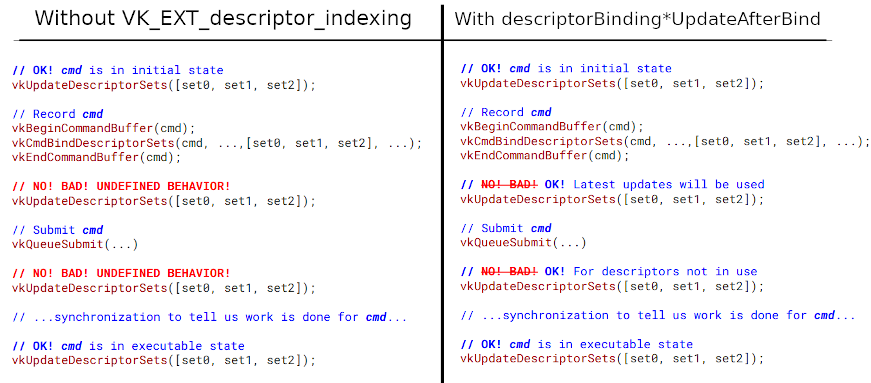

// Copyright 2019-2021 The Khronos Group, Inc.
// SPDX-License-Identifier: CC-BY-4.0

ifndef::chapters[:chapters: ../]
ifndef::images[:images: ../images/]

[[VK_EXT_descriptor_indexing]]
= VK_EXT_descriptor_indexing

[NOTE]
====
Vulkan 1.2에서 코어로 승격됨

link:https://htmlpreview.github.io/?https://github.com/KhronosGroup/SPIRV-Registry/blob/master/extensions/EXT/SPV_EXT_descriptor_indexing.html[SPV_EXT_descriptor_indexing]

link:https://github.com/KhronosGroup/GLSL/blob/master/extensions/ext/GL_EXT_nonuniform_qualifier.txt[GLSL - GL_EXT_nonuniform_qualifier]

Montreal Developer Day 의 프레젠테이션 (link:https://www.youtube.com/watch?v=tXipcoeuNh4[video] 및 link:https://www.khronos.org/assets/uploads/developers/library/2018-vulkan-devday/11-DescriptorUpdateTemplates.pdf[slides])
====

이 확장 기능은 가능한 경우 구현에서 각 기능에 대한 지원을 추가할 수 있도록 몇 가지 작은 기능으로 세분화하도록 설계되었습니다.

== 바인드 후의 업데이트

이 확장 기능이 없으면 커맨드 버퍼 기록과 실행 사이에 애플리케이션의 디스크립터는 업데이트할 수 없습니다. 이 확장 기능을 통해 애플리케이션이 사용 중인 디스크립터 유형에 대해 `descriptorBinding*UpdateAfterBind` 지원을 쿼리하여 애플리케이션이 기록과 실행 사이에 업데이트할 수 있도록 할 수 있습니다.

[NOTE]
.Example
====
애플리케이션에 `StorageBuffer` 디스크립터가 있는 경우, `descriptorBindingStorageBufferUpdateAfterBind` 지원 여부를 쿼리합니다.
====

바인드 후 업데이트 기능을 활성화한 후 애플리케이션에서 바인드 후 업데이트할 수 있는 디스크립터를 사용하려면 다음과 같은 설정을 해야 합니다:

  * 디스크립터가 할당된 모든 `VkDescriptorPool` 에 대한 `VK_DESCRIPTOR_POOL_CREATE_UPDATE_AFTER_BIND_BIT_EXT` 플래그가 설정됩니다.
  * 디스크립터의 출처가 되는 모든 `VkDescriptorSetLayout` 에 대한 `VK_DESCRIPTOR_SET_LAYOUT_CREATE_UPDATE_AFTER_BIND_POOL_BIT_EXT` 플래그가 설정됩니다.
  * 디스크립터가 사용할 `VkDescriptorSetLayout` 의 각 바인딩에 대한 `VK_DESCRIPTOR_BINDING_UPDATE_AFTER_BIND_BIT_EXT` 를 설정합니다.

다음 코드 예시는 바인딩 후 업데이트를 활성화할 때와 그렇지 않을 때의 차이점을 보여줍니다:

== 부분적으로 바인딩

`descriptorBindingPartiallyBound` 기능을 사용하고 `VkDescriptorSetLayoutBindingFlagsCreateInfo::pBindingFlags` 에서 `VK_DESCRIPTOR_BINDING_PARTIALLY_BOUND_BIT_EXT` 를 사용하면 애플리케이션 개발자가 사용 시 모든 디스크립터를 업데이트할 필요가 없습니다.

예를 들어 애플리케이션의 GLSL이 다음과 같은 경우입니다.

[source,glsl]
----
layout(set = 0, binding = 0) uniform sampler2D textureSampler[64];
----

여기서 배열의 첫 32 슬롯만 바인딩합니다. 이것은 배열의 바인딩되지 않은 슬롯에 인덱싱되지 않는다는 것을 애플리케이션이 알고 있어야 합니다.

== 동적 인덱싱

일반적으로 애플리케이션이 바인딩된 디스크립터의 배열로 인덱싱할 때 인덱스는 컴파일 시점에 알 수 있어야 합니다. `shader*ArrayDynamicIndexing` 기능을 사용하면 특정 유형의 디스크립터를 "`동적으로 유니폼한(dynamically uniform)`" 정수로 인덱싱할 수 있습니다. 이 기능은 이미 대부분의 디스크립터에 대해 `VkPhysicalDeviceFeatures` 로 지원되었지만, 이번 확장 기능에서는 `VkPhysicalDeviceDescriptorIndexingFeatures` 구조체를 추가하여 입력 첨부, 유니폼 텍셀 버퍼 및 스토리지 텍셀 버퍼의 동적 유니폼 인덱싱을 구현할 수 있도록 지원합니다.

여기서 핵심 단어는 "`유니폼(uniform)`" 으로, SPIR-V 호출 그룹의 모든 호출이 모두 동일한 동적 인덱스를 사용해야 함을 의미합니다. 이는 단일 `vkCmdDraw*` 호출의 모든 호출 또는 단일 `vkCmdDispatch*` 호출의 단일 워크그룹으로 변환됩니다.

GLSL의 동적 유니폼 인덱싱 예시

[source,glsl]
----
layout(set = 0, binding = 0) uniform sampler2D mySampler[64];
layout(set = 0, binding = 1) uniform UniformBufferObject {
    int textureId;
} ubo;

// ...

void main() {
    // ...
    vec4 samplerColor = texture(mySampler[ubo.textureId], uvCoords);
    // ...
}
----

이 예제는 `ubo.textureId` 값을 실행할 때까지 알 수 없기 때문에 "`동적(dynamic)`" 문입니다. 또한 이 쉐이더에서는 모든 호출에서  `ubo.textureId` 가 사용되기 때문에 "`유니폼(uniform)`" 입니다.

== 동적 비유니폼 인덱싱

동적으로 **비유니폼(non-uniform)**하다는 것은 호출이 디스크립터 배열에 다르게 인덱싱될 수 있다는 것을 의미하지만, 런타임까지는 알 수 없습니다. 이 확장 기능은 `VkPhysicalDeviceDescriptorIndexingFeatures` 에서 `shader*ArrayNonUniformIndexing` 기능 비트 세트를 공개하여 구현이 동적 비균일 인덱싱을 지원하는 디스크립터 유형을 표시합니다. SPIR-V 확장은 `NonUniform` 수식을 추가하며, 이 수식은 `nonuniformEXT` 키워드를 추가하여 GLSL에서 설정할 수 있습니다.

GLSL에서 동적 비유니폼 인덱싱의 예시

[source,glsl]
----
#version450
#extension GL_EXT_nonuniform_qualifier : enable

layout(set = 0, binding = 0) uniform sampler2D mySampler[64];
layout(set = 0, binding = 1) uniform UniformBufferObject {
    int textureId;
} ubo;

// ...

void main() {
    // ...
    if (uvCoords.x > runtimeThreshold) {
        index = 0;
    } else {
        index = 1;
    }
    vec4 samplerColor = texture(mySampler[nonuniformEXT(index)], uvCoords);
    // ...
}
----

이 예제에서 일부 호출은 `mySampler[0]` 에서 인덱싱하고 일부는 `mySampler[1]` 에서 인덱싱하므로 비유니폼(non-uniform)입니다. 이 경우 `nonuniformEXT()` 가 필요합니다.
