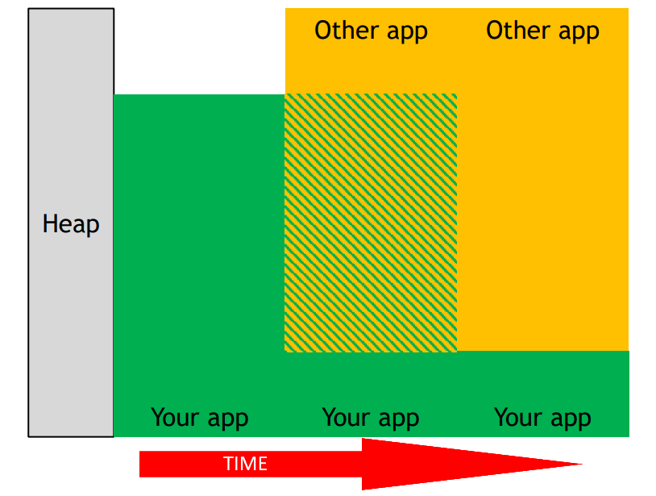
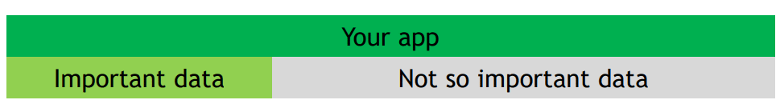

// Copyright 2019-2021 The Khronos Group, Inc.
// SPDX-License-Identifier: CC-BY-4.0

ifndef::chapters[:chapters: ../]
ifndef::images[:images: ../images/]

[[VK_EXT_memory_priority]]
= VK_EXT_memory_priority

메모리 관리는 Vulkan에서 중요한 부분입니다. `VK_EXT_memory_priority` 확장 기능은 애플리케이션이 중요한 할당이 느린 메모리로 이동하는 것을 방지할 수 있도록 설계되었습니다.

이 확장 기능은 두 개의 애플리케이션(기본 애플리케이션과 호스트 머신의 다른 프로세스)을 예로 들어 설명할 수 있습니다. 시간이 지남에 따라 두 애플리케이션 모두 제한된 장치 힙 메모리를 사용하려고 시도합니다.

이 상황에서는 메인 애플리케이션의 할당이 아직 존재하지만 느린 메모리에 있을 가능성이 있습니다(구현에서 다시 필요할 때까지 호스트 가시 메모리로 이동했을 수 있음).

**어떤 메모리**를 옮길지는 구현에 따라 결정됩니다. 이제 메인 애플리케이션의 메모리 사용량이 다음과 같다고 가정해 보겠습니다.

보시다시피, 애플리케이션이 항상 빠른 메모리에 보관하는 것이 더 중요하다고 생각하는 메모리가 있었습니다.

`VK_EXT_memory_priority` 확장 기능을 사용하면 이 작업을 매우 쉽게 수행할 수 있습니다. 메모리를 할당할 때, 애플리케이션은 `VkMemoryAllocateInfoEXT` 를 `VkMemoryAllocateInfo::pNext` 에 추가하기만 하면 됩니다. 여기에서 `VkMemoryPriorityAllocateInfoEXT::priority` 값을 `0.0` 에서 `1.0` 사이의 값으로 설정할 수 있습니다(기본값은 `0.5`). 이를 통해 위와 같은 상황이 발생했을 때 애플리케이션이 더 나은 추측을 할 수 있도록 도와줍니다.

== 제안(Suggestions)

  * 확장 기능이 지원되는지 확인하세요.
  * 이것은 구현에 대한 **힌트**이며, 애플리케이션은 이를 사용하기 전에 적절한 비용(budgets)을 책정해야 한다는 점을 기억하세요.
  * 가능하면 가정하지 말고 항상 메모리 병목 현상을 측정하세요.
  * 기록되는 모든 메모리는 우선순위가 높은 메모리가 될 가능성이 높습니다.
  ** 렌더 타켓(예: 프레임버퍼의 출력 첨부)은 일반적으로 높은 우선순위로 설정하는 것이 중요합니다.
  * 우선 순위가 높은 메모리는 "`고빈도 접근(high frequency access)`" 와 "`낮은 지연시간 허용(low latency tolerance)`" 을 갖는 것으로 간주하세요.
  ** 예: 정점 버퍼는 여러 프레임에 걸쳐 안정적이며, 각 값이 한 번만 액세스되며, 보통 접근 지연에 관대하기 때문에 일반적으로 우선순위를 낮추기에 좋은 후보입니다.
