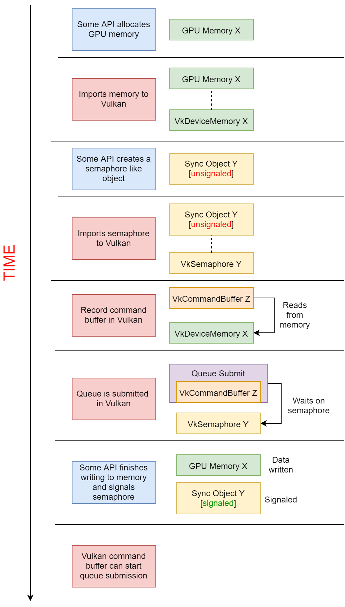

// Copyright 2019-2021 The Khronos Group, Inc.
// SPDX-License-Identifier: CC-BY-4.0

ifndef::chapters[:chapters: ../]
ifndef::images[:images: ../images/]

[[external-memory]]
= 외장 메모리와 동기화

애플리케이션이 GPU와 관련된 모든 작업을 Vulkan에서 수행하는 것은 아닙니다. Vulkan의 범위 밖에서 메모리를 쓰거나 읽어야 하는 다양한 상황이 있습니다. 이러한 사용 사례를 지원하기 위해 외장 메모리 및 동기화 기능 세트가 만들어졌습니다.

이와 관련된 확장 기능 목록은 다음과 같습니다:

  * `VK_KHR_external_fence`
  ** 1.1에서 코어로 승격됨
  * `VK_KHR_external_fence_capabilities`
  ** 1.1에서 코어로 승격됨
  * `VK_KHR_external_memory`
  ** 1.1에서 코어로 승격됨
  * `VK_KHR_external_memory_capabilities`
  ** 1.1에서 코어로 승격됨
  * `VK_KHR_external_semaphore`
  ** 1.1에서 코어로 승격됨
  * `VK_KHR_external_semaphore_capabilities`
  ** 1.1에서 코어로 승격됨
  * `VK_KHR_external_fence_fd`
  * `VK_KHR_external_fence_win32`
  * `VK_KHR_external_memory_fd`
  * `VK_KHR_external_memory_win32`
  * `VK_KHR_external_semaphore_fd`
  * `VK_KHR_external_semaphore_win32`
  * `VK_ANDROID_external_memory_android_hardware_buffer`

너무 많아 보이니 조금씩 나눠서 설명해 드리겠습니다.

== 기능(Capabilities)

`VK_KHR_external_fence_capabilities`, `VK_KHR_external_semaphore_capabilities`, `VK_KHR_external_memory_capabilities` 는 구현이 어떤 외부 지원을 제공하는지에 대한 정보를 쿼리하는 방법일 뿐입니다.

== 메모리 vs 동기화

메모리 자체의 가져오기/내보내기만 처리하는 확장 세트가 있습니다. 다른 확장 세트는 내부 Vulkan 명령을 제어하는 데 사용되는 동기화 프리미티브(`VkFence` 와 `VkSemaphore`) 를 위한 것입니다. 가져오기/내보내기되는 메모리의 각 부분에는 메모리 액세스를 관리하기 위해 일치하는 펜스/세마포어가 있는 것이 일반적입니다.

=== 메모리

`VK_KHR_external_memory` 확장은 주로 외부에서 사용 중인 메모리 유형을 설명하는 `VkExternalMemoryHandleTypeFlagBits` 열거형을 제공하기 위한 것입니다.

현재 지원되는 메모리 가져오기/내보내기 방법은 3가지입니다.

  * POSIX 파일 디스크립터의 메모리를 위한 `VK_KHR_external_memory_fd`
  * 윈도우 핸들의 메모리를 위한 `VK_KHR_external_memory_win32`
  * AHardwareBuffer의 메모리를 위한 `VK_ANDROID_external_memory_android_hardware_buffer`

이러한 각 방법에는 제한 사항, 요구 사항, 소요권 등에 대한 자세한 설명이 있습니다.

==== 메모리 가져오기(Importing)

메모리를 가져오려면 주어진 외부 메모리 확장 기능에 의해 제공되는 `VkImport*Info` 구조체가 있습니다. 이 구조체는 `vkAllocateMemory` 로 전달되며, 이제 Vulkan은 가져온 메모리에 매핑되는 `VkDeviceMemory` 핸들을 갖게 됩니다.

==== 메모리 내보내기(Exporting)

메모리를 내보내려면 주어진 외부 메모리 확장 기능에 의해 제공되는 `VkGetMemory*` 함수가 있습니다. 이 함수는 `VkDeviceMemory` 핸들을 받은 다음 이를 확장 기능이 공개하고 있는 객체에 매핑합니다.

=== 동기화

Vulkan에서 외부 동기화는 `VkFence` 와 `VkSemaphores` 양쪽에서 사용할 수 있습니다. 이 둘을 가져오고 내보내는 데 사용하는 방법에는 거의 차이가 없습니다.

`VK_KHR_external_fence` 와 `VK_KHR_external_semaphore` 확장 기능은 모두 `Vk*ImportFlagBits` 열거형과 `VkExport*CreateInfo` 구조체를 공개하여 가져오기/내보내기되는 동기화 유형을 설명합니다.

현재 지원되는 동기화 가져오기/내보내기 방법은 두 가지입니다.

  * `VK_KHR_external_fence_fd` / `VK_KHR_external_semaphore_fd`
  * `VK_KHR_external_fence_win32` / `VK_KHR_external_semaphore_win32`

각 확장 기능은 동기화 프리미티브의 소유권을 관리하는 방법을 설명합니다.

==== 동기화 프리미티브 가져오기 및 내보내기

가져오기 위한 `VkImport*` 함수와 내보내기 위한 `VkGet*` 함수가 있습니다. 이 두 함수는 외부 동기화 객체를 정의하는 확장 메서드와 함께 전달된 `VkFence`/`VkSemaphores` 핸들을 받습니다.

== 예제

다음은 Vulkan과 GPU와 통신하는 다른 API 간의 이벤트 타임라인을 보여주는 간단한 다이어그램입니다. 이 다이어그램은 이러한 외부 메모리 및 동기화 확장 기능의 일반적인 사용 사례를 나타내는 데 사용됩니다.

