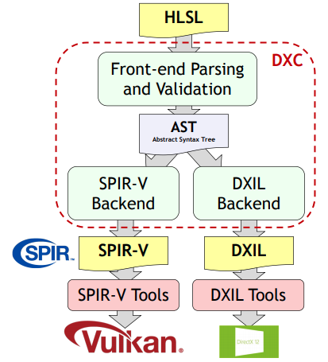

// Copyright 2021-2023 The Khronos Group, Inc.
// Copyright 2021-2023 Sascha Willems
// SPDX-License-Identifier: CC-BY-4.0

ifndef::chapters[:chapters:]
ifndef::images[:images: images/]

[[hlsl-in-vulkan]]
= Vulkan 에서의 HLSL

Vulkan은 인간이 읽을 수 있는 텍스트 형식의 쉐이더를 직접 사용하는 것이 아니라 중간 표현으로서 xref:{chapters}what_is_spirv.adoc[SPIR-V]을 사용합니다. 이렇게 하면 Vulkan SPIR-V 환경을 대상으로 가능한 한 GLSL 이외의 쉐이더 언어를 사용할 수도 있습니다.

그러한 언어 중 하나는 DirectX에서 사용되는 Microsoft의 High Level Shading Language(HLSL) 입니다. link:https://www.khronos.org/blog/hlsl-first-class-vulkan-shading-language[최근 Vulkan 1.2에 추가된 기능 덕분에] 지금은 GLSL과 마찬가지로 쉽게 사용할 수 있는 Vulkan의 최고급 쉐이딩 언어로 간주되고 있습니다.

link:https://github.com/microsoft/DirectXShaderCompiler/blob/main/docs/SPIR-V.rst#unsupported-hlsl-features[몇 가지 예외를 제외하면], 하드웨어 가속 레이 트레이싱과 같은 최근 추가된 Vulkan 기능을 포함하여 GLSL에서 사용할 수 있는 모든 Vulkan 기능과 쉐이더 스테이지를 HLSL에서도 사용할 수 있습니다. 반면에 HLSL에서 SPIR-V로 전환하면, DirectX에서는 (아직) 사용할 수 없는 Vulkan 전용 기능을 지원합니다.

[[educational-resources]]
== 교육용 자료

HLSL을 처음 접하는 경우 link:https://learn.microsoft.com/en-us/windows/win32/direct3dhlsl/dx-graphics-hlsl[Microsoft Learn]의 HLSL 리소스를 참조하는 것이 좋습니다. 또 다른 훌륭한 자료는 link:https://microsoft.github.io/DirectX-Specs/[DirectX 사양서] 입니다. 여기에는 최신 쉐이더 기능 및 HLSL의 쉐이더 모델에 대한 유용한 정보가 포함되어 있습니다.

[[applications-pov]]
== 애플리케이션 관점에서

애플리케이션 관점에서 보면 HLSL을 사용하는 것은 GLSL을 사용하는 것과 완전히 동일합니다. 애플리케이션은 항상 SPIR-V 형식의 쉐이더를 사용하므로 원하는 쉐이딩 언어로 SPIR-V 쉐이더를 생성하는 도구만 다를 뿐입니다.

[[hlsl-spirv-mapping-manual]]
== HLSL에서 SPIR-V 에 대한 기능 매핑 메뉴얼
SPIR-V를 통해 Vulkan에서 HLSL을 사용하는 데 있어 가장 좋은 출발점은 link:https://github.com/microsoft/DirectXShaderCompiler/blob/main/docs/SPIR-V.rst[HLSL에서 SPIR-V로의 기능 매핑 메뉴얼] 입니다. 여기에는 의미론(semantics), 문법(syntax), 지원되는 기능 및 확장 기능 등에 대한 자세한 정보가 포함되어 있으며 반드시 읽어보시기 바랍니다. xref:{chapters}decoder_ring.adoc[디코더 링]에는 Vulkan과 DirectX에서 사용되는 개념과 용어에 대한 번역 표도 있습니다.

[[vk-namespace]]
== Vulkan HLSL namespace
HLSL을 Vulkan과 호환하기 위해 Vulkan 고유 기능에 대한 인터페이스를 제공하는 link:https://github.com/microsoft/DirectXShaderCompiler/blob/main/docs/SPIR-V.rst#the-implicit-vk-namespace)[암시적 네임스페이스(implicit namespace)]가 도입되었습니다.

[[syntax-comparison]]
== 문법 비교

일반 프로그래밍 언어와 마찬가지로 HLSL과 GLSL은 문법에서 차이가 있습니다. GLSL은 (C언어와 같은) 절차적 언어인 반면, HLSL은 (C++와 같은) 객체 지향적 언어입니다.

다음은 두 언어로 작성된 동일한 쉐이더로, 앞서 언급한 명시적 위치를 추가하는 네임스페이스를 포함하여 기본적으로 어떻게 다른지 빠르게 비교할 수 있습니다:

=== GLSL
[source,glsl]
----
#version 450

layout (location = 0) in vec3 inPosition;
layout (location = 1) in vec3 inColor;

layout (binding = 0) uniform UBO
{
	mat4 projectionMatrix;
	mat4 modelMatrix;
	mat4 viewMatrix;
} ubo;

layout (location = 0) out vec3 outColor;

void main()
{
	outColor = inColor * float(gl_VertexIndex);
	gl_Position = ubo.projectionMatrix * ubo.viewMatrix * ubo.modelMatrix * vec4(inPosition.xyz, 1.0);
}
----

=== HLSL
[source,hlsl]
----
struct VSInput
{
[[vk::location(0)]] float3 Position : POSITION0;
[[vk::location(1)]] float3 Color : COLOR0;
};

struct UBO
{
	float4x4 projectionMatrix;
	float4x4 modelMatrix;
	float4x4 viewMatrix;
};

cbuffer ubo : register(b0, space0) { UBO ubo; }

struct VSOutput
{
	float4 Pos : SV_POSITION;
[[vk::location(0)]] float3 Color : COLOR0;
};

VSOutput main(VSInput input, uint VertexIndex : SV_VertexID)
{
	VSOutput output = (VSOutput)0;
	output.Color = input.Color * float(VertexIndex);
	output.Position = mul(ubo.projectionMatrix, mul(ubo.viewMatrix, mul(ubo.modelMatrix, float4(input.Position.xyz, 1.0))));
	return output;
}
----

문법 차이 외에도 내장 기능은 HLSL 이름을 사용합니다. 예를 들어 `gl_vertex` 는 HLSL에서 `VertexIndex` 가 됩니다. GLSL에서 HLSL로의 기본 제공 매핑 목록은 link:https://anteru.net/blog/2016/mapping-between-HLSL-and-GLSL/[여기]에서 확인할 수 있습니다.

[[DirectXShaderCompiler]]
== DirectXShaderCompiler (DXC)

GLSL에서 SPIR-V로 변환하는 경우와 마찬가지로, Vulkan에서 HLSL을 사용하려면 쉐이더 컴파일러가 필요합니다. link:https://github.com/KhronosGroup/glslang[glslang]이 GLSL에서 SPIR-V로 변환하는 레퍼런스 컴파일러인 반면, link:https://github.com/microsoft/DirectXShaderCompiler[DirectXShaderCompiler](DXC)는 HLSL에서 SPIR-V로 변환하는 레퍼런스 컴파일러입니다. 오픈소스 기여 덕분에 DXC의 SPIR-V 백엔드는 이제 공식 릴리즈 빌드에서 지원 및 활성화되어 그대로 사용할 수 있습니다. link:https://github.com/KhronosGroup/glslang/wiki/HLSL-FAQ[glslang]과 같은 다른 쉐이더 컴파일 툴도 HLSL을 지원하지만, DXC는 가장 완전하고 최신 지원을 제공하므로 HLSL에서 SPIR-V를 생성하는 데 권장되는 방식입니다.

=== 입수 장소(Where to get)

link:https://vulkan.lunarg.com/[LunarG Vulkan SDK]에는 미리 컴파일된 DXC 바이너리, 라이브러리, 헤더가 포함되어 있어 바로 시작할 수 있습니다. 최신 릴리즈를 찾고 있다면 link:https://github.com/microsoft/DirectXShaderCompiler/releases[공식 DXC 레포지토리]를 확인하세요.

=== 독립형 컴파일러를 통한 오프라인 컴파일

미리 컴파일된 dxc 바이너리를 통해 쉐이더를 오프라인으로 컴파일하는 것은 glslang으로 컴파일하는 것과 유사합니다:

[source]
----
dxc.exe -spirv -T vs_6_0 -E main .\triangle.vert -Fo .\triangle.vert.spv
----

`-T` 는 쉐이더를 컴파일할 프로파일을 선택합니다 (`vs_6_0` = Vertex shader model 6, `ps_6_0` = Pixel/fragment shader model 6, etc.).

`-E` 는 쉐이더의 주 진입점을 선택합니다.

확장 기능은 기능 사용량에 따라 암시적으로 활성화되지만 명시적으로 지정할 수도 있습니다:

[source]
----
dxc.exe -spirv -T vs_6_1 -E main .\input.vert -Fo .\output.vert.spv -fspv-extension=SPV_EXT_descriptor_indexing
----

그 결과 GLSL에서 생성한 SPIR-V와 마찬가지로 직접 읽을 수 있게 됩니다.

=== 라이브러리를 이용한 실시간 컴파일

DXC는 DirectX 컴파일러 API를 사용하여 Vulkan 애플리케이션에 통합할 수도 있습니다. 이를 통해 쉐이더를 런타임 컴파일할 수 있습니다. 이렇게 하려면 `dxcapi.h` 헤더와 `dxcompiler` 라이브러리에 대한 링크를 포함해야 합니다. 가장 쉬운 방법은 동적 라이브러리를 사용하여 애플리케이션과 함께 배포하는 것입니다(예: Windows의 경우 `dxcompiler.dll` ).

그런 다음 런타임에 HLSL을 SPIR-V로 컴파일하는 것은 매우 간단합니다:

[source, cpp]
----
#include "include/dxc/dxcapi.h"

...

HRESULT hres;

// DXC 라이브러리 초기화
CComPtr<IDxcLibrary> library;
hres = DxcCreateInstance(CLSID_DxcLibrary, IID_PPV_ARGS(&library));
if (FAILED(hres)) {
	throw std::runtime_error("Could not init DXC Library");
}

// DXC 컴파일러 초기화
CComPtr<IDxcCompiler3> compiler;
hres = DxcCreateInstance(CLSID_DxcCompiler, IID_PPV_ARGS(&compiler));
if (FAILED(hres)) {
	throw std::runtime_error("Could not init DXC Compiler");
}

// DXC 유틸리티 초기화
CComPtr<IDxcUtils> utils;
hres = DxcCreateInstance(CLSID_DxcUtils, IID_PPV_ARGS(&utils));
if (FAILED(hres)) {
	throw std::runtime_error("Could not init DXC Utiliy");
}

// HLSL 쉐이더를 디스크에서 읽어들이기
uint32_t codePage = DXC_CP_ACP;
CComPtr<IDxcBlobEncoding> sourceBlob;
hres = utils->LoadFile(filename.c_str(), &codePage, &sourceBlob);
if (FAILED(hres)) {
	throw std::runtime_error("Could not load shader file");
}

// 쉐이더 파일 확장자를 기준으로 대상 프로파일 선택
LPCWSTR targetProfile{};
size_t idx = filename.rfind('.');
if (idx != std::string::npos) {
	std::wstring extension = filename.substr(idx + 1);
	if (extension == L"vert") {
		targetProfile = L"vs_6_1";
	}
	if (extension == L"frag") {
		targetProfile = L"ps_6_1";
	}
	// Mapping for other file types go here (cs_x_y, lib_x_y, etc.)
}

// HLSL 쉐이더를 SPIR-V로 컴파일하기 위한 컴파일러 인수를 구성
std::vector<LPCWSTR> arguments = {
	// (Optional) name of the shader file to be displayed e.g. in an error message
	filename.c_str(),
	// Shader main entry point
	L"-E", L"main",
	// Shader target profile
	L"-T", targetProfile,
	// Compile to SPIRV
	L"-spirv"				
};

// 쉐이더 컴파일
DxcBuffer buffer{};
buffer.Encoding = DXC_CP_ACP;
buffer.Ptr = sourceBlob->GetBufferPointer();
buffer.Size = sourceBlob->GetBufferSize();

CComPtr<IDxcResult> result{ nullptr };
hres = compiler->Compile(
	&buffer,
	arguments.data(),
	(uint32_t)arguments.size(),
	nullptr,
	IID_PPV_ARGS(&result));

if (SUCCEEDED(hres)) {
	result->GetStatus(&hres);
}

// 컴파일 실패 시 오류 출력
if (FAILED(hres) && (result)) {
	CComPtr<IDxcBlobEncoding> errorBlob;
	hres = result->GetErrorBuffer(&errorBlob);
	if (SUCCEEDED(hres) && errorBlob) {
		std::cerr << "Shader compilation failed :\n\n" << (const char*)errorBlob->GetBufferPointer();
		throw std::runtime_error("Compilation failed");
	}
}

// 컴파일 결과 가져오기
CComPtr<IDxcBlob> code;
result->GetResult(&code);

// 컴파일 결과로부터 Vulkan 쉐이더 모듈 생성
VkShaderModuleCreateInfo shaderModuleCI{};
shaderModuleCI.sType = VK_STRUCTURE_TYPE_SHADER_MODULE_CREATE_INFO;
shaderModuleCI.codeSize = code->GetBufferSize();
shaderModuleCI.pCode = (uint32_t*)code->GetBufferPointer();
VkShaderModule shaderModule;
vkCreateShaderModule(device, &shaderModuleCI, nullptr, &shaderModule);
----

=== Vulkan 쉐이더 스테이지에서 HLSL 대상 쉐이더 프로파일로 매핑하기

DXC로 HLSL을 컴파일할 때는 대상 쉐이더 프로파일을 선택해야 합니다. 프로파일의 이름은 쉐이더 유형과 원하는 쉐이더 모델로 구성됩니다.

|===
| Vulkan 쉐이더 스테이지 | HLSL 대상 쉐이더 프로파일 | 비고

|`VK_SHADER_STAGE_VERTEX_BIT`
| `vs`
|

|`VK_SHADER_STAGE_TESSELLATION_CONTROL_BIT`
| `hs`
| HLSL에서의 Hull 쉐이더

|`VK_SHADER_STAGE_TESSELLATION_EVALUATION_BIT`
| `ds`
| HLSL에서의 domain 쉐이더

|`VK_SHADER_STAGE_GEOMETRY_BIT`
| `gs`
|

|`VK_SHADER_STAGE_FRAGMENT_BIT`
| `ps`
| HLSL에서의 픽셀 쉐이더

|`VK_SHADER_STAGE_COMPUTE_BIT`
| `cs`
|

|`VK_SHADER_STAGE_RAYGEN_BIT_KHR`,
`VK_SHADER_STAGE_ANY_HIT_BIT_KHR`,
`VK_SHADER_STAGE_CLOSEST_HIT_BIT_KHR`,
`VK_SHADER_STAGE_MISS_BIT_KHR`,
`VK_SHADER_STAGE_INTERSECTION_BIT_KHR`,
`VK_SHADER_STAGE_CALLABLE_BIT_KHR`
| `lib`
| 모든 레이트레이싱 관련 쉐이더는 `lib` 쉐이더 대상 프로파일을 사용하여 빌드되며, 최소 쉐이더 모델 6.3 (예: `lib_6_3`)을 사용해야 합니다.

| `VK_SHADER_STAGE_TASK_BIT`
| `as`
| HLSL의 Amplification 쉐이더. 최소 쉐이더 모델 6.5 (예: `as_6_5`)를 사용해야 합니다.

| `VK_SHADER_STAGE_MESH_BIT`
| `ms`
| 적어도 쉐이더 모델 6.5 (예: `ms_6_5`)를 사용해야 합니다.

|===

예를 들어 쉐이더 모델 6.6 기능을 대상으로 하는 컴퓨팅 쉐이더를 컴파일하려는 경우, 대상 쉐이더 프로파일은 `cs_6_6` 이 됩니다. 히트(hit) 쉐이더를 추적하는 레이 트레이싱의 경우 `lib_6_3` 이 됩니다.

== 쉐이더 모델 대응 범위(Shader model coverage)

DirectX와 HLSL은 지원되는 기능 세트를 설명하기 위해 고정 쉐이더 모델 개념을 사용합니다. 이는 쉐이더에 기능을 추가하는 유연한 확장 기반 방식인 Vulkan 및 SPIR-V와는 다릅니다. 다음 표는 완전성을 보장할 수 없지만 HLSL 쉐이더 모델에 대한 Vulkan의 지원 범위를 나열한 것입니다:

.Shader models
|===
| 쉐이더 모델 | 지원 | 비고

| Shader Model 5.1 and below
| ✔
| Excluding features without Vulkan equivalent

| link:https://github.com/microsoft/DirectXShaderCompiler/wiki/Shader-Model-6.0[Shader Model 6.0]
| ✔
| Wave intrinsics, 64-bit integers

| link:https://github.com/microsoft/DirectXShaderCompiler/wiki/Shader-Model-6.1[Shader Model 6.1]
| ✔
| SV_ViewID, SV_Barycentrics

| link:https://github.com/microsoft/DirectXShaderCompiler/wiki/Shader-Model-6.2[Shader Model 6.2]
| ✔
| 16-bit types, Denorm mode

| link:https://github.com/microsoft/DirectXShaderCompiler/wiki/Shader-Model-6.3[Shader Model 6.3]
| ✔
| Hardware accelerated ray tracing

| link:https://github.com/microsoft/DirectXShaderCompiler/wiki/Shader-Model-6.4[Shader Model 6.4]
| ✔
| Shader integer dot product, SV_ShadingRate

| link:https://github.com/microsoft/DirectXShaderCompiler/wiki/Shader-Model-6.5[Shader Model 6.5]
| ❌ (partially)
| DXR1.1 (KHR ray tracing), Mesh and Amplification shaders, additional Wave intrinsics

| link:https://github.com/microsoft/DirectXShaderCompiler/wiki/Shader-Model-6.6[Shader Model 6.6]
| ❌ (partially)
| VK_NV_compute_shader_derivatives, VK_KHR_shader_atomic_int64

|===
