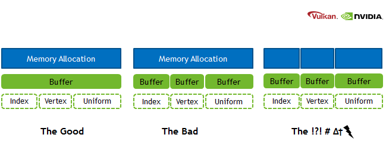
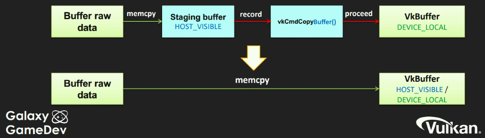

// Copyright 2019-2022 The Khronos Group, Inc.
// SPDX-License-Identifier: CC-BY-4.0

ifndef::chapters[:chapters:]
ifndef::images[:images: images/]

[[memory-allocation]]
= 메모리 할당

Vulkan에서 장치 메모리 관리하는 것은 일부 개발자에게는 처음일 수 있으므로 몇 가지 기본 사항을 이해히는 것이 중요합니다.

Vulkan 메모리 관리에 관한 2개의 크로노스 프레젠테이션, link:https://www.khronos.org/assets/uploads/developers/library/2018-vulkan-devday/03-Memory.pdf[Vulkan Dev Day Montreal] (link:https://www.youtube.com/watch?v=rXSdDE7NWmA[video]) 와 link:https://www.khronos.org/assets/uploads/developers/library/2018-vulkanised/03-Steven-Tovey-VulkanMemoryManagement_Vulkanised2018.pdf[2018 Vulkanised] (link:https://www.youtube.com/watch?v=zSG6dPq57P8[video]) 는 주요 개념을 배우기에 최적입니다.

또한 메모리 관리는 쉽지 않으므로 개발자는link:https://github.com/GPUOpen-LibrariesAndSDKs/VulkanMemoryAllocator[Vulkan Memory Allocator]와 같은 라이브러리를 사용하는 것이 도움이 될 수 있습니다.

== 서브 할당(Sub-allocation)

서브 할당은 Vulkan에서 작업할 때 가장 좋은 접근 방식입니다. 또한 애플리케이션이 한 번에 사용할 수 있는 동시 활성 할당 수에 제한을 두는 link:https://registry.khronos.org/vulkan/specs/1.3/html/vkspec.html#limits-maxMemoryAllocationCount[maxMemoryAllocationCount]가 있다는 점도 중요합니다. OS나 드라이버 수준에서의 메모리 할당과 해제는 매우 느릴 수 있으며, 이것이 서브 할당의 또 다른 이유입니다. Vulkan 앱은 큰 할당을 생성한 다음 자체적으로 관리하는 것을 목표로 해야 합니다.

== 전송

link:https://registry.khronos.org/vulkan/specs/1.3/html/vkspec.html#VkPhysicalDeviceType[VkPhysicalDeviceType]은 외장형과 통합형(UMA(통합 메모리 아키텍처, Unified Memory Architecture)라고도 함)의 두 가지 주요 GPU 유형을 나타냅니다. 이 둘의 차이점을 이해하는 것이 성능에 중요합니다.

외장 그래픽 카드에는 장치에 자체 전용 메모리가 포함되어 있습니다. 데이터는 버스(예: PCIe)를 통해 전송되는데, 데이터 전송의 물리적 속도 제한으로 인해 일반적으로 병목 현상이 발생합니다. 일부 물리적 장치는 데이터 전송을 위한 전용 큐를 허용하는 `VK_QUEUE_TRANSFER_BIT` 로 큐를 알립니다. 일반적인 방법은 커맨드 버퍼를 통해 전송하기 전에 호스트 데이터를 복사할 _스테이징 버퍼_ 를 생성하여 장치 로컬 메모리로 복사하는 것입니다.

UMA 시스템은 장치와 호스트 간에 메모리를 공유하며, 이는 `VK_MEMORY_PROPERTY_DEVICE_LOCAL_BIT | VK_MEMORY_PROPERTY_HOST_VISIBLE_BIT` 조합으로 알립니다. 이 방법의 단점은 시스템 메모리를 GPU와 공유해야 하므로 메모리 압박에 주의해야 합니다. 가장 큰 장점은 _스테이징 버퍼_ 를 생성할 필요가 없고 전송 오버헤드가 크게 줄어든다는 것입니다.

== 지연 메모리 할당

타일 기반 아키텍처(사실상 모든 모바일 GPU)에서 `LAZILY_ALLOCATED_BIT` 메모리 유형은 실제 메모리에 의해 지원되지 않습니다. 이 메모리 유형은 서브패스 간 G-버퍼, 깊이 버퍼 또는 멀티샘플링 이미지와 같이 타일 메모리에 보관할 수 있는 첨부(attachment)에 사용할 수 있습니다. 이렇게 하면 이미지를 메모리에 다시 쓰는 데 드는 상당한 대역폭 비용을 절약할 수 있습니다. 자세한 내용은 크로노스 그룹의 튜토리얼 link:https://github.com/KhronosGroup/Vulkan-Samples/tree/master/samples/performance/render_passes[Render Passes] 와 link:https://github.com/KhronosGroup/Vulkan-Samples/tree/master/samples/performance/subpasses[Subpasses]에서 확인할 수 있습니다.
