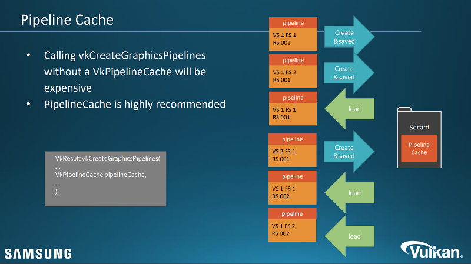

// Copyright 2019-2022 The Khronos Group, Inc.
// SPDX-License-Identifier: CC-BY-4.0

ifndef::chapters[:chapters:]
ifndef::images[:images: images/]

[[pipeline-cache]]
= 파이프라인 캐시(Pipeline Cache)

파이프라인 캐싱은 이미 생성된 파이프라인을 재사용하기 위해 link:https://registry.khronos.org/vulkan/specs/1.3/html/vkspec.html#VkPipelineCache[VkPipelineCache] 객체와 함께 사용되는 기술입니다. 예를 들어 파이프라인을 생성할 때 쉐이더를 컴파일해야 하므로 파이프라인 생성에는 다소 비용이 많이 들 수 있습니다. 파이프라인 캐시의 가장 큰 장점은 파이프라인 상태를 파일에 저장하여 애플리케이션을 실행할 때마다 사용할 수 있으므로 생성 시 비용이 많이 드는 부분을 제거할 수 있다는 것입니다. 이 내용에 관해 link:https://www.khronos.org/assets/uploads/developers/library/2016-siggraph/3D-BOF-SIGGRAPH_Jul16.pdf[SIGGRAPH 2016] (link:https://www.youtube.com/watch?v=owuJRPKIUAg&t=1045s[video]) 140번 슬라이드부터 파이프라인 캐싱에 대한 훌륭한 크로노스 그룹 프레젠테이션이 있습니다.

파이프라인 캐시가 중요한 도구이기는 하지만, 이를 위한 강력한 시스템을 구축하는 것도 중요합니다. Arseny Kapoulkine이 자신의 link:https://zeux.io/2019/07/17/serializing-pipeline-cache/[블로그 게시물]에서 이에 대해 이야기 합니다.

성능 향상과 파이프라인 캐시의 레퍼런스 구현을 설명하기 위해 크로노스 그룹에서 제공하는 link:https://github.com/KhronosGroup/Vulkan-Samples/tree/master/samples/performance/pipeline_cache[샘플 및 튜토리얼]을 참조하세요.
