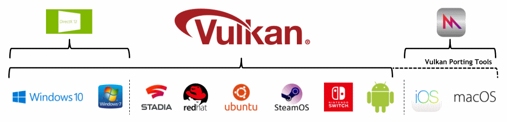

// Copyright 2019-2022 The Khronos Group, Inc.
// SPDX-License-Identifier: CC-BY-4.0

// Required for both single-page and combined guide xrefs to work
ifndef::chapters[:chapters:]
ifndef::images[:images: images/]

[[platforms]]
= 플랫폼

Vulkan은 여러 플랫폼에서 실행되지만, 각 플랫폼마다 Vulkan 관리 방식에 조금씩 차이가 있습니다.

== Android

Vulkan API는 API 레벨 24 (Android Nougat)이후의 모든 안드로이드 기기에서 link:https://developer.android.com/ndk/guides/graphics/getting-started[사용 가능]하지만, 모든 기기에 Vulkan 드라이버가 설치되어 있는 것은 아닙니다.

Android는 link:https://source.android.com/devices/architecture/hal[하드웨어 추상화 계층(Hardware Abstraction Layer, HAL)]을 사용하여 link:https://source.android.com/devices/graphics/implement-vulkan#driver_emun[미리 정의된 경로]에서 Vulkan 드라이버를 찾습니다.

API 레벨 29 (Android Q) 이후 출시된 모든 64비트 기기에는 Vulkan 1.1 드라이버가 설치되어 있어야 합니다.

== BSD Unix

Vulkan은 많은 BSD 유닉스 배포판에서 지원됩니다.

== Fuchsia

Vulkan은 link:https://fuchsia.dev/fuchsia-src/development/graphics/magma/concepts/vulkan[Fuchsia 운영체제]에서 지원됩니다.

== iOS

Vulkan은 iOS에서 기본적으로 지원되지 않지만, xref:{chapters}portability_initiative.adoc#portability-initiative[Vulkan Portability Tools]를 사용하여 대상으로 삼을 수 있습니다.

== Linux

Vulkan은 많은 Linux 배포판에서 지원됩니다.

== MacOS

Vulkan은 MacOS에서 기본적으로 지원되지 않지만, xref:{chapters}portability_initiative.adoc#portability-initiative[Vulkan Portability Tools]를 사용하여 대상으로 삼을 수 있습니다.

== Nintendo Switch

Nintendo Switch는 네이티브 Vulkan을 지원하는 NVIDIA Tegra 칩셋을 탑재하고 있습니다.

== QNX

Vulkan은 QNX 운영 체제에서 지원됩니다.

== Stadia

구글의 스타디아는 AMD 기반 Linux 시스템에서 실행되며, Vulkan은 필수 그래픽 API입니다.

== Windows

Vulkan은 윈도우 7, 8, 10, 11에서 지원됩니다.

== Others

일부 임베디드 시스템은 Vulkan을 지원하는 것도 있어 link:https://registry.khronos.org/vulkan/specs/1.3-extensions/html/vkspec.html#display[디스플레이에 직접] 표시할 수 있습니다.
