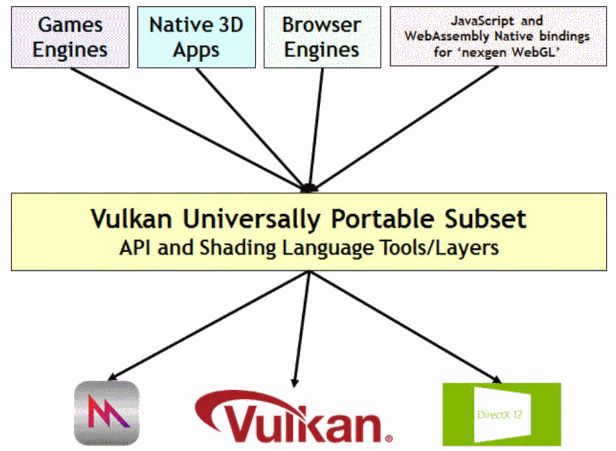
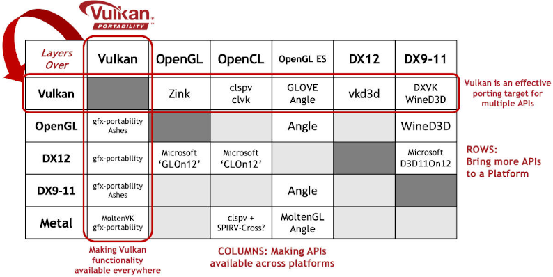
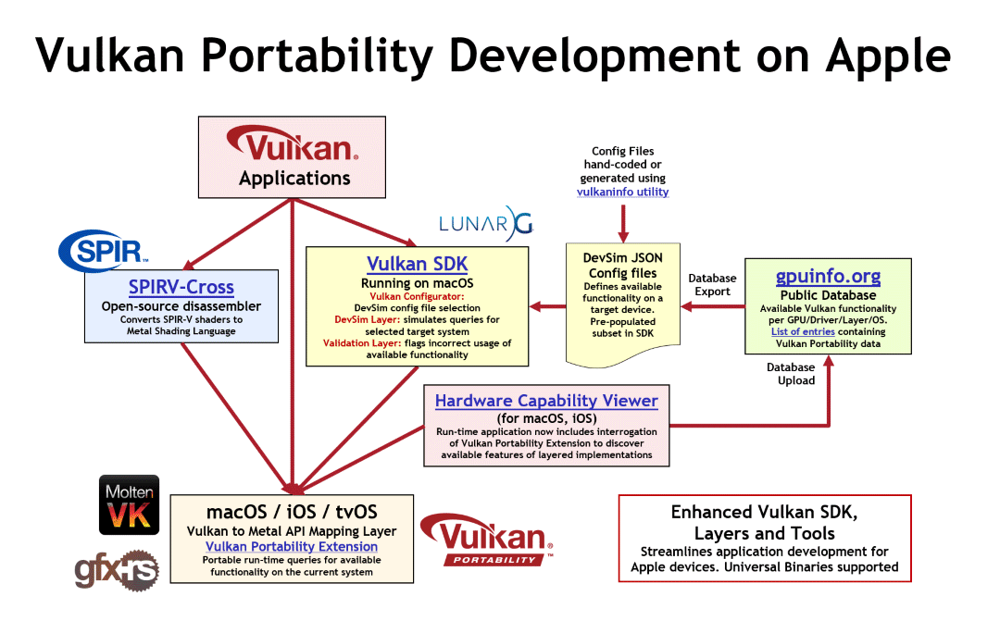

// Copyright 2019-2022 The Khronos Group, Inc.
// SPDX-License-Identifier: CC-BY-4.0

ifndef::chapters[:chapters:]
ifndef::images[:images: images/]

[[portability-initiative]]
= 이식성 프로젝트(Portability Initiative)

[NOTE]
.공지
====
현재 임시적으로 link:https://registry.khronos.org/vulkan/specs/1.3-extensions/man/html/VK_KHR_portability_subset.html[VK_KHR_portability_subset] 확장 기능은 link:https://github.com/KhronosGroup/Vulkan-Headers/blob/main/include/vulkan/vulkan_beta.h[vulkan_beta.h] 헤더를 통해 사용할 수 있습니다. 자세한 내용은 link:https://www.khronos.org/blog/fighting-fragmentation-vulkan-portability-extension-released-implementations-shipping[보도 자료]에서 확인할 수 있습니다.

// 번역 주* 이니셔티브(Initiaitve)에 대한 의미는 다음 link:https://https://www.lecturernews.com/news/articleView.html?idxno=114135[기사]에서 확인할 수 있으며, 여기서는 프로젝트로 번역하였습니다.
====

link:https://www.vulkan.org/porting#vulkan-portability-initiative[Vulkan 이식성 프로젝트]는 현재 Vulkan 네이티브 드라이버가 제공하지 않는 플랫폼을 포함하여 모든 주요 플랫폼에서 네이티브 성능 수준이 나올 수 있도록 보편적으로 사용할 수 있는 Vulkan 기능의 link:https://github.com/KhronosGroup/Vulkan-Portability[하위 집합(subset)]을 정의하고 발전시키기 위한 리소스를 개발하는 크로노스 그룹 내부 활동입니다. 간단히 말해, 이 이니셔티브는 기본적으로 API를 지원하지 않는 플랫폼(예: MaxOS 및 iOS)에서도 Vulkan을 실행할 수 있도록 하는 것입니다.

== 변환 레이어(Translation Layer)

레이어를 사이에 둔 구현은 업계의 API 단편화에 맞서 더 많은 애플리케이션을 더 많은 플랫폼에서 실행할 수 있도록 합니다. 예를 들어, 아래 다이어그램의 첫 번째 행은 Vulkan을 이식 대상으로 플랫폼에 추가 API를 도입하고 커널 수준의 드라이버를 추가하지 않아도 더 많은 콘텐츠를 구현할 수 있음을 보여줍니다. 레이어를 끼운 API 구현은 여러 플랫폼에서 상업용 애플리케이션을 성공적으로 출시하는 데 사용되고 있습니다.

그림의 열은 네이티브 드라이버가 없는 경우에도 추가 플랫폼에서 API를 사용할 수 있도록 하는 데 사용되는 레이어 프로젝트를 보여주며, 애플리케이션 개발자가 원하는 그래픽 API로 개발하여 여러 플랫폼에 출시하는 데 필요한 배포 유연성을 제공합니다. 다이어그램의 첫 번째 열은 Vulkan 이식성 프로젝트 활동으로, 다양한 플랫폼에서 Vulkan 기능의 레이어화된 구현을 가능하게 합니다.

== MacOS 와 iOS 도구

크로노스 그룹 블로그에서 link:https://www.khronos.org/blog/new-release-of-vulkan-sdk[macOS와 iOS 지원에 대한 정보 보기]

== gfx-rs

현재 Mozilla는 link:https://github.com/gfx-rs/portability[gfx-rs 이식성]을 추짛나고 있으며 link:https://gfx-rs.github.io/2017/07/24/low-level.html[gfx-hal]를 다른 다양한 API와의 인터페이스로 사용하고 있습니다.

image::../../../chapters/images/portability_initiative_gfxrs.png[portability_initiative_gfxrs.png]

