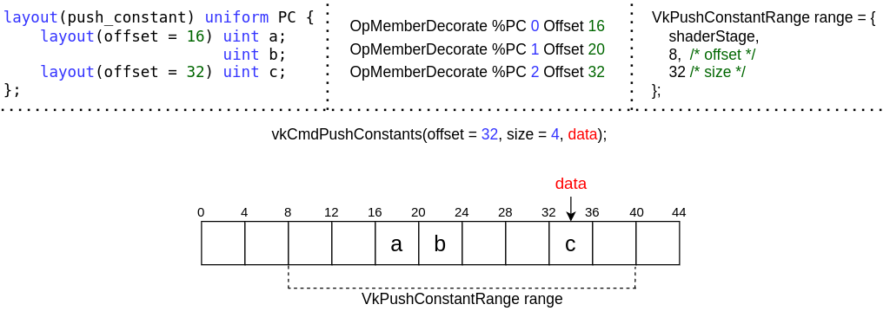

// Copyright 2022 The Khronos Group, Inc.
// SPDX-License-Identifier: CC-BY-4.0

ifndef::chapters[:chapters:]
ifndef::images[:images: images/]

[[push-constants]]
= 푸시 상수(push-constants)

Vulkan 사양서에서 `푸시 상수` 는 다음과 같이 정의하고 있습니다:

[NOTE]
====
API를 통해 작성할 수 있고 쉐이더에서 액세스할 수 있는 작은 값 모음입니다. 푸시 상수를 사용하면 애플리케이션에서 버퍼를 생성하거나 업데이트 할 때마다 디스크립터 세트를 수정 및 바인딩하지 않고 쉐이더에서 사용되는 값을 설정할 수 있습니다.
====

* <<pc-how-to-us, 사용 방법>>
** <<pc-shader-code, 쉐이더 코드>>
** <<pc-pipeline-layout, 파이프라인 레이아웃>>
** <<pc-updating, Updating at record time>>
** <<pc-offsets, 오프셋>>
* <<pc-pipeline-layout-compatibility, 파이프라인 레이아웃 호환성>>
* <<pc-lifetime, 푸시 상수의 수명>>
** <<pc-binding-descriptor-sets, 디스크립터 세트가 바인딩에 미치는 영향은 없음>>
** <<pc-mixing-bind-points, 바인드 포인트 혼합>>
** <<pc-binding-non-compatible, 호환되지 않는 파이프라인 바인딩>>
** <<pc-layout-without, 정적 푸시 상수가 없는 레이아웃>>
** <<pc-updated-incrementally, 점진적 업데이트>>

[[pc-how-to-us]]
== 사용 방법

[[pc-shader-code]]
=== 쉐이더 코드

쉐이더 관점에서 푸시 상수는 유니폼 버퍼와 유사합니다. Vulkan과 SPIR-V 사이의 link:https://www.khronos.org/registry/vulkan/specs/1.3-extensions/html/vkspec.html#interfaces-resources-pushconst[푸시 상수 인터페이스]는 사양서에 자세하게 설명되어 있습니다.

간단한 GLSL 프래그먼트 쉐이더 예제:

[source,glsl]
----
layout(push_constant, std430) uniform pc {
    vec4 data;
};

layout(location = 0) out vec4 outColor;

void main() {
   outColor = data;
}
----

디스어셈블리된 SPIR-V 부분을 살펴보면 다음과 같습니다

[source,swift]
----
                  OpMemberDecorate %pc 0 Offset 0
                  OpDecorate %pc Block

         %float = OpTypeFloat 32
       %v4float = OpTypeVector %float 4

%pc             = OpTypeStruct %v4float
%pc_ptr         = OpTypePointer PushConstant %pc
%pc_var         = OpVariable %pc_ptr PushConstant
%pc_v4float_ptr = OpTypePointer PushConstant %v4float

%access_chain   = OpAccessChain %pc_v4float_ptr %pc_var %int_0
----

이것은 `Block` 수식을 가진 `OpTypeStruct` 타입이라는 link:https://www.khronos.org/registry/vulkan/specs/1.3-extensions/html/vkspec.html#interfaces-resources-pushconst[Vulkan spec]의 기술과 일치합니다.

[[pc-pipeline-layout]]
=== 파이프라인 레이아웃

`vkCreatePipelineLayout` 을 호출할 때, the link:https://www.khronos.org/registry/vulkan/specs/1.3-extensions/man/html/VkPushConstantRange.html[푸시 상수 범위]는 link:https://www.khronos.org/registry/vulkan/specs/1.3-extensions/man/html/VkPipelineLayoutCreateInfo.html[VkPipelineLayoutCreateInfo]에서 설정해야 합니다.

위의 쉐이더를 사용한 예제:

[source,cpp]
----
VkPushConstantRange range = {};
range.stageFlags = VK_SHADER_STAGE_FRAGMENT_BIT;
range.offset = 0;
range.size = 16; // %v4float (vec4) 16바이트로 정의됨

VkPipelineLayoutCreateInfo create_info = {};
create_info.sType = VK_STRUCTURE_TYPE_PIPELINE_LAYOUT_CREATE_INFO;
create_info.pNext = NULL;
create_info.flags = 0;
create_info.setLayoutCount = 0;
create_info.pushConstantRangeCount = 1;
create_info.pPushConstantRanges = &range;

VkPipelineLayout pipeline_layout;
vkCreatePipelineLayout(device, &create_info, NULL, &pipeline_layout);
----

[[pc-updating]]
=== Updating at record time

마지막으로, 푸시 상수 값은 link:https://www.khronos.org/registry/vulkan/specs/1.3-extensions/man/html/vkCmdPushConstants.html[vkCmdPushConstants]를 사용하여 원하는 값으로 업데이트해야 합니다.

[source,cpp]
----
float data[4] = {0.0f, 1.0f, 2.0f, 3.0f}; // where sizeof(float) == 4 bytes

// vkBeginCommandBuffer()
uint32_t offset = 0;
uint32_t size = 16;
vkCmdPushConstants(commandBuffer, pipeline_layout, VK_SHADER_STAGE_FRAGMENT_BIT, offset, size, data);
// draw / dispatch / trace rays / etc
// vkEndCommandBuffer()
----

[[pc-offsets]]
=== 오프셋

위의 쉐이더를 사용하여 개발자는 푸시 상수 블록에 오프셋을 추가할 수 있습니다.

[source,patch]
----
layout(push_constant, std430) uniform pc {
-   vec4 data;
+   layout(offset = 32) vec4 data;
};

layout(location = 0) out vec4 outColor;

void main() {
   outColor = data;
}
----

위의 디스어셈블리된 SPIR-V와 다른 점은 멤버 수식 뿐입니다

[source,patch]
----
- OpMemberDecorate %pc 0 Offset 0
+ OpMemberDecorate %pc 0 Offset 32
----

`32` 의 오프셋을 사용하는 각 쉐이더 스테이지에서 `VkPushConstantRange` 로 지정해야 합니다

[source,patch]
----
VkPushConstantRange range = {};
range.stageFlags = VK_SHADER_STAGE_FRAGMENT_BIT;
-range.offset = 0;
+range.offset = 32;
range.size = 16;
----

다음 다이어그램은 푸시 상수 오프셋의 작동 방식을 시각화한 것입니다.

[[pc-pipeline-layout-compatibility]]
== 파이프라인 레이아웃 호환성

Vulkan 사양서에는 link:https://www.khronos.org/registry/vulkan/specs/1.3-extensions/html/vkspec.html#descriptorsets-compatibility[푸시 상수에 대한 호환성]을 다음과 같이 정의합니다

[NOTE]
====
파이프라인 레이아웃이 동일한 푸시 상수 범위로 생성된 경우
====

즉, link:https://www.khronos.org/registry/vulkan/specs/1.3-extensions/html/vkspec.html#pipeline-bindpoint-commands[바인딩된 파이프라인 커맨드] (`vkCmdDraw`, `vkCmdDispatch` 등)가 실행되기 직전의 `vkCmdPushConstants` 와 `vkCmdBindPipeline` (적절한 `VkPipelineBindPoint` 용으로)에서 사용된 `VkPipelineLayout` 은 **동일한** `VkPushConstantRange` 를 가지고 있어야 한다는 것을 뜻합니다.

[[pc-lifetime]]
== 푸시 상수의 수명

푸시 상수의 수명은 몇 가지 link:https://github.com/KhronosGroup/Vulkan-Docs/issues/1081[edge] link:https://github.com/KhronosGroup/Vulkan-Docs/issues/1485[사례]를 들 수 있으며, 다음은 푸시 상수에서 무엇이 유효한 하고 무엇이 무효한지에 대해 일반적인 예를 제공하기 위해 고안되었습니다.

[NOTE]
====
`dEQP-VK.pipeline.push_constant.lifetime.*` 에서 몇 가지 CTS 테스트가 있습니다.
====

[[pc-binding-descriptor-sets]]
=== 디스크립터 세트가 바인딩에 미치는 영향은 없습니다

푸시 상수는 디스크립터에 연결되지 않으므로 `vkCmdBindDescriptorSets` 를 사용해도 푸시 상수의 수명이나 link:https://www.khronos.org/registry/vulkan/specs/1.3-extensions/html/vkspec.html#descriptorsets-compatibility[파이프라인 레이아웃 호환성]에 영향을 미치지 않습니다.

[[pc-mixing-bind-points]]
=== 바인딩 포인트 혼합

쉐이더에서 푸시 상수를 각각 다른 용도로 사용하는 두 개의 서로 다른 `VkPipelineBindPoint` 를 사용할 수 있습니다.

[source,cpp]
----
// 범위가 다르므로 호환되지 않은 레이아웃
VkPipelineLayout layout_graphics; // VK_SHADER_STAGE_FRAGMENT_BIT
VkPipelineLayout layout_compute;  // VK_SHADER_STAGE_COMPUTE_BIT

// vkBeginCommandBuffer()
vkCmdBindPipeline(pipeline_graphics); // layout_graphics
vkCmdBindPipeline(pipeline_compute);  // layout_compute

vkCmdPushConstants(layout_graphics); // VK_SHADER_STAGE_FRAGMENT_BIT
// 그래픽스의 마지막 파이프라인과 푸시 상수가 호환되므로 여전히 유효
vkCmdDraw();

vkCmdPushConstants(layout_compute); // VK_SHADER_STAGE_COMPUTE_BIT
vkCmdDispatch(); // 유효
// vkEndCommandBuffer()
----

[[pc-binding-non-compatible]]
=== 호환되지 않은 파이프라인 바인딩

사양서에는 다음과 같이 명시되어있습니다:

[NOTE]
====
푸시 상수 레이아웃과 호환되지 않은 레이아웃으로 파이프라인을 바인딩해도 푸시 상수 값에 영향을 미치지 않습니다.
====

다음 예제는 이를 설명하는 데 도움이 됩니다:

[source,cpp]
----
// vkBeginCommandBuffer()
vkCmdPushConstants(layout_0);
vkCmdBindPipeline(pipeline_b); // layout_0 과 호환되지 않음
vkCmdBindPipeline(pipeline_a); // layout_0 과 호환
vkCmdDraw(); // 유효
// vkEndCommandBuffer()

// vkBeginCommandBuffer()
vkCmdBindPipeline(pipeline_b); // layout_0 과 호환되지 않음
vkCmdPushConstants(layout_0);
vkCmdBindPipeline(pipeline_a); // layout_0 과 호환
vkCmdDraw(); // 유효
// vkEndCommandBuffer()

// vkBeginCommandBuffer()
vkCmdPushConstants(layout_0);
vkCmdBindPipeline(pipeline_a); // layout_0 과 호환
vkCmdBindPipeline(pipeline_b); // layout_0 과 호환되지 않음
vkCmdDraw(); // 유효하지 않음
// vkEndCommandBuffer()
----

[[pc-layout-without]]
=== 정적 푸시 상수가 없는 레이아웃

예를 들어 파이프라인 레이아웃에 `VkPushConstantRange` 가 있지만 쉐이더에 푸시 상수가 없는 것도 유효합니다:

[source,cpp]
----
VkPushConstantRange range = {VK_SHADER_STAGE_VERTEX_BIT, 0, 4};
VkPipelineLayoutCreateInfo pipeline_layout_info = {VK_SHADER_STAGE_VERTEX_BIT. 1, &range};
----

[source,glsl]
----
void main() {
   gl_Position = vec4(1.0);
}
----

위의 쉐이더와 파이프라인 레이아웃으로 `VkPipeline` 을 생성한 경우, `vkCmdPushConstants` 를 호출하는 것은 **여전히 유효**합니다.

멘탈 모델(mental model)은 `vkCmdPushConstants` 가 `VkPipelineLayout` 사용법과 연결되어 있으므로 `vkCmdDraw()` 와 같은 명령을 호출하기 전에 일치해야 하는 이유라고 생각할 수 있습니다.

쉐이더에서 한 번도 사용하지 않는 디스크립터 세트를 바인딩할 수 있는 것과 마찬가지로 푸시 상수도 동일하게 작동합니다.

[[pc-updated-incrementally]]
=== 점진적 업데이트

푸시 상수는 커맨드 버퍼가 진행되는 동안 점진적으로 업데이트할 수 있습니다.

다음은 `vec4` 푸시 상수 값의 예제입니다

[source,cpp]
----
// vkBeginCommandBuffer()
vkCmdBindPipeline();
vkCmdPushConstants(offset: 0, size: 16, value = [0, 0, 0, 0]);
vkCmdDraw(); // values = [0, 0, 0, 0]

vkCmdPushConstants(offset: 4, size: 8, value = [1 ,1]);
vkCmdDraw(); // values = [0, 1, 1, 0]

vkCmdPushConstants(offset: 8, size: 8, value = [2, 2]);
vkCmdDraw(); // values = [0, 1, 2, 2]
// vkEndCommandBuffer()
----
