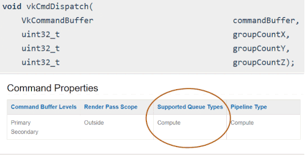
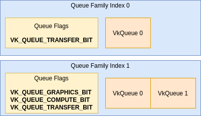

// Copyright 2019-2022 The Khronos Group, Inc.
// SPDX-License-Identifier: CC-BY-4.0

// Required for both single-page and combined guide xrefs to work
ifndef::chapters[:chapters:]
ifndef::images[:images: images/]

[[queues]]
= 큐(Queues, 대기열)

[NOTE]
====
link:https://gpuopen.com/learn/concurrent-execution-asynchronous-queues/[AMD] 및 link:https://www.khronos.org/assets/uploads/developers/library/2016-vulkan-devday-uk/9-Asynchonous-compute.pdf[NVIDIA]의 큐에 대한 추가 리소스
====

애플리케이션은 일반적으로 `VkCommandBuffer` 객체 또는 xref:{chapters}sparse_resources.adoc#sparse-resources[희소 바인딩(sparse bindings)]의 형태로 `VkQueue` 에 작업을 제출합니다.

`VkQueue` 에 제출된 커맨드 버퍼는 순서대로 시작되지만, 그 이후에는 독립적으로 진행되어 순서와 상관없이 완료될 수 있습니다.

다른 큐에 제출된 커맨드 버퍼는 `VkSemaphore` 와 명시적으로 동기화하지 않는 한 서로에 대해 순서가 지정되지 않습니다.

한 번에 하나의 스레드에서만 `VkQueue` 에 작업을 제출할 수 있지만, 서로 다른 스레드에서 동시에 다른 `VkQueue` 에 작업을 제출할 수 있습니다.

`VkQueue` 가 기본 하드웨어에 매핑되는 방법은 구현에 따라 정의됩니다. 일부 구현은 복수의 하드웨어 큐를 가지며, 여러 개의 `VkQueue`&#8203; 에 작업을 제출하는 것은 독립적으로 동시에 진행됩니다. 일부 구현은 하드웨어에 작업을 제출하기 전에 커널 드라이버 수준에서 스케줄링을 수행합니다. 현재 Vulkan에는 각 `VkQueue` 가 어떻게 매핑되는지 정확히 공개할 수 있는 방법이 없습니다.

[NOTE]
====
모든 애플리케이션이 여러 개의 큐가 필요하거나 그 혜택을 받는 것은 아닙니다. 애플리케이션은 하나의 "`범용(universal)`" 그래픽 지원 큐를 통해 모든 작업을 GPU에 제출하는 것이 합리적입니다.
====

== 큐 패밀리(Queue Family)

`VkQueue` 가 지원할 수 있는 연산에는 다양한 유형이 있습니다. "`큐 패밀리`" 는 `VkQueueFamilyProperties` 에 명시된 대로 공통 속성을 가지며 동일한 기능을 지원하는 `VkQueue`&#8203; 의 집합을 설명할 뿐입니다.

다음은 link:https://registry.khronos.org/vulkan/specs/1.3-extensions/man/html/VkQueueFlagBits.html[VkQueueFlagBits]에 있는 큐 연산입니다:

  * `VK_QUEUE_GRAPHICS_BIT` 는 `vkCmdDraw*` 및 그래픽스 파이프라인 명령에 사용됩니다
  * `VK_QUEUE_COMPUTE_BIT` 는 `vkCmdDispatch*` , `vkCmdTraceRays*` 및 컴퓨트 파이프라인 관련 명령에 사용됩니다.
  * `VK_QUEUE_TRANSFER_BIT` 는 모든 전송 명령에 사용됩니다.
  ** 사양서의 link:https://registry.khronos.org/vulkan/specs/1.3-extensions/man/html/VkPipelineStageFlagBits.html[VK_PIPELINE_STAGE_TRANSFER_BIT]는 "`전송 명령`" 을 설명합니다.
  ** `VK_QUEUE_TRANSFER_BIT` 만 있는 큐 패밀리는 일반적으로 link:https://en.wikipedia.org/wiki/Direct_memory_access[DMA]를 사용하여 호스트와 개별 GPU의 장치 메모리 간에 데이터를 비동기적으로 전송하기 위한 것으로, 독립적인 그래픽/컴퓨팅 처리와 동시에 전송을 수행할 수 있습니다.
  ** `VK_QUEUE_GRAPHICS_BIT` 및 `VK_QUEUE_COMPUTE_BIT` 는 항상 암시적으로 `VK_QUEUE_TRANSFER_BIT` 명령을 받을 수 있습니다.
  * `VK_QUEUE_SPARSE_BINDING_BIT` 는 xref:{chapters}sparse_resources.adoc#sparse-resources[희소 리소스]를 `vkQueueBindSparse` 로 메모리에 바인딩하는 데 사용됩니다.
  * `VK_QUEUE_PROTECTED_BIT` 는 xref:{chapters}protected.adoc#protected[보호 메모리]에 사용됩니다.
  * `VK_QUEUE_VIDEO_DECODE_BIT_KHR` 과 `VK_QUEUE_VIDEO_ENCODE_BIT_KHR` 는 link:https://www.khronos.org/blog/an-introduction-to-vulkan-video?mc_cid=8052312abe&mc_eid=64241dfcfa[Vulkan video]에 사용됩니다.

=== 필요한 큐 패밀리 파악하기

Vulkan 사양서의 각 연산에는 link:https://github.com/KhronosGroup/Vulkan-Docs/blob/main/xml/vk.xml[vk.xml] 파일에서 생성된 "`지원되는 큐 타입`" 섹션이 있습니다. 다음은 사양서에서 어떻게 나와있는지 보여주는 3가지 예시입니다:

image::../../../chapters/images/queues_cmd_draw.png[queues_cmd_draw.png]

image::../../../chapters/images/queues_cmd_executecommands.png[queues_cmd_executecommands.png]

=== 큐 패밀리 쿼리하기

다음은 애플리케이션이 하나의 그래픽 `VkQueue` 만 원하는 경우 필요한 가장 간단한 로직입니다

[source,cpp]
----
uint32_t count = 0;
vkGetPhysicalDeviceQueueFamilyProperties(physicalDevice, &count, nullptr);
std::vector<VkQueueFamilyProperties> properties(count);
vkGetPhysicalDeviceQueueFamilyProperties(physicalDevice, &count, properties.data());

// Vulkan은 최소 1개 이상의 그래픽 큐 패밀리를 공개하는 구현이 필요합니다
uint32_t graphicsQueueFamilyIndex;

for (uint32_t i = 0; i < count; i++) {
    if ((properties[i].queueFlags & VK_QUEUE_GRAPHICS_BIT) != 0) {
        // 이 큐 패밀리는 그래픽을 지원합니다
        graphicsQueueFamilyIndex = i;
        break;
    }
}
----

== 큐 만들기 및 가져오기

`VkDevice`, `VkBuffer`, `VkDeviceMemory` 와 같은 다른 핸들과는 달리 `vkCreateQueue` 나 `vkAllocateQueue` 가 **없습니다**. 대신, 드라이버는 `vkCreateDevice`/`vkDestroyDevice` 시간 동안 `VkQueue` 핸들의 생성과 소멸을 담당합니다.

다음 예제에서는 2개의 큐 패밀리에서 3개의 `VkQueue`&#8203; 를 지원하는 가상 구현을 사용합니다:

다음은 논리 장치를 이용하여 3개의 `VkQueue`&#8203; 를 모두 생성하는 방법의 예입니다:

[source,cpp]
----
VkDeviceQueueCreateInfo queueCreateInfo[2];
queueCreateInfo[0].queueFamilyIndex = 0; // Transfer
queueCreateInfo[0].queueCount = 1;
queueCreateInfo[1].queueFamilyIndex = 1; // Graphics
queueCreateInfo[1].queueCount = 2;

VkDeviceCreateInfo deviceCreateInfo   = {};
deviceCreateInfo.pQueueCreateInfos    = queueCreateInfo;
deviceCreateInfo.queueCreateInfoCount = 2;

vkCreateDevice(physicalDevice, &deviceCreateInfo, nullptr, &device);
----

`VkDevice` 를 생성한 후 애플리케이션은 `vkGetDeviceQueue` 를 사용하여 `VkQueue` 핸들을 가져올 수 있습니다

[source,cpp]
----
VkQueue graphicsQueue0 = VK_NULL_HANDLE;
VkQueue graphicsQueue1 = VK_NULL_HANDLE;
VkQueue transferQueue0 = VK_NULL_HANDLE;

// 어떤 순서로든 획득 가능
vkGetDeviceQueue(device, 0, 0, &transferQueue0); // family 0 - queue 0
vkGetDeviceQueue(device, 1, 1, &graphicsQueue1); // family 1 - queue 1
vkGetDeviceQueue(device, 1, 0, &graphicsQueue0); // family 1 - queue 0
----
