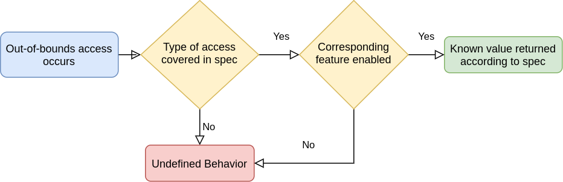

// Copyright 2019-2022 The Khronos Group, Inc.
// SPDX-License-Identifier: CC-BY-4.0

ifndef::chapters[:chapters:]
ifndef::images[:images: images/]

[[robustness]]
= 견고성(Robustness)

== 견고성(robustness) 의미

Vulkan 애플리케이션이 접근 권한이 없는 메모리에 접근(로그, 저장, 아토믹 실행)하려고 하면 구현은 어떤 식으로든 반응해야 합니다. 견고성이 없는 경우, 정의되지 않은 동작이 발생하고 구현이 프로그램을 종료할 수도 있습니다. 접근하려는 메모리 유형에 대해 견고성이 활성화된 경우, 구현은 사양서에 정의된 대로 특정 동작을 해야 합니다.

== 사용 시기

일부 Vulkan 애플리케이션의 특성상 잘못된 메모리 접근을 방지할 수 없는 쉐이더 코드를 실행해야 하는 경우가 있습니다. 이러한 애플리케이션에는 견고성이 필요합니다.

[NOTE]
.중요
====
견고성을 설정하면 런타임 성능 비용이 발생할 수 있습니다. 애플리케이션 작성자는 견고성 활성화가 미치는 영향을 신중하게 고려해야 합니다.
====

== Vulkan이 코어로 제공하는 것

모든 Vulkan 구현은 `robustBufferAccess` 기능을 지원해야 합니다. link:https://registry.khronos.org/vulkan/specs/1.3-extensions/html/vkspec.html#features-robustBufferAccess[사양서는 어떤 것이 범위를 벗어난 것으로 간주되는지] 그리고 어떻게 처리해야 하는지를 설명합니다.구현에는 `robustBufferAccess` 에 대해 어느 정도의 유연성이 부여됩니다. 예를 들어 `w` 값이 범위를 벗어난 `vec4(x,y,z,w)` 에 접근하는 경우, `x`, `y`, `z` 도 범위를 벗어난 것으로 간주할지 여부를 구현에서 결정할 수 있도록 사양에서 허용하고 있기 때문입니다.

(Vulkan 1.2의 핵심인) `VK_EXT_descriptor_indexing` 에 있는 바인딩 후 업데이트 기능을 다루는 경우, 구현이 `robustBufferAccess` 와 바인딩 후 디스크립터를 업데이트하는 기능을 모두 지원할 수 있는지를 나타내는 link:https://registry.khronos.org/vulkan/specs/1.3-extensions/html/vkspec.html#limits-robustBufferAccessUpdateAfterBind[robustBufferAccessUpdateAfterBind]를 알아두는 것이 중요합니다.

`robustBufferAccess` 기능은 이미지가 아닌 버퍼만 다루기 때문에 몇 가지 제한이 있습니다. 또한 접근 중인 버퍼의 데이터를 수정하기 위해 범위를 벗어난 쓰기나 아토믹을 허용해버립니다. 더 강력한 형태의 견고성을 원하는 애플리케이션의 경우, link:https://registry.khronos.org/vulkan/specs/1.3-extensions/man/html/VK_EXT_robustness2.html[VK_EXT_robustness2]가 있습니다.

이미지가 범위를 벗어난 경우, 코어 Vulkan에서는 스토어나 아토믹이 접근하려는 메모리에 영향을 주지 않는 것이 link:https://registry.khronos.org/vulkan/specs/1.3-extensions/html/vkspec.html#textures-output-coordinate-validation[보장되어 있습니다].

== VK_EXT_image_robustness

=== robustImageAccess

link:https://registry.khronos.org/vulkan/specs/1.3-extensions/html/vkspec.html#VK_EXT_image_robustness[VK_EXT_image_robustness] 의 link:https://registry.khronos.org/vulkan/specs/1.3-extensions/html/vkspec.html#features-robustImageAccess[robustImageAccess] 기능은 이미지 뷰 크기에 대한 범위를 넘는 접근을 검사할 수 있습니다. 이미지 범위에 접근이 있는 경우 `(0, 0, 0, 0)` 또는 `(0, 0, 0, 1)` 를 반환합니다.

`robustImageAccess` 기능은 유효하지 않은 LOD에 접근할 때 반환되는 값에 대한 보장을 제공하지 않으며, 아직 정의되지 않은 동작입니다.

== VK_EXT_robustness2

D3D12와 같은 다른 API에서 포팅된 애플리케이션과 같은 일부 애플리케이션은 `robustBufferAccess` 와 `robustImageAccess` 가 제공하는 것보다 더 엄격한 보장을 필요로 합니다. 다음 섹션에서 설명하는 3 가지 새로운 견고성 기능을 공개하여 link:https://registry.khronos.org/vulkan/specs/1.3-extensions/man/html/VK_EXT_robustness2.html[VK_EXT_robustness2] 확장 기능을 추가합니다. 일부 구현의 경우 이러한 추가 보장은 성능 저하를 초래할 수 있습니다. 추가 견고성이 필요하지 않은 애플리케이션은 가능하면 `robustBufferAccess` 및/또는 `robustImageAccess` 를 대신 사용하는 것이 좋습니다.

=== robustBufferAccess2

link:https://registry.khronos.org/vulkan/specs/1.3-extensions/html/vkspec.html#features-robustBufferAccess2[robustBufferAccess2] 기능은 `robustBufferAccess` 의 상위 집합으로 볼 수 있습니다.

이 기능을 활성화하면, 모든 범위를 벗어난 쓰기나 아토믹이 메모리 백업 버퍼를 수정할 수 없게 됩니다. 또한 `robustBufferAccess2` 기능은 link:https://registry.khronos.org/vulkan/specs/1.3-extensions/html/vkspec.html#features-robustBufferAccess[사양서에 설명된 대로] 범위를 벗어난 접근을 할 때 다양한 유형의 버퍼에 대해 반환해야 하는 값을 강제 적용합니다.

버퍼가 바인딩되는 위치의 정렬은 구현마다 다르므로, link:https://registry.khronos.org/vulkan/specs/1.3-extensions/man/html/VkPhysicalDeviceRobustness2PropertiesEXT.html[VkPhysicalDeviceRobustness2PropertiesEXT]에서 `robustUniformBufferAccessSizeAlignment` 및 `robustStorageBufferAccessSizeAlignment` 를 쿼리하는 것이 중요합니다.

=== robustImageAccess2

link:https://registry.khronos.org/vulkan/specs/1.3-extensions/html/vkspec.html#features-robustImageAccess2[robustImageAccess2] 기능은 `robustImageAccess` 의 상위 집합으로 볼 수 있습니다. 이 기능은 접근하는 이미지 뷰의 차원에 대한 범위를 벗어난 검사를 기반으로 하며, 반환할 수 있는 값에 대해 더 엄격한 요구 사항을 추가합니다.

`robustImageAccess2` 를 사용하여 R, RG, 또는 RGB 포맷에 대한 범위를 벗어난 접근은 `(0, 0, 0, 1)` 을 반환합니다. `VK_FORMAT_R8G8B8A8_UNORM` 과 같은 RGBA 포맷의 경우, `(0, 0, 0, 0)` 을 반환합니다.

지원되는 범위를 벗어난 이미지 LOD에 접근하려는 경우, `robustImageAccess2` 를 활성화하면 범위를 벗어난 것으로 간주됩니다.

=== nullDescriptor

link:https://registry.khronos.org/vulkan/specs/1.3-extensions/html/vkspec.html#features-nullDescriptor[nullDescriptor] 기능이 활성화되지 않은 경우, `VkDescriptorSet` 을 업데이트할 때, 쉐이더에서 정적으로 사용되지 않은 디스크립터라도 이를 지원하는 모든 리소스는 null이 아니어야 합니다. 이 기능을 사용하면 null 리소스 또는 뷰가 디스크립터를 지원할 수 있습니다. null 디스크립터에서 로드하면 0 값이 반환되고 null 디스크립터에 대한 스토어 및 아토믹이 삭제됩니다.

`nullDescriptor` 기능을 사용하면 `vkCmdBindVertexBuffers::pBuffers` 가 null인 정점 입력 바인딩에 접근을 가능하게 합니다.

== VK_EXT_pipeline_robustness

일부 구현에서는 견고성이 성능에 영향을 미칠 수 있으므로, 개발자가 필요한 경우에만 견고성을 요청할 수 있도록 link:https://registry.khronos.org/vulkan/specs/1.3-extensions/man/html/VK_EXT_pipeline_robustness.html[VK_EXT_pipeline_robustness] 확장 기능을 추가했습니다.

`VkPipeline` 생성 시 파이프라인 전체 또는 파이프라인 스테이지별로 버퍼, 이미지 및 정점 입력 리소스에 접근하려는 견고성 동작을 지정하기 위해 하나 이상의 `VkPipelineRobustnessCreateInfoEXT` 구조체를 전달할 수 있습니다.

이 확장 기능은 견고성 기능이 활성화되지 않았을 때 어떤 동작을 기본으로 제공하는지 구현에 쿼리하는 `VkPhysicalDevicePipelineRobustnessPropertiesEXT` 도 제공합니다.
