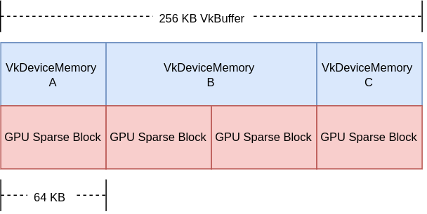

// Copyright 2019-2022 The Khronos Group, Inc.
// SPDX-License-Identifier: CC-BY-4.0

ifndef::chapters[:chapters:]
ifndef::images[:images: images/]

[[sparse-resources]]
= 희소 리소스(Sparse Resources)

Vulkan은 link:https://registry.khronos.org/vulkan/specs/1.3-extensions/html/vkspec.html#sparsememory[희소 리소스]는 하나 이상의 `VkDeviceMemory` 할당에 비연속적으로 바인딩할 수 있는 `VkBuffer` 와 `VkImage` 객체를 생성하는 방법입니다. link:https://registry.khronos.org/vulkan/specs/1.3-extensions/html/vkspec.html#sparsememory-sparseresourcefeatures[사양서]에 희소 리소스의 여러 측면과 특징에 대해서 잘 설명되어 있습니다. link:https://registry.khronos.org/vulkan/specs/1.3-extensions/html/vkspec.html#_sparse_resource_implementation_guidelines[구현 가이드라인]에서 지적한 바와 같이 대부분의 구현은 희소 리소스를 사용하여 메모리의 선형 가상 주소 범위를 애플리케이션에 공개하는 한편 바인딩할 때 각 희소 블록을 물리 페이지에 매핑합니다.

== 희소 메모리 바인딩

`vkBindBufferMemory()` 또는 `vkBindImageMemory()` 를 호출하는 일반 리소스와 달리, 희소 메모리는 link:https://registry.khronos.org/vulkan/specs/1.3-extensions/html/vkspec.html#sparsememory-resource-binding[큐 연산] `vkQueueBindSparse()` 를 통해 바인딩됩니다. 이 방법의 가장 큰 장점은 애플리케이션의 수명이 다할 때까지 희소 리소스에 메모리를 다시 바인딩할 수 있다는 것입니다.

이를 위해 애플리케이션에서 몇 가지 추가 고려 사항이 필요하다는 점에 유의해야 합니다. 애플리케이션은 다른 큐가 바인딩 변경과 동시에 메모리 범위에 접근하지 못하도록 보장하기 위해 **동기화 프리미티브를 사용해야 합니다**. 또한, `vkFreeMemory()` 로 `VkDeviceMemory` 객체를 해제해도 메모리 객체에 바인딩된 리소스(또는 리소스 영역)는 바인딩 **해제되지 않습니다**. 애플리케이션은 해제된 메모리에 바인딩된 리소스에 접근해서는 안 됩니다.

== 희소 버퍼

다음 예제는 메모리에서 희소 `VkBuffer` 가 어떻게 보이는지 시각적으로 보여주기 위해 사용되었습니다. 필수는 아니지만, 대부분의 구현은 `VkBuffer` 에 64KB의 희소 블록 크기를 사용합니다(실제 크기는 `VkMemoryRequirements::alignment` 에서 반환됩니다).

애플리케이션이 개별적으로 업데이트하려는 부분이 3개 있는 256KB의 `VkBuffer` 를 상상해 보세요.

  * Section A - 64 KB
  * Section B - 128 KB
  * Section C - 64 KB

다음은 애플리케이션이 `VkBuffer` 를 보는 방법을 보여줍니다:

=== 희소 이미지

==== Mip Tail Regions

희소 이미지를 사용하여 Mip 레벨을 개별적으로 업데이트하려면 link:https://registry.khronos.org/vulkan/specs/1.3-extensions/html/vkspec.html#sparsememory-miptail[mip tail region]이 생성됩니다. 이 사양서에는 다이어그램에서 발생할 수 있는 다양한 예제를 설명합니다.

==== 기본 희소 리소스 예제

다음 예제는 희소 이미지의 기본적인 생성 및 물리적 메모리에 바인딩하는 방법을 보여줍니다.

이 기본 예제에서는 일반적인 `VkImage` 객체를 생성하지만 세분화된 메모리 할당을 사용하여 여러 메모리 범위로 리소스를 백업합니다.

[source,cpp]
----
VkDevice                device;
VkQueue                 queue;
VkImage                 sparseImage;
VkAllocationCallbacks*  pAllocator = NULL;
VkMemoryRequirements    memoryRequirements = {};
VkDeviceSize            offset = 0;
VkSparseMemoryBind      binds[MAX_CHUNKS] = {}; // MAX_CHUNKS는 Vulkan에 일부가 아닙니다
uint32_t                bindCount = 0;

// ...

// 이미지 객체 할당
const VkImageCreateInfo sparseImageInfo =
{
    VK_STRUCTURE_TYPE_IMAGE_CREATE_INFO,        // sType
    NULL,                                       // pNext
    VK_IMAGE_CREATE_SPARSE_BINDING_BIT | ...,   // flags
    ...
};
vkCreateImage(device, &sparseImageInfo, pAllocator, &sparseImage);

// 메모리 요구 사항 확인
vkGetImageMemoryRequirements(
    device,
    sparseImage,
    &memoryRequirements);

// 여러 VkDeviceMemory 풀에서 이용 가능한 메모리 범위를 찾아
// 세분화된 방식으로 메모리를 바인딩
// (이것은 예시용이며, 성능을 위해서는 최적화 가능)
while (memoryRequirements.size && bindCount < MAX_CHUNKS)
{
    VkSparseMemoryBind* pBind = &binds[bindCount];
    pBind->resourceOffset = offset;

    AllocateOrGetMemoryRange(
        device,
        &memoryRequirements,
        &pBind->memory,
        &pBind->memoryOffset,
        &pBind->size);

    // 메모리 범위의 크기는 정렬의 배수로 지정해야 합니다
    assert(IsMultiple(pBind->size, memoryRequirements.alignment));
    assert(IsMultiple(pBind->memoryOffset, memoryRequirements.alignment));

    memoryRequirements.size -= pBind->size;
    offset                  += pBind->size;
    bindCount++;
}

// 전체 이미지에 백업이 있는지 확인
if (memoryRequirements.size)
{
    // 오류 조건 - 청크가 너무 많음
}

const VkSparseImageOpaqueMemoryBindInfo opaqueBindInfo =
{
    sparseImage,                                // image
    bindCount,                                  // bindCount
    binds                                       // pBinds
};

const VkBindSparseInfo bindSparseInfo =
{
    VK_STRUCTURE_TYPE_BIND_SPARSE_INFO,         // sType
    NULL,                                       // pNext
    ...
    1,                                          // imageOpaqueBindCount
    &opaqueBindInfo,                            // pImageOpaqueBinds
    ...
};

// vkQueueBindSparse 는 큐 객체별로 외부에서 동기화됩니다.
AcquireQueueOwnership(queue);

// 실제 메모리 바인딩
vkQueueBindSparse(queue, 1, &bindSparseInfo, VK_NULL_HANDLE);

ReleaseQueueOwnership(queue);
----

==== 고급 희소 리소스

보다 정교한 예제에서는 색상 첨부/텍스처 이미지 배열을 만들고 LOD 0과 필요한 메타데이터만 물리 메모리에 바인딩합니다.

[source,cpp]
----
VkDevice                            device;
VkQueue                             queue;
VkImage                             sparseImage;
VkAllocationCallbacks*              pAllocator = NULL;
VkMemoryRequirements                memoryRequirements = {};
uint32_t                            sparseRequirementsCount = 0;
VkSparseImageMemoryRequirements*    pSparseReqs = NULL;
VkSparseMemoryBind                  binds[MY_IMAGE_ARRAY_SIZE] = {};
VkSparseImageMemoryBind             imageBinds[MY_IMAGE_ARRAY_SIZE] = {};
uint32_t                            bindCount = 0;

// 이미지 객체 할당 (렌더링 및 샘플 모두 가능)
const VkImageCreateInfo sparseImageInfo =
{
    VK_STRUCTURE_TYPE_IMAGE_CREATE_INFO,        // sType
    NULL,                                       // pNext
    VK_IMAGE_CREATE_SPARSE_RESIDENCY_BIT | ..., // flags
    ...
    VK_FORMAT_R8G8B8A8_UNORM,                   // format
    ...
    MY_IMAGE_ARRAY_SIZE,                        // arrayLayers
    ...
    VK_IMAGE_USAGE_COLOR_ATTACHMENT_BIT |
    VK_IMAGE_USAGE_SAMPLED_BIT,                 // usage
    ...
};
vkCreateImage(device, &sparseImageInfo, pAllocator, &sparseImage);

// 메모리 요구사항 확인
vkGetImageMemoryRequirements(
    device,
    sparseImage,
    &memoryRequirements);

// 희소 이미지 종횡비 속성 확인
vkGetImageSparseMemoryRequirements(
    device,
    sparseImage,
    &sparseRequirementsCount,
    NULL);

pSparseReqs = (VkSparseImageMemoryRequirements*)
    malloc(sparseRequirementsCount * sizeof(VkSparseImageMemoryRequirements));

vkGetImageSparseMemoryRequirements(
    device,
    sparseImage,
    &sparseRequirementsCount,
    pSparseReqs);

// LOD 레벨 0 및 모든 필수 메타데이터를 메모리에 바인딩
for (uint32_t i = 0; i < sparseRequirementsCount; ++i)
{
    if (pSparseReqs[i].formatProperties.aspectMask &
        VK_IMAGE_ASPECT_METADATA_BIT)
    {
        // 메타데이터는 다른 종횡과 조합해서는 안 됩니다
        assert(pSparseReqs[i].formatProperties.aspectMask ==
               VK_IMAGE_ASPECT_METADATA_BIT);

        if (pSparseReqs[i].formatProperties.flags &
            VK_SPARSE_IMAGE_FORMAT_SINGLE_MIPTAIL_BIT)
        {
            VkSparseMemoryBind* pBind = &binds[bindCount];
            pBind->memorySize = pSparseReqs[i].imageMipTailSize;
            bindCount++;

            // ... 메모리 범위 할당

            pBind->resourceOffset = pSparseReqs[i].imageMipTailOffset;
            pBind->memoryOffset = /* 메모리 오프셋 할당 */;
            pBind->memory = /* 메모리 할당 */;
            pBind->flags = VK_SPARSE_MEMORY_BIND_METADATA_BIT;

        }
        else
        {
            // 배열 레이어마다 mip tail region이 필요.
            for (uint32_t a = 0; a < sparseImageInfo.arrayLayers; ++a)
            {
                VkSparseMemoryBind* pBind = &binds[bindCount];
                pBind->memorySize = pSparseReqs[i].imageMipTailSize;
                bindCount++;

                // ... 메모리 범위 할당

                pBind->resourceOffset = pSparseReqs[i].imageMipTailOffset +
                                        (a * pSparseReqs[i].imageMipTailStride);

                pBind->memoryOffset = /* 메모리오프셋 할당 */;
                pBind->memory = /* 메모리 할당 */
                pBind->flags = VK_SPARSE_MEMORY_BIND_METADATA_BIT;
            }
        }
    }
    else
    {
        // 리소스 데이터
        VkExtent3D lod0BlockSize =
        {
            AlignedDivide(
                sparseImageInfo.extent.width,
                pSparseReqs[i].formatProperties.imageGranularity.width);
            AlignedDivide(
                sparseImageInfo.extent.height,
                pSparseReqs[i].formatProperties.imageGranularity.height);
            AlignedDivide(
                sparseImageInfo.extent.depth,
                pSparseReqs[i].formatProperties.imageGranularity.depth);
        }
        size_t totalBlocks =
            lod0BlockSize.width *
            lod0BlockSize.height *
            lod0BlockSize.depth;

        // 각 블록은 정렬 요건과 같은 크기
        // 레벨 0의 총 메모리 크기를 계산
        VkDeviceSize lod0MemSize = totalBlocks * memoryRequirements.alignment;

        // 배열 레이어마다 메모리 할당
        for (uint32_t a = 0; a < sparseImageInfo.arrayLayers; ++a)
        {
            // ... 메모리 범위 할당

            VkSparseImageMemoryBind* pBind = &imageBinds[a];
            pBind->subresource.aspectMask = pSparseReqs[i].formatProperties.aspectMask;
            pBind->subresource.mipLevel = 0;
            pBind->subresource.arrayLayer = a;

            pBind->offset = (VkOffset3D){0, 0, 0};
            pBind->extent = sparseImageInfo.extent;
            pBind->memoryOffset = /* 메모리 오프셋 할당 */;
            pBind->memory = /* 메모리 할당 */;
            pBind->flags = 0;
        }
    }

    free(pSparseReqs);
}

const VkSparseImageOpaqueMemoryBindInfo opaqueBindInfo =
{
    sparseImage,                                // image
    bindCount,                                  // bindCount
    binds                                       // pBinds
};

const VkSparseImageMemoryBindInfo imageBindInfo =
{
    sparseImage,                                // image
    sparseImageInfo.arrayLayers,                // bindCount
    imageBinds                                  // pBinds
};

const VkBindSparseInfo bindSparseInfo =
{
    VK_STRUCTURE_TYPE_BIND_SPARSE_INFO,         // sType
    NULL,                                       // pNext
    ...
    1,                                          // imageOpaqueBindCount
    &opaqueBindInfo,                            // pImageOpaqueBinds
    1,                                          // imageBindCount
    &imageBindInfo,                             // pImageBinds
    ...
};

// vkQueueBindSparse 는 큐 객체마다 외부에서 동기화됩니다.
AcquireQueueOwnership(queue);

// 실제 메모리 바인딩
vkQueueBindSparse(queue, 1, &bindSparseInfo, VK_NULL_HANDLE);

ReleaseQueueOwnership(queue);
----
