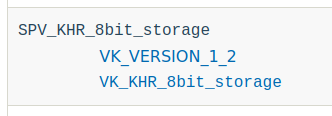
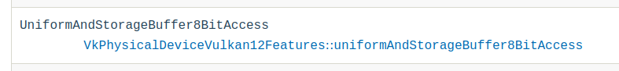

// Copyright 2019-2022 The Khronos Group, Inc.
// SPDX-License-Identifier: CC-BY-4.0

// Required for both single-page and combined guide xrefs to work
ifndef::chapters[:chapters:]
ifndef::images[:images: images/]

[[spirv-extensions]]
= SPIR-V 확장 기능 사용

xref:{chapters}what_is_spirv.adoc[SPIR-V]는 `vkCreateShaderModule` 시점에 사용되는 쉐이더 표현입니다. Vulkan과 마찬가지로, link:https://github.com/KhronosGroup/SPIRV-Guide/blob/master/chapters/extension_overview.md[SPIR-V에도 확장 기능]과 link:https://github.com/KhronosGroup/SPIRV-Guide/blob/master/chapters/capabilities.md[기능 시스템]이 있습니다.

SPIR-V는 중간 언어이지 API가 아니라는 것을 잊어서는 안 됩니다. SPIR-V는 런타임에 애플리케이션에서 사용할 수 있는 기능을 공개하기 위해 Vulkan과 같은 API에 의존합니다. 이 장에서는 SPIR-V 클라이언트 API인 Vulkan이 SPIR-V 확장 및 기능과 상호 작용하는 방법을 설명합니다.

== SPIR-V 확장 기능 예제

이 예제에서는 link:https://registry.khronos.org/vulkan/specs/1.3-extensions/man/html/VK_KHR_shader_atomic_int64.html[VK_KHR_8bit_storage] 와 link:http://htmlpreview.github.io/?https://github.com/KhronosGroup/SPIRV-Registry/blob/master/extensions/KHR/SPV_KHR_8bit_storage.html[SPV_KHR_8bit_storage]를 사용하여 `UniformAndStorageBuffer8BitAccess` 기능을 공개합니다. 다음은 SPIR-V의 디스어셈블리 모습입니다:

[source,swift]
----
OpCapability Shader
OpCapability UniformAndStorageBuffer8BitAccess
OpExtension  "SPV_KHR_8bit_storage"
----

[[steps-for-using-spriv-features]]
=== SPIR-V 기능 사용 단계:

  1. Vulkan에서 SPIR-V 확장 및 기능을 사용할 수 있는지 확인하세요.
  2. 필요한 Vulkan 확장 기능, 기능(feature) 또는 버전이 지원되는지 확인하세요.
  3. 필요한 경우 Vulkan 확장 프로그램 및 기능을 활성화 합니다.
  4. 필요한 경우, 사용하는 고수준 쉐이딩 언어(예: GLSL 또는 HLSL)와 일치하는 확장 기능이 있는지 확인합니다.

각 단계를 보다 상세하게 설명하겠습니다:

==== SPIR-V 기능 지원 여부 확인

쉐이더 기능에 따라 필요한 `OpExtension` 또는 `OpCapability` 가 하나만 있을 수 있습니다. 이 예제에서 `UniformAndStorageBuffer8BitAccess` 는 link:http://htmlpreview.github.io/?https://github.com/KhronosGroup/SPIRV-Registry/blob/master/extensions/KHR/SPV_KHR_8bit_storage.html[SPV_KHR_8bit_storage] 확장 기능의 일부입니다.

SPIR-V 확장이 지원되는지 확인하려면 Vulkan 사양서에서 link:https://registry.khronos.org/vulkan/specs/1.3-extensions/html/vkspec.html#spirvenv-extensions[지원되는 SPIR-V 확장 기능 표]를 참조하세요.

또한 Vulkan 사양서의 link:https://registry.khronos.org/vulkan/specs/1.3-extensions/html/vkspec.html#spirvenv-capabilities[지원되는 SPIR-V 기능(capabilites) 표]를 참고하세요.

[NOTE]
====
표에는 `VkPhysicalDeviceVulkan12Features::uniformAndStorageBuffer8BitAccess` 라고 되어 있지만, 여기서는 `VkPhysicalDevice8BitStorageFeatures::uniformAndStorageBuffer8BitAccess` 가 별칭으로 동일하다고 간주합니다.
====

다행히도 확인하는 것을 잊어버렸을 때 대비해 Vulkan 유효성 검사 레이어 link:https://github.com/KhronosGroup/Vulkan-ValidationLayers/blob/master/layers/generated/spirv_validation_helper.cpp[자동 생성 유효성 검사]가 있습니다. 유효성 검사 레이어와 Vulkan 사양서 테이블은 모두 link:https://github.com/KhronosGroup/Vulkan-Docs/blob/main/xml/vk.xml[./xml/vk.xml] 파일을 기반으로 합니다.

[source,xml]
----
<spirvcapability name="UniformAndStorageBuffer8BitAccess">
    <enable struct="VkPhysicalDeviceVulkan12Features" feature="uniformAndStorageBuffer8BitAccess" requires="VK_VERSION_1_2,VK_KHR_8bit_storage"/>
</spirvcapability>

<spirvextension name="SPV_KHR_8bit_storage">
    <enable version="VK_VERSION_1_2"/>
    <enable extension="VK_KHR_8bit_storage"/>
</spirvextension>
----

==== 지원 여부를 확인한 후 필요한 경우 사용 설정

이 예시에서는 `VK_KHR_8bit_storage` 또는 Vulkan 1.2 장치가 필요합니다.

Vulkan 1.0 또는 1.1 장치를 사용하는 경우, 디바이스 생성 시 `VK_KHR_8bit_storage` 확장 기능이 xref:{chapters}enabling_extensions.adoc#enabling-extensions[지원 및 활성화]되어 있어야 합니다.

Vulkan 확장 프로그램이나 버전을 사용하는 것과 관계없이, 필요한 경우 앱은 디바이스 생성 시 필요한 Vulkan 기능이 xref:{chapters}enabling_features.adoc#enabling-extensions[지원 및 활성화]되어 있는지 **확인해야 합니다**. 일부 SPIR-V 확장 및 기능에는 Vulkan 기능이 필요하지 않지만, 사양서의 표에는 모두 정리되어 있습니다.

이 예제에서는 `VkPhysicalDeviceVulkan12Features::uniformAndStorageBuffer8BitAccess` 또는 `VkPhysicalDevice8BitStorageFeatures::uniformAndStorageBuffer8BitAccess` 기능이 지원 및 활성화되어 있어야 합니다.

==== 고수준 쉐이딩 언어 확장 기능 사용

이 예제에서 GLSL은 link:https://github.com/KhronosGroup/GLSL/blob/master/extensions/ext/GL_EXT_shader_16bit_storage.txt[GL_EXT_shader_16bit_storage] 확장 기능을 가지고 있으며, 그 안에 `GL_EXT_shader_8bit_storage` 확장 기능이 포함되어 있습니다.

`glslang` 과 `SPIRV-Tools` 와 같은 도구는 일치하는 `OpExtension` 과 `OpCapability` 가 사용되고 있는지 확인합니다.
