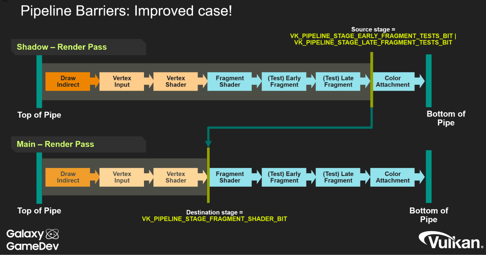

// Copyright 2019-2022 The Khronos Group, Inc.
// SPDX-License-Identifier: CC-BY-4.0

// Required for both single-page and combined guide xrefs to work
ifndef::chapters[:chapters:]
ifndef::images[:images: images/]

[[synchronization]]
= 동기화

동기화는 Vulkan을 사용할 때 가장 강력하지만 가장 복잡한 부분 중 하나입니다. 이제 애플리케이션 개발자는 다양한 link:https://registry.khronos.org/vulkan/specs/1.3/html/vkspec.html#synchronization[Vulkan 동기화 기본 요소]를 사용하여 동기화를 관리할 책임이 있습니다. 동기화를 부적절하게 사용하면 찾기 어려운 버그가 발생할 수 있을 뿐만 아니라 GPU가 불필요하게 idle 상태가 되어 성능이 저하될 수 있습니다.

크로노스 그룹에서 제공하는 link:https://github.com/KhronosGroup/Vulkan-Docs/wiki/Synchronization-Examples[예제 세트]와 link:https://www.khronos.org/blog/understanding-vulkan-synchronization[Vulkan 동기화 이해] 블로그에서 일부 동기화 프리미티브의 사용법을 확인할 수 있습니다. 지난 Vulkan talks에서 Tobias Hector의 프레젠테이션도 있습니다: link:https://www.khronos.org/assets/uploads/developers/library/2017-vulkan-devu-vancouver/009%20-%20Synchronization%20-%20Keeping%20Your%20Device%20Fed.pdf[part 1 slides] (link:https://www.youtube.com/watch?v=YkJ4hKCPjm0[video]) 및 link:https://www.khronos.org/assets/uploads/developers/library/2018-vulkanised/06-Keeping%20Your%20Device%20Fed%20v4_Vulkanised2018.pdf[part 2 slides] (link:https://www.youtube.com/watch?v=5GDg4OxkSEc[video]).

다음은 `VkEvent`, `VkFence`, `VkSemaphore` 의 차이점에 대한 개요도입니다.

image::../../../chapters/images/synchronization_overview.png[synchronization_overview.png]

== 유효성 검사

크로노스 유효성 검사 레이어는 일부 link:https://vulkan.lunarg.com/doc/sdk/latest/windows/synchronization_usage.html[동기화 유효성 검사]를 구현했습니다. 이 기능은 link:https://vulkan.lunarg.com/sdk/home[Vulkan SDK]에 포함된 link:https://vulkan.lunarg.com/doc/sdk/latest/windows/vkconfig.html[Vulkan Configurator]를 통해 쉽게 활성화할 수 있습니다. 동기화 유효성 검사에 대해 설명하는 link:https://www.lunarg.com/wp-content/uploads/2020/09/Final_LunarG_Guide_to_Vulkan-Synchronization_Validation_08_20.pdf[상세한 백서(whitepaper)]도 작성되어 link:https://www.khronos.org/blog/a-guide-to-vulkan-synchronization-validation[크로노스 블로그]에 공개되어있습니다.

== 파이프라인 장벽(Pipeline Barriers)

link:https://registry.khronos.org/vulkan/specs/1.3/html/vkspec.html#synchronization-pipeline-barriers[파이프라인 장벽]은 커맨드 버퍼가 실행될 때 어떤 파이프라인 스테이지가 이전 파이프라인 스테이지를 기다려야 하는지 제어합니다.

파이프라인 장벽은 처음에는 이해하기 어려울 수 있지만, 이 주제에 대해 자세히 설명하는 훌륭한 크로노스 강연과 기타 리소스가 많이 있습니다.

  * link:https://www.khronos.org/assets/uploads/developers/library/2018-vulkanised/05-The%20low-level%20mysteries%20of%20pipeline%20barriers_Vulkanised2018.pdf[Vulkanised 2018 - Low-level mysteries of pipeline barriers] (link:https://www.youtube.com/watch?v=e0ySJ9Qzvrs[video])
  * link:https://www.khronos.org/assets/uploads/developers/library/2019-vulkanised/02_Live%20Long%20And%20Optimise-May19.pdf[Vulkanised 2019 - Live Long and Optimise]  (link:https://www.youtube.com/watch?v=ch6161wvME8&t=463s[video]) Pipeline Analysis starting slide 12
  * link:https://gpuopen.com/learn/vulkan-barriers-explained/[Vulkan barriers explained] 블로그 게시물
  * link:http://themaister.net/blog/2019/08/14/yet-another-blog-explaining-vulkan-synchronization/[Yet another blog post explaining Vulkan synchronization]

== VK_KHR_synchronization2

`VK_KHR_synchronization2` 확장 기능은 애플리케이션 개발자의 복잡성을 줄이기 위해 기존 핵심 동기화 API를 점검하고 기존 API에 없는 몇 가지 기능을 추가합니다.

동기화 API의 차이점과 새 확장 기능을 사용하도록 포팅하는 방법에 대한 자세한 나용은 xref:{chapters}extensions/VK_KHR_synchronization2.adoc#VK_KHR_synchronization2[VK_KHR_synchronization2] 챕터를 참조하세요.
