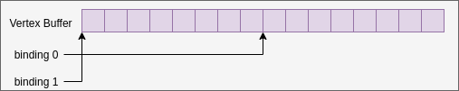
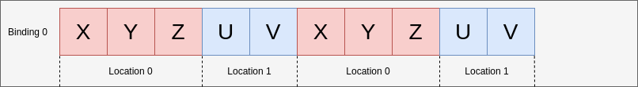
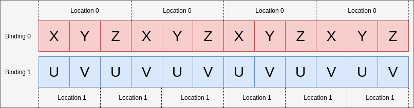

// Copyright 2019-2022 The Khronos Group, Inc.
// SPDX-License-Identifier: CC-BY-4.0

ifndef::chapters[:chapters:]
ifndef::images[:images: images/]

[[vertex-input-data-processing]]
= 정점 입력 데이터 처리

이 장에서는 그래픽스 파이프라인을 사용할 때 애플리케이션이 어떻게 데이터를 정점 쉐이더에 매핑하는지에 대한 깊은 이해를 위해 link:https://registry.khronos.org/vulkan/specs/1.3-extensions/html/vkspec.html#fxvertex[사양서의 고정 함수 정점 처리 챕터]의 개요를 설명합니다.

Vulkan은 다양한 방식으로 사용할 수 있는 도구라는 점을 기억하세요. 다음은 정점 데이터를 어떻게 배치**할 수 있는 지**에 대한 교육 목적의 예시입니다.

== 바인딩과 위치

`바인딩` 은 정점 쉐이더가 `vkCmdDraw*` 호출 중에 데이터를 읽기 시작할 정점 버퍼의 위치에 연결됩니다. `바인딩` 을 변경해도 앱의 정점 쉐이더 소스 코드를 변경할 필요는 **없습니다**.

예를 들어, 다음 코드는 `바인딩` 이 작동하는 방식에 대한 다이어그램과 일치합니다.

[source,c]
----
// 이 예제에서는 양쪽 바인딩에 동일한 버퍼를 사용합니다
VkBuffer buffers[] = { vertex_buffer, vertex_buffer };
VkDeviceSize offsets[] = { 8, 0 };

vkCmdBindVertexBuffers(
                        my_command_buffer, // commandBuffer
                        0,                 // firstBinding
                        2,                 // bindingCount
                        buffers,           // pBuffers
                        offsets,           // pOffsets
                      );
----

다음 예제에서는 데이터 입력에 따라 `바인딩` 및 `위치` 값을 설정하는 다양한 방법을 보여줍니다.

=== 예제 A - 패킹된 데이터

첫 번째 예제에서 정점별 속성 데이터는 다음과 같습니다:

[source,c]
----
struct Vertex {
    float   x, y, z;
    uint8_t u, v;
};
----

파이프라인 생성 정보 코드는 대략 다음과 같습니다:

[source,c]
----
const VkVertexInputBindingDescription binding = {
    0,                          // binding
    sizeof(Vertex),             // stride
    VK_VERTEX_INPUT_RATE_VERTEX // inputRate
};

const VkVertexInputAttributeDescription attributes[] = {
    {
        0,                          // location
        binding.binding,            // binding
        VK_FORMAT_R32G32B32_SFLOAT, // format
        0                           // offset
    },
    {
        1,                          // location
        binding.binding,            // binding
        VK_FORMAT_R8G8_UNORM,       // format
        3 * sizeof(float)           // offset
    }
};

const VkPipelineVertexInputStateCreateInfo info = {
    1,             // vertexBindingDescriptionCount
    &binding,      // pVertexBindingDescriptions
    2,             // vertexAttributeDescriptionCount
    &attributes[0] // pVertexAttributeDescriptions
};
----

이것을 사용하는 GLSL 코드는다음과 같습니다

[source,glsl]
----
layout(location = 0) in vec3 inPos;
layout(location = 1) in uvec2 inUV;
----

=== 예제 B - 패딩과 오프셋 조정

이 예제에서는 정점 데이터가 빽빽하게 채워지지 않고 여분의 패딩이 있는 경우를 살펴봅니다.

[source,c]
----
struct Vertex {
    float   x, y, z, pad;
    uint8_t u, v;
};
----

파이프라인 생성 시 오프셋을 조정하는 것만 변경하면 됩니다

[source,patch]
----
        1,                          // location
        binding.binding,            // binding
        VK_FORMAT_R8G8_UNORM,       // format
-        3 * sizeof(float)           // offset
+        4 * sizeof(float)           // offset
----

이제 `u` 와 `v` 를 읽어들이는 위치에 대한 올바른 오프셋이 설정됩니다.

image::../../../chapters/images/vertex_input_data_processing_example_b_offset.png[vertex_input_data_processing_example_b_offset]

=== 예제 C - 비인터리브

//*interleave : 데이터가 서로 인접하지 않도록 배열하는 방식
데이터가 인터리브되지 않은 경우는 다음과 같습니다

[source,c]
----
float position_data[] = { /*....*/ };
uint8_t uv_data[] = { /*....*/ };
----

이 경우 바인딩은 2개이지만 여전히 2개의 위치가 있습니다

[source,c]
----
const VkVertexInputBindingDescription bindings[] = {
    {
        0,                          // binding
        3 * sizeof(float),          // stride
        VK_VERTEX_INPUT_RATE_VERTEX // inputRate
    },
    {
        1,                          // binding
        2 * sizeof(uint8_t),        // stride
        VK_VERTEX_INPUT_RATE_VERTEX // inputRate
    }
};

const VkVertexInputAttributeDescription attributes[] = {
    {
        0,                          // location
        bindings[0].binding,        // binding
        VK_FORMAT_R32G32B32_SFLOAT, // format
        0                           // offset
    },
    {
        1,                          // location
        bindings[1].binding,        // binding
        VK_FORMAT_R8G8_UNORM,       // format
        0                           // offset
    }
};

const VkPipelineVertexInputStateCreateInfo info = {
    2,             // vertexBindingDescriptionCount
    &bindings[0],  // pVertexBindingDescriptions
    2,             // vertexAttributeDescriptionCount
    &attributes[0] // pVertexAttributeDescriptions
};
----

GLSL 코드는 예제 A에서 변경되지 않습니다

[source,glsl]
----
layout(location = 0) in vec3 inPos;
layout(location = 1) in uvec2 inUV;
----

=== 예제 D - 2개의 바인딩과 3개의 위치

이 예제는 `바인딩` 과 `위치` 가 서로 독립적이라는 점을 설명하기 위한 것입니다.

이 예제에서 정점의 데이터는 다음 포맷으로 제공되는 두 개의 버퍼에 배치됩니다:

[source,c]
----
struct typeA {
    float   x, y, z; // position
    uint8_t u, v;    // UV
};

struct typeB {
    float x, y, z; // normal
};

typeA a[] = { /*....*/ };
typeB b[] = { /*....*/ };
----

쉐이더 인터페이스는 다음과 같습니다

[source,glsl]
----
layout(location = 0) in vec3 inPos;
layout(location = 1) in vec3 inNormal;
layout(location = 2) in uvec2 inUV;
----

`VkVertexInputBindingDescription` 와 `VkVertexInputAttributeDescription` 을 적절히 설정하여 올바르게 매핑할 수 있습니다:

image::../../../chapters/images/vertex_input_data_processing_example_d.png[vertex_input_data_processing_example_d]

[source,c]
----
const VkVertexInputBindingDescription bindings[] = {
    {
        0,                          // binding
        sizeof(typeA),              // stride
        VK_VERTEX_INPUT_RATE_VERTEX // inputRate
    },
    {
        1,                          // binding
        sizeof(typeB),              // stride
        VK_VERTEX_INPUT_RATE_VERTEX // inputRate
    }
};

const VkVertexInputAttributeDescription attributes[] = {
    {
        0,                          // location
        bindings[0].binding,        // binding
        VK_FORMAT_R32G32B32_SFLOAT, // format
        0                           // offset
    },
    {
        1,                          // location
        bindings[1].binding,        // binding
        VK_FORMAT_R32G32B32_SFLOAT, // format
        0                           // offset
    },
    {
        2,                          // location
        bindings[0].binding,        // binding
        VK_FORMAT_R8G8_UNORM,       // format
        3 * sizeof(float)           // offset
    }
};
----

image::../../../chapters/images/vertex_input_data_processing_example_d_vertex.png[vertex_input_data_processing_example_d_vertex]

[[input-attribute-format]]
== 예제 E - 입력 속성 포맷 이해

`VkVertexInputAttributeDescription::format` 이 혼동의 원인이 될 수 있습니다. `format` 필드는 쉐이더가 읽어야 하는 데이터의 **크기** 와 **타입** 만 설명합니다.

`VkFormat` 값을 사용하는 이유는 이 값이 잘 정의되어 있고 정점 쉐이더의 입력 레이아웃과 일치하기 때문입니다.

이 예제에서 정점 데이터는 4개의 부동소수점뿐입니다:

[source,c]
----
struct Vertex {
    float a, b, c, d;
};
----

`format` 과 `offset` 의 설정에 의해, 읽히는 데이터가 겹칩니다

[source,c]
----
const VkVertexInputBindingDescription binding = {
    0,                          // binding
    sizeof(Vertex),             // stride
    VK_VERTEX_INPUT_RATE_VERTEX // inputRate
};

const VkVertexInputAttributeDescription attributes[] = {
    {
        0,                          // location
        binding.binding,            // binding
        VK_FORMAT_R32G32_SFLOAT,    // format - Reads in two 32-bit signed floats ('a' and 'b')
        0                           // offset
    },
    {
        1,                          // location
        binding.binding,            // binding
        VK_FORMAT_R32G32B32_SFLOAT, // format - Reads in three 32-bit signed floats ('b', 'c', and 'd')
        1 * sizeof(float)           // offset
    }
};
----

쉐이더에서 데이터를 읽을 때 겹치는 부분은 값이 동일합니다

[source,glsl]
----
layout(location = 0) in vec2 in0;
layout(location = 1) in vec2 in1;

// in0.y == in1.x
----

image::../../../chapters/images/vertex_input_data_processing_understanding_format.png[vertex_input_data_processing_understanding_format]

`in1` 은 `vec2` 인 반면 입력 속성은 `VK_FORMAT_R32G32B32_SFLOAT` 로 완전히 일치하지 않는다는 점에 유의해야 합니다. 사양서에 따르면:

____
정점 쉐이더의 컴포넌트 수가 적으면 여분의 컴포넌트는 버려집니다.
____

따라서 이 경우 위치 1의 마지막 컴포넌트(`d`)는 버려지고 쉐이더에서 읽히지 않습니다.

== 컴포넌트 할당

link:https://registry.khronos.org/vulkan/specs/1.3-extensions/html/vkspec.html#fxvertex-attrib-location[사양서]에서 `Component` 할당에 대해 더 자세히 설명합니다. 다음은 주제에 대한 일반적인 개요입니다.

=== 컴포넌트 채우기

`VkVertexInputAttributeDescription` 의 각 `location` 에는 4개의 컴포넌트가 있습니다. 위의 예제에서는 쉐이더 입력에 컴포넌트 수가 적을 때 `format` 의 여분의 컴포넌트가 버려지는 것을 이미 보여주었습니다.

[NOTE]
.예제
====
`VK_FORMAT_R32G32B32_SFLOAT` 에는 3개의 컴포넌트가 있는 반면 `vec2` 에는 2개만 있습니다
====

그 반대의 경우 사양서에는 다음과 같이 나와 있습니다:

____
포맷에 G, B, A 컴포넌트가 포함되지 않은 경우 64비트 데이터 유형이 아닌 속성은 필요에 따라 (0,0,1)로 채워집니다(포맷에 따라 1.0f 또는 정수 1 사용).
____

이는 다음과 같은 예제를 의미합니다

[source,glsl]
----
layout(location = 0) in vec3 inPos;
layout(location = 1) in uvec2 inUV;
----

image::../../../chapters/images/vertex_input_data_processing_fill_0.png[vertex_input_data_processing_fill_0]

는 위의 예제를 다음과 같이 채웁니다

[source,glsl]
----
layout(location = 0) in vec4 inPos;
layout(location = 1) in uvec4 inUV;
----

image::../../../chapters/images/vertex_input_data_processing_fill_1.png[vertex_input_data_processing_fill_1]
