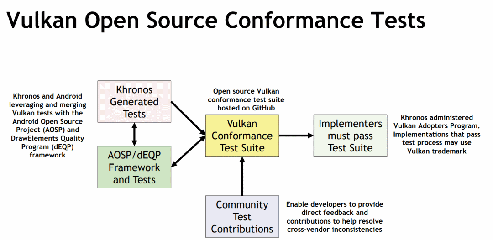

// Copyright 2019-2022 The Khronos Group, Inc.
// SPDX-License-Identifier: CC-BY-4.0

ifndef::chapters[:chapters:]
ifndef::images[:images: images/]

[[vulkan-cts]]
= Vulkan CTS

Vulkan 적합성 테스트 제품군(CTS, Conformace Tests Suite)은 구현의 적합성을 검증하는 데 사용되는 테스트 세트입니다. 적합한 구현은 CTS를 성공적으로 통과했으며 그것이 Vulkan의 유효한 구현임을 나타냅니다. link:https://www.khronos.org/conformance/adopters/conformant-products/vulkan[적합 제품 목록]은 공개되어 있습니다.

규정을 준수하는 구현을 보유한 모든 기업은 공개된 Vulkan 사양을 자유롭게 사용하여 공개적으로 제품을 만들 수 있습니다. Vulkan API의 모든 구현은 link:https://www.khronos.org/adopters[크로노스 Vulkan 채택자 프로그램]에서 적합성 테스트를 거쳐야만 Vulkan 명칭이나 로고를 API 구현과 함께 사용할 수 있습니다.

link:https://github.com/KhronosGroup/VK-GL-CTS/tree/master/external/vulkancts[Vulkan CTS 소스 코드]는 무료로 제공되며, link:https://github.com/KhronosGroup/VK-GL-CTS/wiki/Contributing[기여하기 Wiki]를 따르기만 하면 누구나 자유롭게 새 테스트를 만들어 Vulkan CTS에 추가할 수 있습니다.

애플리케이션은 `VK_KHR_driver_properties` 확장 기능을 통해 link:https://registry.khronos.org/vulkan/specs/1.3-extensions/html/vkspec.html#VkConformanceVersion[VkConformanceVersion] 프로퍼티를 사용하여 구현에 전달된 CTS 버전을 쿼리할 수 있습니다(Vulkan 1.2에서 코어로 승격됨).
