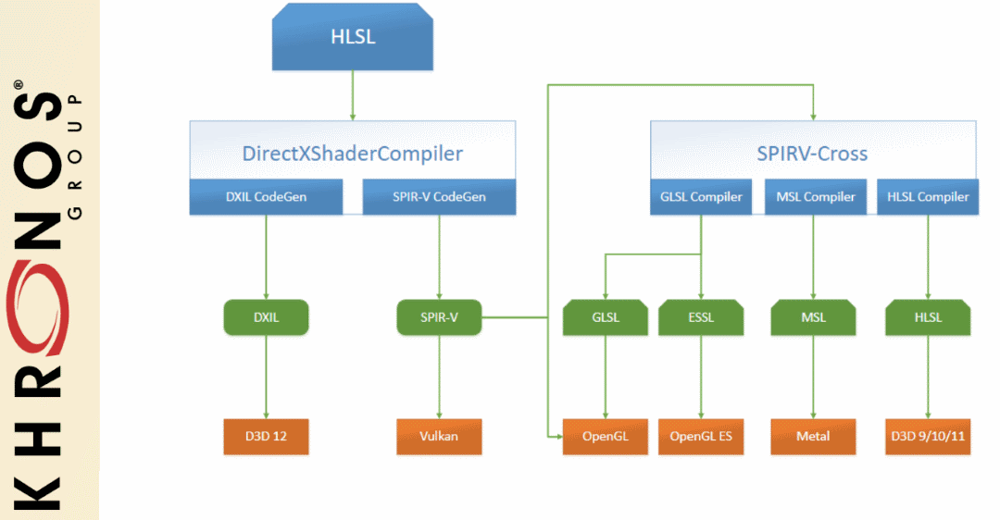

// Copyright 2019-2022 The Khronos Group, Inc.
// SPDX-License-Identifier: CC-BY-4.0

ifndef::chapters[:chapters:]
ifndef::images[:images: images/]

[[what-is-spirv]]
= SPIR-V 란?

[NOTE]
====
SPIR-V에 대한 자세한 내용은 link:https://github.com/KhronosGroup/SPIRV-Guide[SPIRV-Guide]를 참조하세요
====

link:https://registry.khronos.org/SPIR-V/[SPIR-V]는 그래픽 쉐이더 스테이지와 컴퓨트 커널을 위한 바이너리 중간 표현입니다. Vulkan에서는 애플리케이션에서 쉐이더를 GLSL 또는 xref:{chapters}hlsl.adoc[HLSL]과 같은 고수준 쉐이딩 언어를 쓸수 있지만, link:https://registry.khronos.org/vulkan/specs/1.3/html/vkspec.html#vkCreateShaderModule[vkCreateShaderModule]을 사용할 때는 SPIR-V 바이너리가 필요합니다. 크로노스에는 SPIR-V와 그 장점 및 표현에 대한 높은 수준의 설명에 대한 link:https://registry.khronos.org/SPIR-V/papers/WhitePaper.pdf[백서(white paper)]가 있습니다. Vulkan DevDay 2016에서 두 가지 훌륭한 크로노스 프레젠테이션을 link:https://www.khronos.org/assets/uploads/developers/library/2016-vulkan-devday-uk/3-Intro-to-spir-v-shaders.pdf[이곳]과 link:https://www.khronos.org/assets/uploads/developers/library/2016-vulkan-devday-uk/4-Using-spir-v-with-spirv-cross.pdf[이곳]에서 볼 수 있습니다.
(link:https://www.youtube.com/watch?v=XRpVwdduzgU[두 프레젠테이션의 동영상]).

== SPIR-V 인터페이스 및 기능

Vulkan에는 link:https://registry.khronos.org/vulkan/specs/1.3/html/vkspec.html#interfaces[Vulkan이 SPIR-V 쉐이더와 인터페이스하는 방법]을 정의하는 전체 섹션이 있습니다. SPIR-V와의 인터페이스는쉐이더를 함께 컴파일할 때 파이프라인 생성 중에 가장 유효하게 사용됩니다.

SPIR-V는 Vulkan뿐만 아니라 다른 대상도 지원하기 때문에 많은 기능을 가지고 있습니다. Vulkan에 필요한 지원 기능을 확인하려면 link:https://registry.khronos.org/vulkan/specs/1.3/html/vkspec.html#spirvenv-capabilities[부록]을 참조하세요. Vulkan의 일부 확장 및 기능은 일부 SPIR-V 기능의 지원 여부를 확인하기 위해 설계되었습니다.

== 컴파일러

=== glslang

link:https://github.com/KhronosGroup/glslang[glslang]은 GLSL, HLSL, ESSL을 위한 크로노스 레페런스 프론트엔드이며 샘플 SPIR-V 생성기입니다. 독립형 `glslangValidator` 도구가 포함되어 있어 GLSL, HLSL, ESSL에서 SPIR-V를 생성하는 데 사용할 수 있습니다.

=== Shaderc

Google에서 호스팅하는 Vulkan 쉐이더 컴파일을 위한 도구, 라이브러리 및 테스트 모음입니다. 여기에는 link:https://github.com/KhronosGroup/glslang[glslang] 와 link:https://github.com/KhronosGroup/SPIRV-Tools[SPIRV-Tools]의 핵심 기능을 감싸는 `glslc` 가 포함되어 있습니다. Shaderc 에는 link:https://github.com/KhronosGroup/SPIRV-Cross[SPIRV-Cross] 및 link:https://github.com/KhronosGroup/SPIRV-Tools[SPIRV-Tools]의 핵심 기능을 감싸는 `spvc` 도 포함되어 있습니다.

Shaderc는 독립형 커맨드 라인 툴(link:https://github.com/google/shaderc/tree/main/glslc[glslc])과 링크할 라이브러리(link:https://github.com/google/shaderc/tree/main/libshaderc[libshaderc]) 두 도구를 사용하여 빌드합니다.

=== DXC

link:https://github.com/microsoft/DirectXShaderCompiler[DirectXShaderCompiler]는 link:https://github.com/Microsoft/DirectXShaderCompiler/wiki/SPIR%E2%80%90V-CodeGen[HLSL을 SPIR-V로 변환]하는 기능도 지원합니다.

image::../../../chapters/images/what_is_spirv_dxc.png[what_is_spirv_dxc.png]

=== Clspv

link:https://github.com/google/clspv[Clspv]는 Vulkan 컴퓨트 쉐이더로 사용할 수 있는 OpenCL C의 하위 집합을 SPIR-V로 변환하기 위한 프로토타입 컴파일러입니다.

== 도구와 생태계

SPIR-V를 활용할 수 있는 풍부한 도구 생태계가 있습니다. Vulkan SDK에서는 개발자를 위해 빌드되고 패키징된 모든 link:https://vulkan.lunarg.com/doc/sdk/latest/windows/spirv_toolchain.html[SPIR-V 도구 개요]를 소개하고 있습니다.

=== SPIRV-Tools

크로노스 link:https://github.com/KhronosGroup/SPIRV-Tools[SPIRV-Tools] 프로젝트는 SPIR-V 모듈과 함께 작동하기 위한 C/C++ API와 명령줄 인터페이스를 제공합니다. 자세한 내용은 link:https://github.com/KhronosGroup/SPIRV-Guide/blob/master/chapters/khronos_tooling.md#spir-v-tools[SPIRV-Guide]를 참조하세요.

=== SPIRV-Cross

크로노스 link:https://github.com/KhronosGroup/SPIRV-Cross[SPIRV-Cross] 프로젝트는 SPIR-V에 대한 리플렉션을 수행하고 SPIR-V를 원하는 고수준 쉐이딩 언어로 다시 분해할 수 있는 실용적인 도구이자 라이브러리입니다. 자세한 내용은 SPIR-V Cross의 주요 개발자인 link:https://github.com/Themaister[Hans Kristian]이 SPIR-V Cross와 같은 도구를 만드는 데 필요한 사항에 대해 두 차례에 걸쳐 훌륭한 프레젠테이션을 진행한 바 있습니다(link:https://www.khronos.org/assets/uploads/developers/library/2018-vulkanised/04-SPIRVCross_Vulkanised2018.pdf[2018 Vulkanised] (link:https://www.youtube.com/watch?v=T5Va6hSGx44[video]) 와 link:https://www.khronos.org/assets/uploads/developers/library/2019-vulkanised/04-SPIRV-Cross-May19.pdf[2019 Vulkanised] (link:https://www.youtube.com/watch?v=lv-fh_oFJUc[video]).

=== SPIRV-LLVM

크로노스 link:https://github.com/KhronosGroup/SPIRV-LLVM[SPIRV-LLVM] 프로젝트는 SPIR-V를 지원하는 LLVM 프레임워크입니다. 이 프로젝트는 LLVM과 SPIR-V 간의 양방향 변환기를 포함하도록 설계되었습니다. 또한 SPIR-V를 대상으로 하는 LLVM 기반 프론트엔드 컴파일러의 기반이 되기도 합니다.
