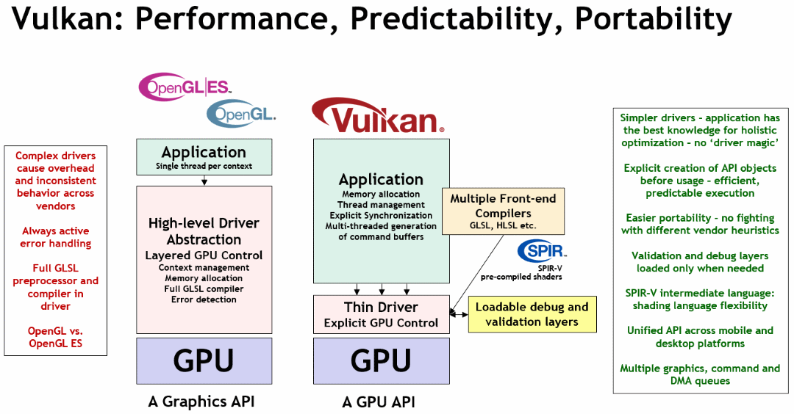
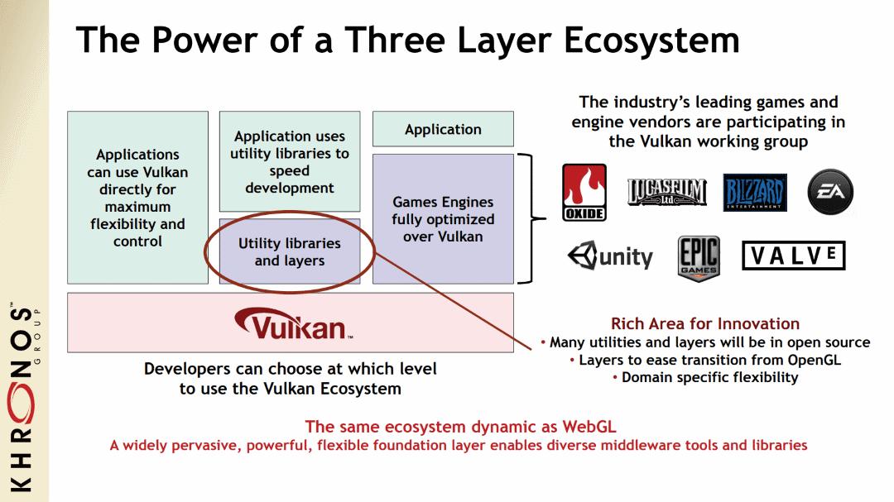

// Copyright 2019-2022 The Khronos Group, Inc.
// SPDX-License-Identifier: CC-BY-4.0

ifndef::chapters[:chapters:]
ifndef::images[:images: images/]

[[what-is-vulkan]]
= Vulkan 이란?

[NOTE]
====
Vulkan은 PC와 콘솔부터 휴대폰과 임베디드 플랫폼에 이르기까지 다양한 기기에서 사용되는 최신 GPU에 대한 크로스 플랫폼으로 고효율로 접근할 수 있는 차세대 그래픽 및 컴퓨팅 API입니다.
====

Vulkan은 회사나 언어가 아니라 개발자가 크로스 플랫폼 및 크로스 벤더 방식으로 최신 GPU 하드웨어를 프로그래밍할 수 있는 방법입니다. 크로노스 그룹은 회원 중심의 컨소시엄으로 Vulkan을 만들고 유지 관리합니다.

== Vulkan의 핵심

본질적으로 Vulkan은 적합한 하드웨어 구현이 따르는 link:https://registry.khronos.org/vulkan/#apispecs[API 사양]입니다. 공개된 사양은 link:https://github.com/KhronosGroup/Vulkan-Docs[Vulkan-Doc]에 있는 Vulkan Specification 저장소의 공식 공개 사본에 있는 link:https://github.com/KhronosGroup/Vulkan-Docs/blob/main/xml/vk.xml[./xml/vk.xml] Vulkan Registry 파일에서 생성됩니다. 또한 link:https://registry.khronos.org/vulkan/specs/1.3/registry.html[XML 스키마]에 대한 문서도 제공됩니다.

크로노스 그룹은 Vulkan 사양과 함께 개발자가 Vulkan API와 인터페이스하는 데 사용할 수 있는 link:https://registry.khronos.org/vulkan/#apiregistry[API Registry]에서 생성된 link:https://www.open-std.org/jtc1/sc22/wg14/www/standards[C99] link:https://github.com/KhronosGroup/Vulkan-Headers/tree/main/include/vulkan[header files]을 공개합니다.

C 코드로 작업할 수 없는 분들을 위해 다양한 link:https://github.com/KhronosGroup/Khronosdotorg/blob/main/api/vulkan/resources.md#language-bindings[언어] link:https://github.com/vinjn/awesome-vulkan#bindings[바인딩]이 있습니다.

== Vulkan 과 OpenGL

일부 개발자는 3D 그래픽 API인 또 다른 크로노스 그룹 표준 link:https://www.khronos.org/opengl/[OpenGL]을 알고 있을 것입니다. Vulkan은 OpenGL을 직접적으로 대체하는 것이 아니라 GPU를 보다 명시적으로 제어할 수 있는 명시적 API 입니다.

크로노스 link:https://github.com/KhronosGroup/Vulkan-Samples[Vulkan Samples]의 link:https://github.com/KhronosGroup/Vulkan-Samples/blob/master/samples/vulkan_basics.md["Vulkan은 OpenGL ES와 어떻게 다른가요? Vulkan에게 무엇을 기대할 수 있나요?] 기사에서 두 API를 더 자세히 비교할 수 있습니다.

Vulkan은 애플리케이션에 더 많은 작업과 책임을 부여합니다. 모든 개발자가 이러한 추가 투자를 원하지는 않겠지만, 올바르게 투자하는 개발자는 성능 및 전력 향상을 얻을 수 있습니다.

image::../../../chapters/images/what_is_vulkan_decision.png[what_is_vulkan_decision.png]

== 라이브러리 이용

일부 개발자는 도움 없이 Vulkan을 사용해보고 싶을 수도 있지만, 개발 흐름에서 더 가벼운 라이브러리를 사용하여 Vulkan의 지루한 측면을 추상화하는 것이 일반적입니다. 다음은 link:https://github.com/vinjn/awesome-vulkan#libraries[개발에 도움이 되는] 몇 가지 link:https://github.com/KhronosGroup/Khronosdotorg/blob/main/api/vulkan/resources.md#libraries[라이브러리]입니다.

== Vulkan 사용법 배우기

Vulkan은 개발자가 하드웨어 가속 애플리케이션을 만들 수 있는 도구입니다. Vulkan Guide는 확장 기능, 버전, 사양 등과 같은 보다 일반적인 내용을 다루려고 합니다. 자세한 내용은 "`사용`" 방법을 참조하세요. Hello World Triangle과 같은 것을 만드는 방법에 대한 자세한 내용은 link:https://www.vulkan.org/learn[크로노스의 Vulkan "`배우기`" 페이지]에 있는 리소스를 참조하세요. 더 많은 실무적인 도움과 지식을 얻고 싶으시다면, link:https://khr.io/slack[크로노스 개발자 슬랙(Slack)]이나 link:https://community.khronos.org/[크로노스 커뮤니티 포럼]에도 자유롭게 참여하세요!!
