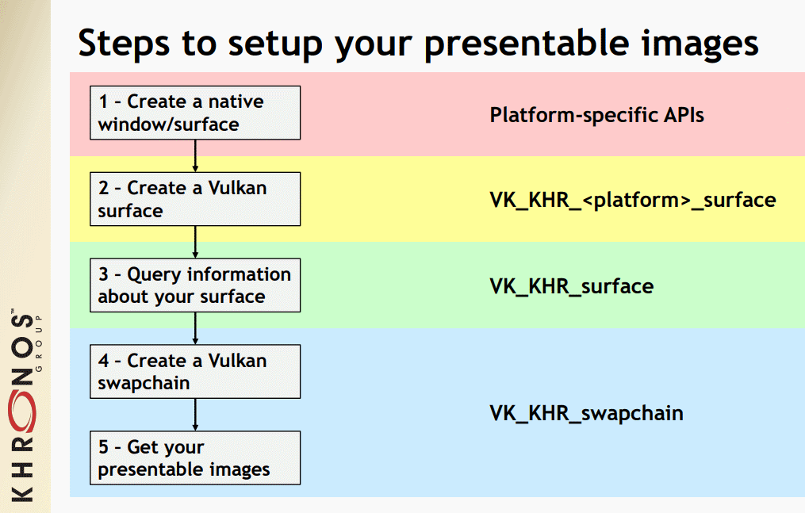
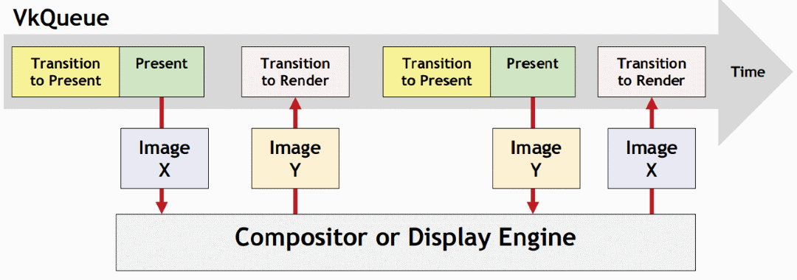

// Copyright 2019-2022 The Khronos Group, Inc.
// SPDX-License-Identifier: CC-BY-4.0

ifndef::chapters[:chapters:]
ifndef::images[:images: images/]

[[wsi]]
= 창 시스템 통합(Window System Integration, WSI)

Vulkan API는 결과를 표시하지 않고 사용할 수 있으므로 link:https://registry.khronos.org/vulkan/specs/1.3-extensions/html/vkspec.html#wsi[선택적 Vulkan 확장 기능]을 사용하여 WSI를 제공합니다. 대부분의 구현에는 WSI 지원이 포함됩니다. WSI 설계는 각 플랫폼의 윈도우 메커니즘을 코어 Vulkan API에서 추상화하기 위해 만들어졌습니다.

== 서페이스(Surface)

`VkSurfaceKHR` 객체는 플랫폼에 구애받지 않으며 나머지 Vulkan API가 모든 WSI 연산에 사용할 수 있도록 설계되었습니다. 이 객체는 `VK_KHR_surface` 확장 기능을 사용하여 활성화할 수 있습니다.

Vulkan 서페이스를 지원하는 각 플랫폼은 플랫폼마다 고유의 API에서 `VkSurfaceKHR` 객체를 만드는 독자적인 방법을 가지고 있습니다.

  * Android - link:https://registry.khronos.org/vulkan/specs/1.3-extensions/html/vkspec.html#vkCreateAndroidSurfaceKHR[vkCreateAndroidSurfaceKHR]
  * DirectFB - link:https://registry.khronos.org/vulkan/specs/1.3-extensions/html/vkspec.html#vkCreateDirectFBSurfaceEXT[vkCreateDirectFBSurfaceEXT]
  * Fuchsia - link:https://registry.khronos.org/vulkan/specs/1.3-extensions/html/vkspec.html#vkCreateImagePipeSurfaceFUCHSIA[vkCreateImagePipeSurfaceFUCHSIA]
  * Google Games - link:https://registry.khronos.org/vulkan/specs/1.3-extensions/html/vkspec.html#vkCreateStreamDescriptorSurfaceGGP[vkCreateStreamDescriptorSurfaceGGP]
  * iOS - link:https://registry.khronos.org/vulkan/specs/1.3-extensions/html/vkspec.html#vkCreateIOSSurfaceMVK[vkCreateIOSSurfaceMVK]
  * macOS - link:https://registry.khronos.org/vulkan/specs/1.3-extensions/html/vkspec.html#vkCreateMacOSSurfaceMVK[vkCreateMacOSSurfaceMVK]
  * Metal - link:https://registry.khronos.org/vulkan/specs/1.3-extensions/html/vkspec.html#vkCreateMetalSurfaceEXT[vkCreateMetalSurfaceEXT]
  * VI - link:https://registry.khronos.org/vulkan/specs/1.3-extensions/html/vkspec.html#vkCreateViSurfaceNN[vkCreateViSurfaceNN]
  * Wayland - link:https://registry.khronos.org/vulkan/specs/1.3-extensions/html/vkspec.html#vkWaylandSurfaceCreateInfoKHR[vkWaylandSurfaceCreateInfoKHR]
  * QNX - link:https://registry.khronos.org/vulkan/specs/1.3-extensions/man/html/vkCreateScreenSurfaceQNX.html[vkCreateScreenSurfaceQNX]
  * Windows - link:https://registry.khronos.org/vulkan/specs/1.3-extensions/html/vkspec.html#vkCreateWin32SurfaceKHR[vkCreateWin32SurfaceKHR]
  * XCB - link:https://registry.khronos.org/vulkan/specs/1.3-extensions/html/vkspec.html#vkCreateXcbSurfaceKHR[vkCreateXcbSurfaceKHR]
  * Xlib - link:https://registry.khronos.org/vulkan/specs/1.3-extensions/html/vkspec.html#vkCreateXlibSurfaceKHR[vkCreateXlibSurfaceKHR]
  * Direct-to-Display - link:https://registry.khronos.org/vulkan/specs/1.3-extensions/html/vkspec.html#vkCreateDisplayPlaneSurfaceKHR[vkCreateDisplayPlaneSurfaceKHR]

`VkSurfaceKHR` 이 생성되면 다양한 link:https://registry.khronos.org/vulkan/specs/1.3-extensions/html/vkspec.html#vkGetPhysicalDeviceSurfaceCapabilitiesKHR[기능], link:https://registry.khronos.org/vulkan/specs/1.3-extensions/html/vkspec.html#vkGetPhysicalDeviceSurfaceFormatsKHR[포맷], link:https://registry.khronos.org/vulkan/specs/1.3-extensions/html/vkspec.html#vkGetPhysicalDeviceSurfacePresentModesKHR[프레젠테이션 모드]를 쿼리할 수 있습니다.

== 스왑체인(Swapchain)

`VkSwapchainKHR` 객체는 `VkImage` 객체 배열을 통해 렌더링 결과를 서페이스에 표시하는 기능을 제공합니다. 스왑체인의 다양한 link:https://registry.khronos.org/vulkan/specs/1.3-extensions/html/vkspec.html#VkPresentModeKHR[표시 모드]에 따라 표시 엔진이 구현되는 방식이 결정됩니다.

크로노스의 link:https://github.com/KhronosGroup/Vulkan-Samples/tree/master/samples/performance/swapchain_images[샘플 및 튜토리얼]은 스왑체인을 생성하고 표시 모드를 선택할 때 고려해야 할 다양한 사항을 설명합니다.\

== 회전 전에 해야할 일(Pre-Rotation)

모바일 기기는 회전이 가능하므로 애플리케이션 창의 논리적 방향과 디스플레이의 물리적 방향이 일치하지 않을 수 있습니다. 애플리케이션은 `세로모드(portrait)` 와 `가로모드(landscape)` 2가지 모드로 작동할 수 있어야 합니다. 이 두 모드의 차이는 해상도의 변화로 단순화할 수 있습니다. 그러나 일부 디스펠리에 하위 시스템은 항상 디스플레이 패널의 "`기본(native)`" (또는 "`물리적`") 방향에서 작동합니다. 장치가 회전되었으므로 원하는 효과를 얻으려면 애플리케이션 출력도 회전해야 합니다.

안드로이드와 같은 모바일 플랫폼에서 애플리케이션이 Vulkan을 최대한 활용하려면 사전 회전을 구현하는 것이 필수입니다. 스왑체인 생성 시 방향을 지정하여 서페이스 회전을 처리하는 방법을 설명하는 link:https://android-developers.googleblog.com/2020/02/handling-device-orientation-efficiently.html?m=1[Google의 자세한 블로그 게시물]이 있으며 link:https://github.com/google/vulkan-pre-rotation-demo[독립 실행형 예제]도 함께 제공됩니다. link:https://github.com/KhronosGroup/Vulkan-Samples[Vulkan-Samples]에는 사전 회전이 문제가 되는 이유에 대한 link:https://github.com/KhronosGroup/Vulkan-Samples/tree/master/samples/performance/surface_rotation[훌륭한 글]과 쉐이더에서 이를 해결하는 방법을 보여주는 link:https://github.com/KhronosGroup/Vulkan-Samples/tree/master/samples/performance/surface_rotation[실행 샘플]도 있습니다. Adreno GPU 기반 기기를 사용하는 경우, 퀄컴(Qualcomm)은 link:https://registry.khronos.org/vulkan/specs/1.3-extensions/man/html/VK_QCOM_render_pass_transform.html[VK_QCOM_render_pass_transform] 확장 기능을 사용하여 사전 회전을 구현할 것을 권장합니다.
